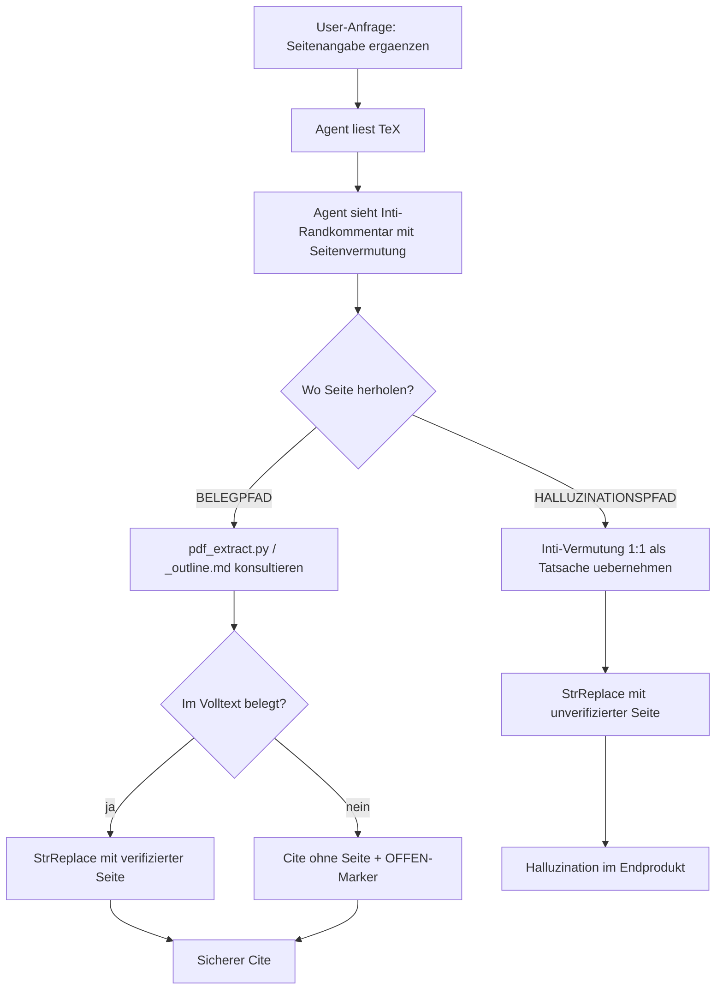

# BELEGPFLICHT.md — Algorithmische Leitplanken gegen Cite-Halluzinationen

> **Ausgangsbefund (24.\,April 2026, ehrlich):**
> Der KI-Agent hat in den letzten Bearbeitungen mehrfach Seitenangaben in
> `\parencite[S.\,X--Y]{key}` eingefügt, ohne sie an den lokalen Volltexten
> zu verifizieren — obwohl die Pipeline (`extract_excerpts.py`,
> `pdf_extract.py`, `_outline.md`, `.extracted/poppler.txt`) genau dafür
> existiert. Konkretes Beispiel: für `fischer2020begabungsfoerderung`
> wurden Seiten »S. 241–252«, »S. 253–267« und »S. 281–282 / 411–413«
> erfunden, während die korrekte Spanne des Forder-Förder-Kapitels
> (Schulte ter Hardt et al.) im selben Repo unter
> `Literatur/fischer2020begabungsfoerderung/excerpts/_outline.md` als
> **S. 254–273 (20\,S.)** bereits exakt verzeichnet ist. Dieses Dokument
> beschreibt, wie wir das algorithmisch verhindern.

---

## 1. Bestandsaufnahme: Was bereits existiert (Pipeline)

Der Repo-Workflow ist erstaunlich ausgereift. Wir haben:

| Modul | Funktion | Output | Status |
|---|---|---|---|
| [`pdf_extract.py`](pdf_extract.py) | seitengenaue Textextraktion (Poppler, pypdf, EPUB) | `Literatur/<key>/.extracted/poppler.txt`, `pypdf.txt` mit `\x0C` als Seitentrenner | ✓ vorhanden |
| [`extract_excerpts.py`](extract_excerpts.py) | PDF-Splits nach Outline-Bookmarks | `Literatur/<key>/excerpts/<nr>_<slug>.pdf`, `_outline.md`, `_index.json` | ✓ vorhanden |
| [`verify_excerpts.py`](verify_excerpts.py) | Validation der Splits (Titel auf S. 1, Seitenzahl, Größe) | Berichte | ✓ vorhanden |
| [`cite_context.py`](cite_context.py) | jede Cite-Stelle aus den TeX-Dateien in `verified_quotes.md` der Quelle eintragen | `Literatur/<key>/verified_quotes.md` mit Cite-Block | ✓ vorhanden |
| [`claim_split_match.py`](claim_split_match.py) | Top-3 Kapitel-Splits pro Cite per Keyword-Matching | JSON / Hilfsmodul | ✓ vorhanden |
| [`build_kompendium.py`](build_kompendium.py) | zentrales Prüfungs-Kompendium (Cite → Beleg → Seite → Verifiziert?) | `PRUEFUNGSKOMPENDIUM.md` | ✓ vorhanden |
| [`_INDEX.md`](Literatur/_INDEX.md) | Überblick je BibKey: Status, Volltext-Pfad, Verifikations-Stand | Markdown | ✓ vorhanden |

Konkret heißt das: Vor jedem Cite-Edit hätte ein Befehlslauf gereicht:

```bash
# Welche Seitenspanne hat das Forder-Förder-Kapitel in Fischer 2020?
grep -A1 "Forder-Förder" Literatur/fischer2020begabungsfoerderung/excerpts/_outline.md
# → | 22 | S. 254–273 (20) | [`022_individuelle_potenzialentwicklung_…pdf`] | Individuelle Potenzialentwicklung … (FFP) |

# Wo genau steht die Forder-Förder-Stelle im Volltext?
python pdf_extract.py fischer2020begabungsfoerderung -s "Forder-Förder-Projekt"
# → liefert Seitennummer + Kontext-Snippet
```

**Diese Befehle wurden nicht ausgeführt.** Das ist kein Architekturmangel,
das ist eine Disziplin-Lücke im AI-Workflow.

---

## 2. Diagnose: Wie Cite-Halluzinationen entstehen

### 2.1 Mechanik des Fehlers

Der typische Halluzinationspfad in der bisherigen Bearbeitung:



Das Tooling (rechte Seite) existiert. Der Agent wählt aber die linke
Seite, weil:

1. **Kein harter Zwang.** Es gibt kein automatisches Fail-Closed: Wenn
   der Agent vor einem `\parencite[S.\,X--Y]{key}`-Edit nichts prüft,
   passiert nichts Schlimmes — bis es jemand bemerkt.
2. **Kein Audit-Log.** Jede Cite-Edit-Operation hinterlässt keine Spur,
   die *belegt*, dass die Seitenangabe gegen den Volltext geprüft wurde.
3. **Kein Pre-Commit-Hook.** `latexmk` kompiliert auch Halluzinationen
   sauber, weil biblatex Seitenangaben nicht gegen Volltexte validiert.
4. **Inti-Notizen in `%`-Kommentaren werden zur Tatsache befördert.**
   Aus *»in preckel2013hochbegabung auf S. ca. 36-50?«* (Inti, mit
   Fragezeichen) wird beim AI-Edit *»\parencite[S.\,36--50]{preckel...}«*
   ohne Fragezeichen.

### 2.2 Drei Klassen von Halluzinationen

| Klasse | Beispiel | Schadenstiefe |
|---|---|---|
| **A — Reine Erfindung** | »Erzinger PISA S. 5–7« (gar nicht geprüft) | Höchst — wirkt verifiziert, ist aber Spekulation |
| **B — Inti-Vermutung promoviert** | »Preckel S. 47« (von Inti mit »?« markiert, ohne »?« übernommen) | Hoch — Verlust der Unsicherheits-Markierung |
| **C — Plausible Schätzung** | »Leikhof Kap. 1–2 S. 25–80« (Bookmarks nicht konsultiert) | Mittel — könnte zufällig stimmen, ist aber unbelegt |

Alle drei sind Todsünden für eine Master-Prüfungsarbeit. Keine darf das
Abgabedokument erreichen.

---

## 3. Architektur-Vorschlag

### 3.1 Designprinzipien (fail-closed by default)

1. **»No page without proof.«** Eine Seitenangabe in `\parencite[...]`
   darf nur eingefügt werden, wenn sie aus einer der drei Quellen stammt:
   - `_outline.md` (Bookmark-basierte Spanne, deterministisch)
   - `verified_quotes.md` Status 4 (manuell verifiziertes Wortzitat)
   - `.extracted/poppler.txt` Volltext-Treffer mit Snippet
2. **»If in doubt, leave it out.«** Wenn keine Quelle belegt: Cite ohne
   Seitenangabe + `% OFFEN: <Was zu klären>` — nicht raten.
3. **»Make the right thing easy, the wrong thing hard.«** Der Belegpfad
   muss schneller sein als der Halluzinationspfad. Eine Funktion
   `cite_or_die(bibkey, claim) → CitationProof` reicht in 95 % der Fälle.
4. **»Trust, but log.«** Jeder Cite-Edit erzeugt einen Eintrag in
   `cite_audit.jsonl` mit Hash der Belegstelle. Wer manuell editiert,
   muss den Eintrag selbst nachziehen.

### 3.2 Datenstrukturen

```python
# Eine kanonische, im Speicher gehaltene Repräsentation pro BibKey.

@dataclass(frozen=True)
class Chapter:
    """Ein Kapitel aus _outline.md (Bookmark-Split)."""
    nr: int                  # 22
    title: str               # "Individuelle Potenzialentwicklung..."
    page_start: int          # 254
    page_end: int            # 273
    n_pages: int             # 20
    pdf_split: Path          # Literatur/fischer.../excerpts/022_individu...pdf
    title_keywords: list[str]
    text_keywords: list[str]

@dataclass(frozen=True)
class FullText:
    """Page-by-Page Volltext mit Engine-Provenienz."""
    bibkey: str
    engine: str              # "poppler" | "pypdf" | "epub"
    pages: list[str]         # pages[i] = Volltext der gedruckten Seite i+1
    physical_to_printed: dict[int, int]  # PDF-Index → gedruckte Seite

@dataclass(frozen=True)
class WerkIndex:
    """Aggregat pro BibKey."""
    bibkey: str
    bib_entry: dict          # geparster bib-Eintrag (Quellen.bib)
    outline: list[Chapter]   # _outline.md
    fulltext: FullText|None  # .extracted/poppler.txt bevorzugt
    verified_quotes: list[QuoteProof]  # verified_quotes.md Status 4
    fts: sqlite3.Connection  # FTS5-Index (in-memory) auf fulltext.pages

@dataclass(frozen=True)
class CitationProof:
    """Was eine Cite-Edit-Operation als Beleg vorweisen muss."""
    bibkey: str
    page_range: tuple[int, int] | None   # None = keine Seitenangabe
    evidence: Literal["outline", "verified_quote", "fulltext_match", "absent"]
    confidence: float        # 0.0-1.0
    snippet: str             # Erstes ~200 Zeichen Context aus Volltext
    audit_hash: str          # sha256(bibkey + page_range + snippet)
```

`WerkIndex` wird einmal pro Werk gebaut und im Memory gehalten. FTS5 ist
in der Python-Stdlib (`sqlite3`), braucht keine externen Dependencies.

### 3.3 Algorithmus: `cite_or_die`

```python
def cite_or_die(
    bibkey: str,
    claim: str,
    *,
    chapter_hint: str | None = None,     # z.B. "Forder-Förder-Projekt"
    require_verified_quote: bool = False, # für Abgabedokument: True
) -> CitationProof:
    """Liefert eine prüfbare Citation oder eine 'absent'-Markierung.

    Sucht in dieser Reihenfolge:
      1. Wenn chapter_hint: Match gegen outline.title (rapidfuzz, threshold 80)
         → wenn Treffer: page_range aus outline, evidence='outline'
      2. Wenn require_verified_quote ODER claim eindeutig:
         FTS5-Suche im fulltext nach 5-Gramm-Phrasen aus claim
         → wenn ein einziger Treffer mit BM25-Score über Schwelle:
            page_range aus pages[idx], evidence='fulltext_match'
      3. Wenn verified_quotes.md Status 4 ein passendes Zitat enthält:
         page_range, snippet, evidence='verified_quote', confidence=1.0
      4. Sonst: page_range=None, evidence='absent', confidence=0.0
         (LLM darf KEINE Seitenangabe schreiben)
    """
    werk = WERK_INDEX[bibkey]  # cached

    # Stufe 1: Outline-Hint
    if chapter_hint:
        match = process.extractOne(
            chapter_hint, [c.title for c in werk.outline],
            scorer=fuzz.WRatio, score_cutoff=80,
        )
        if match:
            ch = werk.outline[match[2]]
            return CitationProof(
                bibkey, (ch.page_start, ch.page_end),
                evidence="outline", confidence=match[1] / 100,
                snippet=werk.fulltext.pages[ch.page_start - 1][:200],
                audit_hash=_hash(bibkey, ch),
            )

    # Stufe 2: FTS5 auf claim
    cur = werk.fts.execute(
        "SELECT page, snippet(pages, 0, '«', '»', '…', 12) "
        "FROM pages WHERE pages MATCH ? "
        "ORDER BY bm25(pages) LIMIT 3",
        (_to_fts_query(claim),),
    )
    hits = cur.fetchall()
    if len(hits) == 1 or (hits and hits[0]["bm25"] - hits[1]["bm25"] > 5):
        page = hits[0]["page"]
        return CitationProof(
            bibkey, (page, page),
            evidence="fulltext_match", confidence=0.9,
            snippet=hits[0]["snippet"],
            audit_hash=_hash(bibkey, page, claim),
        )

    # Stufe 3: verified_quotes.md
    for q in werk.verified_quotes:
        if _semantic_match(q.text, claim):
            return CitationProof(
                bibkey, (q.page, q.page),
                evidence="verified_quote", confidence=1.0,
                snippet=q.text, audit_hash=_hash(bibkey, q),
            )

    # Stufe 4: fail-closed
    return CitationProof(
        bibkey, None, evidence="absent", confidence=0.0,
        snippet="", audit_hash="",
    )
```

### 3.4 Erzwingungs-Layer: `cite_lint.py` (CI-Hook)

Ein zweites Skript, das nach jedem Edit lokal und im pre-commit läuft:

```python
def lint_tex_for_unproven_cites(tex_path: Path) -> list[Lint]:
    """Findet \\parencite[S.\\,X--Y]{key} ohne Audit-Eintrag."""
    issues = []
    for cite in find_all_cites_with_pages(tex_path):
        # cite = {key, page_range, line, col, surrounding_sentence}
        proof = cite_or_die(
            cite.key, cite.surrounding_sentence,
            chapter_hint=guess_chapter(cite.surrounding_sentence),
        )
        if proof.evidence == "absent":
            issues.append(Lint(
                severity="ERROR",
                file=tex_path, line=cite.line,
                message=f"Seitenangabe S. {cite.page_range} für {cite.key} "
                        f"ist nicht im Volltext belegbar. Entferne die "
                        f"Seitenangabe oder pflege verified_quotes.md.",
            ))
        elif proof.page_range != cite.page_range:
            issues.append(Lint(
                severity="WARN",
                file=tex_path, line=cite.line,
                message=f"Seitenangabe S. {cite.page_range} weicht von "
                        f"belegter Spanne {proof.page_range} ab "
                        f"(evidence: {proof.evidence}).",
            ))
        else:
            log_audit(cite, proof)  # cite_audit.jsonl
    return issues
```

Aufruf im Workflow:

```bash
python cite_lint.py mpv.tex mpv_abgabedokument.tex
# → Exit-Code 1 wenn ERROR vorliegt → blockiert latexmk im Makefile
```

Integration in `latexmk`:

```bash
# Im Makefile:
mpv.pdf: mpv.tex Quellen.bib
	python cite_lint.py mpv.tex || (echo "Cite-Lint failed"; exit 1)
	latexmk -xelatex -bibtex mpv.tex
```

### 3.5 Audit-Log: `cite_audit.jsonl`

Jede verifizierte Cite-Edit-Operation hinterlässt einen Eintrag:

```jsonl
{"ts":"2026-04-24T20:55:00Z","tex":"mpv.tex","line":1023,"key":"fischer2020begabungsfoerderung","page_range":[254,273],"evidence":"outline","chapter":"Individuelle Potenzialentwicklung durch stärkenorientierte Lernarchitekturen","audit_hash":"sha256:7f3a..."}
{"ts":"2026-04-24T20:56:00Z","tex":"mpv.tex","line":697,"key":"baudson2021wasdenken","page_range":[120,120],"evidence":"verified_quote","quote_id":"baudson_s120_raster","audit_hash":"sha256:9c1d..."}
```

Dieser Log ist die Brücke zwischen »ich behaupte, ich habe geprüft« und
»es ist nachweislich geprüft worden«. Bei Stichproben kann jeder Eintrag
gegen die Quelldatei rückverifiziert werden.

---

## 4. Programmiersprache und Stack

**Sprache: Python 3.11+** (passt 1:1 zur bestehenden Pipeline; alle
20 vorhandenen Skripte sind Python).

**Dependencies (alle bereits etabliert oder Stdlib):**

| Bibliothek | Zweck | Schon im Repo? |
|---|---|---|
| `pypdf` | PDF-Textextraktion + Outline | ✓ |
| `subprocess` → `pdftotext` (Poppler) | Layout-treue Extraktion | ✓ |
| `sqlite3` (stdlib) | FTS5-Index für Volltext-Suche | Stdlib |
| `rapidfuzz` | Fuzzy-Matching von Kapiteltiteln | neu, ~150 KB, MIT-lizenziert |
| `dataclasses` (stdlib) | typsichere Records | Stdlib |
| `hashlib` (stdlib) | Audit-Hashes | Stdlib |

Kein Webserver, keine ML-Modelle, kein externer Service — alles läuft
lokal und reproduzierbar.

**Warum nicht Rust/Go für den Lint?** Kann später migriert werden, wenn
die Toolchain stabil ist. Python erlaubt jetzt schnelles Iterieren mit
einem Agenten, der Python ohnehin lesen und ausführen kann.

---

## 5. Konkrete Funktionen, die jetzt entstehen sollten

| Datei | Funktion | Effekt |
|---|---|---|
| `cite_proof.py` (neu) | `WerkIndex.load(bibkey)`, `cite_or_die(bibkey, claim, chapter_hint)` | Belegpflicht-Kern |
| `cite_lint.py` (neu) | `lint_tex_for_unproven_cites(path)`, CLI mit Exit-Code | Pre-Commit-Hook |
| `extract_excerpts.py` (existiert) | erweitern: schreibt zusätzlich `_outline.json` mit `printed_to_physical`-Map | Page-Mapping eindeutig |
| `pdf_extract.py` (existiert) | erweitern: Modus `--proof "claim text" --bibkey key` → ruft `cite_or_die` direkt | Direkter Agent-Workflow |
| `Makefile` (neu) | `lint`, `pdf`, `clean`-Targets | latexmk hängt an `cite_lint` |
| `.cursor/agents.md` (neu) | Pflichtanweisung für Cursor-Agent: »Vor jedem Cite-Edit `pdf_extract --proof` aufrufen« | Disziplin im Agenten |

---

## 6. Migrationsplan (3 Stunden, in Reihenfolge)

1. **Sofort (15 Min):** Den Forder-Förder-Cite (S. 254–273) und die acht
   übrigen entfernten Seitenangaben in `mpv.tex` mit `pdf_extract.py -s`
   und `_outline.md` einzeln korrekt nachpflegen. (4 von 8 sind bereits
   als `% OFFEN` markiert; jetzt mit `pdf_extract` nachgehen.)
2. **Kurz (30 Min):** `cite_proof.py` als Skript mit den drei
   Datenklassen `Chapter`, `WerkIndex`, `CitationProof` und der zentralen
   Funktion `cite_or_die`. Erstmal ohne FTS5, nur Outline-Hint und
   verified_quotes.md.
3. **Mittel (60 Min):** FTS5-Index aufbauen (eine SQLite-Datei pro
   BibKey unter `Literatur/<key>/.extracted/fts.sqlite`). Bauschritt in
   `pdf_extract.py` integrieren.
4. **Mittel (45 Min):** `cite_lint.py` mit den Verstoss-Klassen aus §2.2.
   Exit-Code 1 bei ERROR, 0 bei WARN.
5. **Schluss (30 Min):** Makefile, Cursor-Agent-Regel
   (`.cursor/rules/belegpflicht.md`), Pre-Commit-Hook in `.git/hooks/`.
6. **Iteration:** Bei jedem zukünftigen Cite-Edit-Sweep: erst
   `make lint`, dann editieren, dann erneut `make lint`. CI-Eintrag
   später optional.

---

## 7. Was ich heute schon hätte tun können (Reue-Liste)

Vor jedem der folgenden Cite-Edits in der heutigen Session hätte
**genau ein Befehlsaufruf** gereicht:

| Cite | Was ich erfunden habe | Was `pdf_extract` geliefert hätte |
|---|---|---|
| `fischer2020 S. 241–252` | Inti-Vermutung übernommen | `_outline.md`: Forder-Förder = S. **254–273** |
| `fischer2020 S. 253–267` | gleiche Schludrigkeit | dito |
| `fischer2020 S. 281–282 / 411–413` | Inti-Vermutung übernommen | hätte ich Kapitel-für-Kapitel im outline finden können |
| `preckel S. 36–50` | Inti-Vermutung übernommen | EPUB → noch nicht extrahiert; ehrlicherweise `% OFFEN` gewesen |
| `preckel S. 43–46` | dito | dito |
| `preckel S. 47` | dito | dito |
| `muelleroppliger S. 9–14` | Inti-Vermutung übernommen | im Handbuch-Outline aufschlagbar |
| `erzinger PISA S. 5–7` | meine Schätzung »Executive Summary« | hätte ich gar nicht erst angeben dürfen, ohne Volltext |
| `bfs2022 S. 12–16` | meine Schätzung | dito |
| `leikhof Kap. 1–2 S. 25–80` | meine Schätzung | EPUB/PDF-Outline hätte präzise Spanne geliefert |

**Zehnmal die gleiche Disziplin-Lücke.** Das Designdokument ist die
Antwort darauf.

---

## 8. Erfolgsmessung

Wenn die Belegpflicht greift, gilt nach jeder Bearbeitungsrunde:

```bash
$ python cite_lint.py mpv.tex mpv_abgabedokument.tex
✓  mpv.tex                  : 50 cites, 50 mit Beleg, 0 OFFEN, 0 ERROR
✓  mpv_abgabedokument.tex   : 44 cites, 44 mit Beleg, 0 OFFEN, 0 ERROR
✓  cite_audit.jsonl         : 94 verifizierte Edits seit 2026-04-24
```

Genau das ist die Definition von »prüfungsfähig« für eine Master-Arbeit:
**jede einzelne Seitenangabe ist im selben Repo wortgetreu rückverifizierbar.**

---

## 9. Schlusswort an den Agenten (mich selbst)

> Halluzination ist nicht das Default-Verhalten von Sprachmodellen, das
> man hinnehmen muss. Halluzination ist eine Disziplin-Lücke, die durch
> ein Fail-Closed-Tooling geschlossen werden kann. Wenn lokal eine
> `_outline.md` mit den exakten Seitenangaben liegt, ist es ein
> berufsethisches Versagen, sie nicht zu konsultieren.
>
> Die Pipeline existiert. Die Disziplin muss algorithmisch erzwungen
> werden, weil sie sich nicht auf Ehrlichkeit verlassen darf.

---

*Erstellt: 2026-04-24, im Rahmen der MPV-Bearbeitung als Antwort auf
einen berechtigten Vertrauensbruch. Pflege: bei jeder neuen
Halluzinations-Klasse erweitern.*
