# BELEGPFLICHT_GREENFIELD.md — Plain-Vanilla-Architektur für skalierte, KI-arme Wissenschaftspublikation

> **Frage:** Wenn ich heute mit einer weißen Wand anfangen dürfte, wie
> sähe ein System aus, das viele Manuskripte parallel publiziert,
> belegtreu, mit minimal KI im kritischen Pfad?
>
> **Kurzantwort:** Rust. Content-addressed Source Store. Atomare Facts
> mit kryptographischer Provenienz. KI nur als optionaler »Vorschlagsmotor«
> ausserhalb der Verifikationskette. Pipeline aus deterministischen
> Workern, die einander nur über Events kennen.

---

## 1. Was wir gerade gelernt haben (und warum das die Architektur formt)

Das eigentliche Problem ist **nicht**, dass Sprachmodelle halluzinieren.
Das eigentliche Problem ist, dass die heutige Wissenschafts-Toolchain
(LaTeX/biber, Word/Zotero) Cite-Manipulationen *nicht gegen die
Primärquellen validiert*. `\parencite[S.\,42]{key}` durchläuft den
Compile genau gleich, ob die Seite existiert oder erfunden ist.

Die Greenfield-Antwort darauf ist nicht ein neues KI-Modell, sondern eine
**fail-closed Datenpipeline**, in der jede Cite-Insertion gegen einen
content-addressed Quellenspeicher abgeglichen werden *muss*, sonst gar
nicht erst geschrieben werden *kann*. KI ist dann eine optionale
Beschleunigung am Anfang der Pipeline, nicht eine Vertrauensquelle in
der Mitte.

---

## 2. Sprachwahl: Rust, mit Begründung

Die Frage »Go oder Rust« hat für dieses Problem eine klare Antwort. Hier
die ehrliche Abwägung:

| Kriterium | Go | Rust | Gewinner |
|---|---|---|---|
| Concurrency / I/O-Skalierung | Goroutines + channels, sehr ergonomisch | tokio + async/await, mittlerweile sehr ergonomisch | **Tie** |
| CPU-intensives PDF-Parsing | brauchbar (`unipdf`, `pdfcpu`) | exzellent (`lopdf`, `pdfium-render`, `mupdf-rs`) | **Rust** |
| Volltext-Suche (FTS) | bleve (gut, aber GC-pausen sichtbar) | tantivy (schneller, deutscher Stemmer eingebaut, von Quickwit gepflegt) | **Rust** |
| Speicher-Footprint pro Worker | GC, ~30–80 MB Baseline | Ownership, ~5–15 MB Baseline | **Rust** (wichtig bei 1 000 parallelen Workern) |
| Type-System für »Fact als immutable Wert« | strukturell schwach (Interface{} bei Generics) | sealed enums, Newtype-Pattern, Lifetimes | **Rust** |
| Lernkurve für neuen Mitarbeiter | flach | steil (Borrow-Checker) | **Go** |
| Single-Binary Distribution | ja (statisch linked) | ja | **Tie** |
| Build-Zeiten | schnell | langsam, aber `mold` + `cargo-chef` mildern | **Go** |
| Ökosystem für Wissenschafts-Tooling (BibTeX, CSL, MathML) | dünn | dünn (beide brauchen Eigenbau) | **Tie** |
| Fehler als Werte (kein panic-by-default) | `error` als zweiter Rückgabewert (verleitet zu `if err != nil` Boilerplate) | `Result<T,E>` + `?` (idiomatisch) | **Rust** |

**Entscheidung: Rust.** Drei Gründe wiegen schwerer als die steilere
Lernkurve:

1. **Tantivy.** Die FTS-Library ist für genau dieses Problem gebaut:
   große, statische Korpora mit BM25, Fuzzy, Phrase-Search,
   Snippet-Highlighting und einem stabilen Format. Die Go-Alternative
   (bleve) ist solide, aber langsamer und hat sichtbare GC-Pausen unter
   Last.
2. **Ownership zwingt zu sauberen Datenstrukturen.** »Ein `Fact` ist
   immutable und content-addressed« lässt sich in Rust durch das
   Type-System erzwingen (newtype + frozen). In Go könnte ein Fact
   versehentlich mutiert werden, das Type-System wehrt sich nicht.
3. **No GC pauses.** Bei 1 000 parallelen Manuskript-Workern und 100 GB
   PDF-Korpus sind GC-Pausen ein operatives Problem, das man nicht haben
   muss.

**Wann doch Go?** Wenn das Team Rust nicht kennt und ein 18-Monats-
Time-to-Market-Druck herrscht. Dann lieber Go-Prototyp jetzt, Rust-
Re-Implementation später. Aber: für ein neues System ohne Altlasten
ist die Rust-Reife heute (2026) gut genug, um direkt zu starten.

**Was definitiv NICHT:** Python im kritischen Pfad. Python ist gut für
Notebook-Exploration und für die KI-Vorschlagsstufe (LangChain etc.),
aber nicht für die Verifikations- und Publikations-Pipeline. CPython
hat kein Multi-Threading (GIL), das `multiprocessing`-Modell ist
fragil, und der Speicher-Overhead pro Worker macht Massen-Parallelität
unwirtschaftlich.

---

## 3. Datenstrukturen: Content-Addressed, immutable, typsicher

Die Schlüsselidee ist: **Quellen, Facts und Manuscripts sind
content-addressed Werte, keine veränderlichen Records.** Damit werden
Reproduzierbarkeit, Caching und Concurrency trivial.

### 3.1 Identitäten

```rust
// Alle Identifier sind 32-byte BLAKE3-Hashes der jeweiligen kanonischen
// Serialisierung. Das ergibt automatisch Eindeutigkeit ohne zentrale
// ID-Vergabe und erlaubt verteilte Pipelines ohne Koordination.

pub type SourceId    = [u8; 32]; // BLAKE3 of source file bytes
pub type FactId      = [u8; 32]; // BLAKE3 of {source_id || page || span || excerpt}
pub type ClaimId     = [u8; 32]; // BLAKE3 of normalized claim text
pub type ManuscriptId = [u8; 32]; // BLAKE3 of manuscript tree (git-tree-style)
pub type AuditId     = [u8; 32]; // BLAKE3 of {fact_id || verifier_id || ts || prev_audit_id}
```

### 3.2 Source Manifest (das »Stamm-Buch« pro Quelle)

```rust
#[derive(Serialize, Deserialize, Clone, Debug)]
pub struct SourceManifest {
    pub source_id: SourceId,
    pub bib: BibEntry,                   // parsed APA/CSL JSON
    pub outline: Vec<Chapter>,           // bookmarks → printed pages
    pub page_map: PageMap,               // physical_index ↔ printed_page
    pub fingerprint: SourceFingerprint,  // {sha256, file_size, page_count, first_page_text_hash}
    pub indices: IndexRefs,              // tantivy index paths
    pub created_at: Timestamp,
    pub manifest_version: u8,
}

#[derive(Serialize, Deserialize, Clone, Debug)]
pub struct Chapter {
    pub nr: u16,
    pub title: String,
    pub authors: Vec<String>,            // explicit, parsed
    pub page_start: u32,                 // PRINTED page number
    pub page_end: u32,
    pub depth: u8,
    pub parent: Option<u16>,
    pub keyword_titles: Vec<String>,     // tokenized
    pub keyword_text_top20: Vec<String>, // tf-idf rank in chapter scope
}

#[derive(Serialize, Deserialize, Clone, Debug)]
pub struct PageMap {
    /// physical[i] = printed_page on PDF page (i+1).
    pub physical_to_printed: Vec<i32>,   // -1 = roman / front matter
    /// printed_to_physical[printed_page] = first_physical_index_with_that_page
    pub printed_to_physical: HashMap<i32, u32>,
}
```

Manifest ist immutable. Eine Änderung an der PDF-Datei → neuer
`source_id` → neues Manifest. Der alte bleibt erhalten (Versionierung
ist umsonst).

### 3.3 Fact (das »Atom« der wissenschaftlichen Aussage)

```rust
#[derive(Serialize, Deserialize, Clone, Debug)]
pub struct Fact {
    pub fact_id: FactId,
    pub source_id: SourceId,
    pub page: PrintedPage,
    pub byte_span: (u32, u32),          // span im .extracted/poppler.txt
    pub excerpt: String,                // wortgetreu, ≤ 1024 chars
    pub excerpt_hash: [u8; 32],         // BLAKE3 zur Re-Verifikation
    pub claim_template: Option<String>, // optionale Paraphrase
    pub language: Lang,                 // de | en | fr | ...
    pub created_at: Timestamp,
}
```

Ein Fact ist **das einzige Bindeglied** zwischen Manuskript und Quelle.
Ein Manuskript kennt keine Bib-Keys mehr direkt — nur Fact-Ids. Die
Bib-Key-Anzeige (`Fischer 2020, S. 254`) ist ein abgeleiteter View aus
`Fact → Source → Bib`.

### 3.4 Verifications-Zustand (state machine, append-only)

```rust
#[derive(Serialize, Deserialize, Clone, Debug)]
pub struct AuditEntry {
    pub audit_id: AuditId,
    pub prev: Option<AuditId>,           // hash chain → tamper-evident
    pub fact_id: FactId,
    pub event: AuditEvent,
    pub actor: Actor,                    // tool | human | ki_suggestion
    pub timestamp: Timestamp,
    pub signature: Option<Signature>,    // ed25519, optional
}

#[derive(Serialize, Deserialize, Clone, Debug)]
pub enum AuditEvent {
    FactProposed         { proposer: Actor, claim_text: String },
    FactToolVerified     { tool: ToolId, evidence_hash: [u8; 32] },
    FactHumanVerified    { user: UserId, comment: Option<String> },
    FactSuperseded       { by: FactId, reason: String },
    FactPublished        { manuscript: ManuscriptId },
    FactRetracted        { reason: String },
}
```

Der Audit-Log ist **append-only und hash-chained** (wie Git). Damit
gilt: Jede Veröffentlichung lässt sich auf den Tag und die Aktion
zurückführen, die einen Fact in den Status »human_verified« gehoben hat.
Manipulationen am Log sind detektierbar.

### 3.5 Manuscript (Quellbaum, content-addressed)

```rust
#[derive(Serialize, Deserialize, Clone, Debug)]
pub struct Manuscript {
    pub manuscript_id: ManuscriptId,
    pub head_tree: TreeHash,            // git-style merkle tree
    pub citations: Vec<CitationLink>,   // jede Cite-Stelle einzeln
    pub bib_view: BibView,              // abgeleitet aus Fact → Source
    pub lint_report: LintReport,
    pub state: ManuscriptState,         // Draft | LintClean | Compiled | Published
}

#[derive(Serialize, Deserialize, Clone, Debug)]
pub struct CitationLink {
    pub location: TexLocation,          // file, line, col, byte_offset
    pub fact_id: FactId,
    pub render: CitationRender,         // \parencite[S.\,254--273]{fischer2020...}
    pub audit_chain: Vec<AuditId>,      // alle Audits, die diesen Cite stützen
}
```

Auch Manuscripts sind unveränderlich pro `manuscript_id`. Ein Edit ist
ein neuer Manuscript mit neuer ID. Damit lässt sich »vorher / nachher«
trivial vergleichen, »rollback« ist nur ein Pointer-Wechsel.

---

## 4. Speicher-Layout: append-only, immutable, content-addressed

```
store/
├─ sources/                    # immutable, content-addressed
│  ├─ <sha-prefix>/
│  │  └─ <source_id>/
│  │     ├─ source.pdf            # raw, byte-identical
│  │     ├─ manifest.cbor         # parsed metadata
│  │     ├─ extracted/
│  │     │  ├─ poppler.txt        # \x0C-separated pages
│  │     │  ├─ pypdf.txt
│  │     │  └─ engine_diff.json
│  │     ├─ excerpts/             # bookmark-split PDFs
│  │     │  ├─ 022_individuelle_potenzialentwicklung.pdf
│  │     │  └─ ...
│  │     └─ tantivy/              # FTS index
│  │        ├─ meta.json
│  │        └─ ...
│  └─ ...
│
├─ facts/                      # immutable, content-addressed
│  ├─ <sha-prefix>/<fact_id>.cbor
│  └─ ...
│
├─ audits/                     # append-only, hash-chained
│  ├─ 2026/04/24/audit_<bucket>.jsonl
│  └─ HEAD                       # latest audit_id
│
├─ manuscripts/                # per manuscript: working tree
│  ├─ mpv-merolli-2026/
│  │  ├─ HEAD                    # current manuscript_id
│  │  ├─ refs/
│  │  └─ trees/<tree_hash>/...
│  └─ ...
│
└─ catalog.sqlite              # B-Tree indices (Bib → SourceId, Author → SourceId, ...)
```

Eigenschaften:

- **Niemand schreibt jemals in `sources/` rein**. Wenn die PDF sich
  ändert, bekommt sie eine neue Source-Id. Alte Manifeste bleiben.
- **`audits/` ist append-only.** Jede Datei wird beim Tag-Wechsel
  geschlossen, nie modifiziert. Backup ist trivial (rsync).
- **`catalog.sqlite`** ist nur ein Index für schnelle Lookups; jederzeit
  aus den anderen Verzeichnissen rekonstruierbar.

---

## 5. Pipeline: deterministische Worker, Events als Glue

Das Herzstück ist eine Pipeline, die **stateless Worker mit klarer
Verantwortung** über Events koordiniert. Kein Worker hält geteiltes
mutable State.

```mermaid
flowchart LR
  subgraph ingest["Ingestion (deterministic)"]
    PDFin[PDF dropped] --> SrcIngest[Source Ingestion Worker]
    SrcIngest --> ManifestEv["SourceManifest written"]
  end

  subgraph index["Indexing (deterministic)"]
    ManifestEv --> ExtractW[Text Extraction Worker]
    ExtractW --> ExcerptW[Bookmark Excerpt Worker]
    ExcerptW --> TantivyW[Tantivy Index Worker]
    TantivyW --> SourceReady["SourceReady event"]
  end

  subgraph propose["Proposal (KI optional)"]
    KI(["KI Proposer (sandboxed)"]) -- optional --> ClaimQ[Claim Queue]
    HumanIn[Human author] -- always --> ClaimQ
    ClaimQ --> CiteResolver[Cite Resolver Worker]
    SourceReady -.lookup.-> CiteResolver
  end

  subgraph verify["Verification (deterministic)"]
    CiteResolver --> FactCandidate["FactCandidate event"]
    FactCandidate --> VerifW[Verification Worker]
    VerifW -- absent --> Reject[Reject + tell author]
    VerifW -- ok --> AuditAppend[Audit Append]
    AuditAppend --> AuditEv["FactToolVerified event"]
  end

  subgraph publish["Publication (deterministic)"]
    AuditEv --> ManuLinker[Manuscript Linker]
    ManuLinker --> LintW[Lint Worker]
    LintW -- pass --> CompileW[Compile Worker latexmk]
    CompileW --> Out[Manuscript PDF + Audit Bundle]
  end
```



Eigenschaften:

- **Jeder Worker ist idempotent.** Gleiches Input → gleicher Output;
  doppelte Events sind harmlos.
- **Nur KI-Proposer ist nicht-deterministisch** — und seine Vorschläge
  durchlaufen die gleiche Verifikationskette wie menschliche Vorschläge.
- **Backpressure**: jede Stage hat eine begrenzte Queue; bei Überlauf
  wartet die vorherige Stage statt zu droppen.
- **At-least-once delivery + idempotent processing** = exactly-once-
  Semantik aus Anwendersicht.

---

## 6. Kern-Algorithmen

### 6.1 Source-Ingestion (deterministic)

```rust
pub async fn ingest_source(pdf_path: &Path) -> Result<SourceManifest> {
    let bytes = tokio::fs::read(pdf_path).await?;
    let source_id = blake3::hash(&bytes).into();
    let store_path = store_path_for(source_id);

    if store_path.join("manifest.cbor").exists() {
        // Bereits ingested. Idempotent.
        return load_manifest(source_id).await;
    }

    // Dauerhafter Speicher zuerst, Manifest zuletzt → atomarer commit:
    write_atomic(&store_path.join("source.pdf"), &bytes).await?;

    let outline = extract_outline_with_pypdf(&store_path.join("source.pdf"))?;
    let page_map = derive_page_map(&store_path.join("source.pdf"))?;
    let fingerprint = compute_fingerprint(&bytes, &outline);
    let bib = parse_bib_from_filename_or_metadata(pdf_path)?;

    let manifest = SourceManifest {
        source_id, bib, outline, page_map, fingerprint,
        indices: IndexRefs::pending(),
        created_at: now(),
        manifest_version: 1,
    };

    write_atomic(
        &store_path.join("manifest.cbor"),
        &serde_cbor::to_vec(&manifest)?,
    ).await?;

    publish_event(Event::SourceManifestWritten { source_id }).await?;
    Ok(manifest)
}
```

### 6.2 Cite-Resolution (deterministic, fail-closed)

Das Herzstück. Erinnert an die `cite_or_die`-Skizze aus
`BELEGPFLICHT.md`, aber mit Rust-Garantien:

```rust
pub async fn resolve_citation(
    source_id: SourceId,
    claim: &str,
    chapter_hint: Option<&str>,
    require_human_verified: bool,
) -> Result<CitationProof, ResolveError> {
    let manifest = load_manifest(source_id).await?;
    let index = open_tantivy(&manifest.indices.fulltext)?;

    // Stufe 1: Outline-Hint (deterministic, fast path)
    if let Some(hint) = chapter_hint {
        if let Some(chapter) = fuzzy_match_chapter(&manifest.outline, hint, 80) {
            return Ok(CitationProof::from_outline(source_id, chapter));
        }
    }

    // Stufe 2: Tantivy Phrase + BM25
    let searcher = index.reader()?.searcher();
    let parser = QueryParser::for_index(&index, vec![text_field]);
    let query = parser.parse_query(&claim_to_phrase_query(claim))?;
    let top_docs = searcher.search(&query, &TopDocs::with_limit(5))?;

    if let Some(unique_top) = pick_unique_top(&top_docs, score_gap = 5.0) {
        return Ok(CitationProof::from_fts_hit(source_id, unique_top));
    }

    // Stufe 3: verified_quotes — nur wenn require_human_verified
    if require_human_verified {
        if let Some(quote) = find_human_verified_quote(source_id, claim).await? {
            return Ok(CitationProof::from_human(source_id, quote));
        }
        return Err(ResolveError::NotHumanVerified);
    }

    // Stufe 4: fail-closed
    Err(ResolveError::Absent {
        source_id, claim_summary: summarize(claim),
        suggestion: "Strip page from \\parencite or add \\cite-only.",
    })
}
```

Der Compiler verbietet, `CitationProof` mit erfundenen Seiten zu
konstruieren — das Konstruktor-Pattern (`from_outline`, `from_fts_hit`,
`from_human`) ist die einzige Quelle. KI kann keinen `CitationProof`
fabrizieren, weil sie keine Quell-Belege halluzinieren *kann* —
das `Result<_, ResolveError>` ist die einzige Cite-Schreib-API.

### 6.3 Cite-Lint (block der Build-Pipeline)

```rust
pub async fn lint_manuscript(manuscript_id: ManuscriptId) -> LintReport {
    let manuscript = load_manuscript(manuscript_id).await?;
    let mut errors = vec![];
    let mut warnings = vec![];

    for cite in extract_all_cite_calls_from_tex(&manuscript) {
        let surrounding = extract_sentence_around(cite.location);
        let chapter_hint = guess_chapter_hint(&surrounding);

        match resolve_citation(
            cite.source_id, &surrounding, chapter_hint.as_deref(),
            manuscript.requires_human_verified(),
        ).await {
            Ok(proof) => {
                if let Some(written) = cite.page_range {
                    if proof.page_range != Some(written) {
                        warnings.push(LintIssue::PageMismatch {
                            location: cite.location,
                            written, proposed: proof.page_range,
                        });
                    }
                }
                append_audit(AuditEvent::FactToolVerified {
                    tool: ToolId("cite_lint/0.3"), evidence_hash: proof.audit_hash,
                }).await?;
            }
            Err(ResolveError::Absent { .. }) if cite.page_range.is_some() => {
                errors.push(LintIssue::UnprovenPage {
                    location: cite.location, written: cite.page_range,
                });
            }
            Err(other) => warnings.push(LintIssue::ResolveFailed { location: cite.location, error: other }),
        }
    }

    LintReport { errors, warnings, ts: now() }
}
```

Der Build (`latexmk`) wird über `Makefile` blockiert, wenn `errors`
nicht leer ist. Damit gilt: **Eine Master-Arbeit kann nur compiliert
werden, wenn jede Seitenangabe gegen den Volltext belegt ist.**

### 6.4 Massen-Parallelisierung: ein worker-pool, viele Manuskripte

```rust
#[tokio::main]
async fn main() -> Result<()> {
    let cfg = load_config()?;
    let event_bus = EventBus::open(&cfg.event_log).await?;

    // 8 Source-Ingestion-Worker
    spawn_pool(8, |bus| async move {
        while let Some(Event::SourceDropped { path }) = bus.recv("ingest_in").await {
            let _ = ingest_source(&path).await;
        }
    }, &event_bus);

    // 16 Cite-Resolver (CPU-bound)
    spawn_pool(16, |bus| async move {
        while let Some(Event::CiteResolveRequested { manuscript, cite }) = bus.recv("resolve_in").await {
            let _ = resolve_and_emit(manuscript, cite).await;
        }
    }, &event_bus);

    // 4 Compile-Worker (RAM-bound, latexmk)
    spawn_pool(4, ..., &event_bus);

    // 1 Watcher
    spawn(filesystem_watcher(&cfg.manuscript_dirs, &event_bus));

    event_bus.run_forever().await
}
```

Skalierbarkeit:

- **Kein Locking auf den Source-Store.** Lesen ist Lock-frei (immutable
  Daten), Schreiben passiert nur einmal pro `source_id` und ist atomar.
- **Skalierung pro Worker-Typ unabhängig.** PDF-Ingestion bremst
  niemals Cite-Resolution.
- **Bei 1 000 parallelen Manuskripten:** Der Source-Store bleibt
  read-only-shared, Manuscripts haben getrennte Working-Verzeichnisse.
  Tantivy-Indices sind read-only-shareable über mmap.
- **Distributed:** Wenn das auf einer Maschine eng wird, lässt sich der
  Event-Bus auf NATS/Kafka ziehen, der Source-Store auf S3, die
  Worker-Pools auf k8s. Code ändert sich kaum.

---

## 7. Wo darf KI eigentlich noch hin?

Sehr begrenzt — und dieser Punkt ist wichtig:

| Schritt | KI erlaubt? | Begründung |
|---|---|---|
| Manuskript-Text schreiben | **Ja** | Kreative Aufgabe, Halluzinationen wirken sich nur auf Stil aus, nicht auf Fakten |
| Claim aus Text extrahieren | **Ja, mit Sandbox** | KI darf vorschlagen »dieser Satz braucht einen Beleg in fischer2020«; das geht in die `Claim Queue` |
| Chapter-Hint vorschlagen | **Ja** | KI darf raten »Forder-Förder-Projekt«; der Resolver verifiziert deterministisch |
| Cite mit Seitenangabe schreiben | **NEIN** | Nur `CitationProof::from_*` darf das, und der ist deterministisch erzeugt |
| `verified_quotes.md` befüllen | **NEIN** | Nur menschliche Verifikation oder Tool-Verifikation gegen Volltext |
| Audit-Log schreiben | **NEIN** | Append-only durch deterministische Worker |

Damit hat KI ihre Stärken (Kreativität, Texte verstehen, Vorschläge
machen) und ihre Schwächen (Halluzination) sind aus dem kritischen
Pfad entfernt.

---

## 8. Konkreter Crate-Stack (Rust 2024)

| Funktion | Crate | Anmerkung |
|---|---|---|
| Async runtime | `tokio` | de-facto standard |
| FTS-Index | `tantivy` | BM25, deutscher Stemmer (`stop-words`, `german_stemmer`) |
| PDF-Parsing | `pdfium-render` (Chrome's PDFium) oder `lopdf` + `pdf-extract` | PDFium ist robuster, aber lizenzbedingt nicht in jedem Projekt |
| Content hashing | `blake3` | schneller als sha256, kryptographisch ausreichend |
| Serialisation | `serde` + `serde_cbor` für Manifeste, `serde_json` für Logs | CBOR ist kompakt, deterministisch serialisierbar |
| KV-Store (catalog) | `redb` (pure Rust, ACID) oder `sqlx` + SQLite | redb ist lockless lesbar |
| Event-Bus (lokal) | `tokio::sync::broadcast` + persistent log auf Disk | später NATS/Kafka |
| Fuzzy-Matching | `strsim` oder `rapidfuzz-rs` | für Chapter-Hint |
| Filesystem-Watcher | `notify` | inotify/FSEvents/ReadDirectoryChangesW |
| Web-API (optional) | `axum` + `tower` | falls REST/GraphQL gebraucht |
| BibTeX-Parser | `biblatex` (crate) | gut genug; CSL-JSON Output |
| LaTeX-Build | externer Aufruf von `latexmk` | nicht in Rust nachbauen |
| Sig-Auth | `ed25519-dalek` | für signierte Audit-Einträge |
| CLI | `clap` | derive-Style |

Alles MIT/Apache, ein einzelnes statisches Binary von ~25 MB ist
realistisch.

---

## 9. Migrationspfad: was bauen wir wann?

### Phase 0 — Schmales Prototypen-MVP (1 Woche solo, 200 LoC Rust)

- [ ] `bibproof` CLI mit Subcommands `ingest`, `resolve`, `lint`
- [ ] Source-Store nach Spec (sources/, audits/, manuscripts/)
- [ ] Source-Ingestion mit blake3 + Outline-Extraktion via `pypdf` über
      stdin (ja, Python im Dev-Loop ist okay, später ersetzbar)
- [ ] Tantivy-Index pro Quelle (nur Volltext)
- [ ] `cite_or_die` als Library-Funktion
- [ ] Lint-Subcommand mit Exit-Code 1 bei `Absent`
- [ ] Audit-Log als JSONL hash-chained

Ergebnis: Ein einziger, schlanker Cite-Lint, der heute bereits in
diesem Repo blockieren würde, wenn ich »S. 241–252« erfunden hätte.

### Phase 1 — Multi-Manuskript + Worker-Pool (2 Wochen)

- [ ] Event-Bus auf Disk (append-only JSONL pro Tag)
- [ ] Filesystem-Watcher
- [ ] Worker-Pools mit Backpressure
- [ ] CSL-JSON Bibliographie-Generator (für Word/Pages-Workflows)
- [ ] Web-Dashboard (axum + minimal HTML) für Audit-Log-Inspektion

### Phase 2 — Verteilte Skalierung (4 Wochen)

- [ ] NATS oder Redpanda als Event-Bus
- [ ] S3-kompatibler Source-Store (MinIO lokal, R2/S3 produktiv)
- [ ] Postgres als Catalog für Multi-User-Workflows
- [ ] OAuth-basierte Verifikations-Signaturen (ed25519 mit Hardware-Keys)
- [ ] Kubernetes-Manifeste

### Phase 3 — Integration (open-ended)

- [ ] Plugin für Obsidian / Logseq (Cite-Insertion direkt aus dem Tool)
- [ ] LaTeX-Package `\citeproved{fact_id}` als Erweiterung von biblatex
- [ ] DOI-Resolver, OpenAlex-Connector, Zotero-Bridge
- [ ] Browser-Extension »diese PDF-Seite als Fact erfassen«
- [ ] Optional: föderierter Fact-Austausch zwischen Forschungsgruppen
      (jeder Fact ist content-addressed, also natürlich föderierbar)

---

## 10. Was an dieser Architektur ungewöhnlich (und wichtig) ist

Drei Punkte, die anders sind als bei klassischer Wissenschaftssoftware:

1. **Bib-Keys verschwinden aus dem kritischen Pfad.** `Fact-Id` ist der
   einzige Identifier, der zwischen Manuscript und Quelle steht. Bib-Keys
   sind nur noch ein human-readable View. Damit verschwindet die ganze
   Klasse von »Bib-Key-Tippfehler«-Bugs und »Cite verweist auf falschen
   Eintrag«-Bugs.
2. **Audit-Log ist primär, Manuscripts sind sekundär.** Ein Manuskript
   ist im Wesentlichen eine geordnete Liste von `Fact-Id`s mit Lay-Out.
   Wenn der Audit-Log eine Quelle als »retracted« markiert, weiss das
   System sofort, welche Manuscripts betroffen sind und kann sie
   automatisch markieren.
3. **KI ist optional, nicht konstitutiv.** Die Pipeline funktioniert
   ohne LLM. Ein Forscher kann jeden Fact menschlich erfassen und
   bekommt die gleiche Reproduzierbarkeit. KI beschleunigt die
   Vorschlagsstufe, ist aber im Hot-Path *nirgends*.

---

## 11. Persönlicher Schluss

Die Frage hat mich produktiv getroffen. Was ich heute Nachmittag in
diesem Repo gemacht habe (Inti-Vermutungen als Tatsachen serialisieren),
darf in einem System wie hier skizziert *gar nicht erst tippbar* sein,
weil der einzige Weg, eine Cite mit Seitenangabe zu schreiben, durch
`CitationProof::from_*` führt — und diese Konstruktoren sind
deterministische Funktionen, die KI nicht aufrufen kann, ohne dass die
Belege existieren.

Das ist die Architektur, die wissenschaftliche Publikation in einer
Welt mit billigem Text-Generieren tragen kann: **deterministisch, was
deterministisch sein muss; kreativ, was kreativ sein darf; und an
keiner Stelle ein Vertrauen darauf, dass jemand schon gewissenhaft sein
wird.**

---

*Erstellt: 2026-04-24, parallel zu `BELEGPFLICHT.md`. Während
`BELEGPFLICHT.md` zeigt, wie wir den bestehenden Python-Stack
nachbessern, zeigt dieses Dokument, wie ich heute mit weisser Wand
anfangen würde. Beide Dokumente teilen die Datenkern-Idee
(content-addressed Facts, fail-closed Lookup), unterscheiden sich nur
in Sprache, Skala und Toolchain.*
