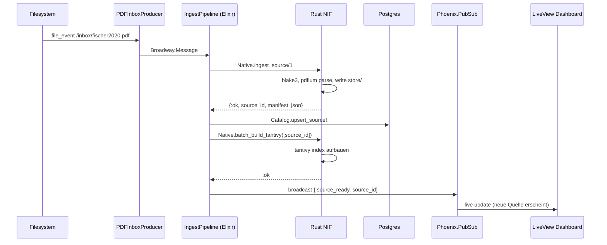
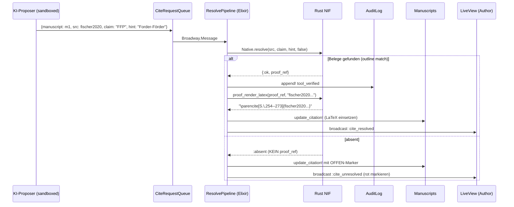
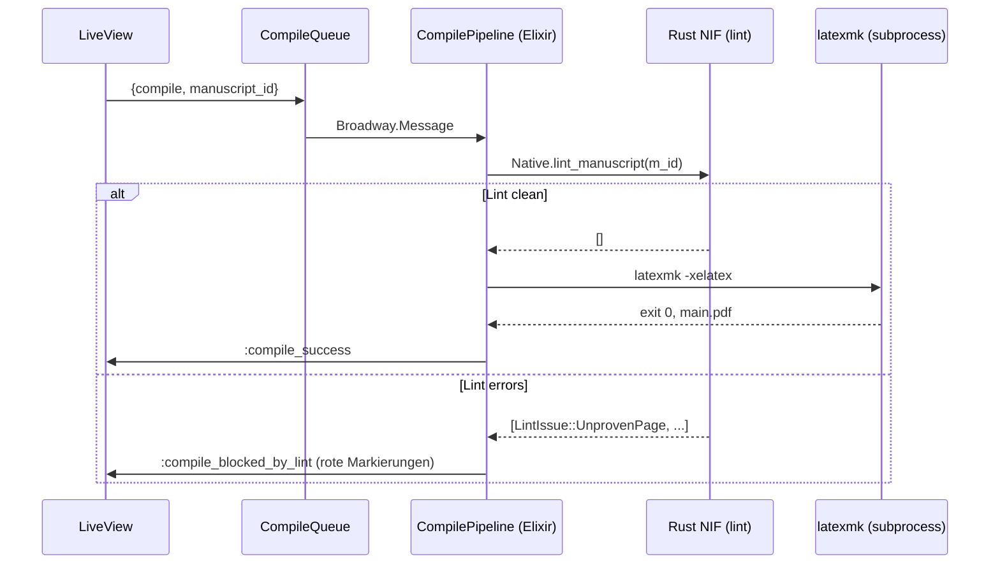

# BELEGPFLICHT_HYBRID.md — Elixir + Rust-NIFs für skalierte, KI-arme Wissenschaftspublikation

> **Zweck:** Dieses Dokument konkretisiert die Hybrid-Architektur aus
> der Diskussion zu `BELEGPFLICHT_GREENFIELD.md`. Es zeigt die exakte
> Aufgabentrennung zwischen Elixir/OTP (Orchestrierung, Fault Tolerance,
> Web) und Rust (Hot-Paths, Type-Safety im kritischen Pfad), inkl. NIF-
> Boundaries, Broadway-Pipelines, Phoenix-LiveView-Dashboard und Single-
> Binary-Distribution.
>
> **Kernidee:** Rust hält die *Wahrheit* (Source-Store, Fact-Konstruktion,
> CitationProof), Elixir hält die *Bewegung* (Pipelines, Cluster, UI).
> Die Hand-off-Schicht zwischen beiden ist ein dünnes, type-sicheres
> NIF-Interface mit *opaque resources*, sodass auch Elixir-Code keinen
> CitationProof aus dem Nichts fabrizieren kann.

---

## 1. Aufgabentrennung Elixir ↔ Rust

Klare, erzwingbare Boundary. Nichts „kann auf beiden Seiten":

| Aufgabe | Layer | Begründung |
|---|---|---|
| Filesystem-Watcher (PDFs in Inbox) | Elixir (`FileSystem`) | I/O-bound, OTP-Supervisor sinnvoll |
| Pipeline-Stages (Ingest, Resolve, Compile) | Elixir (`Broadway`) | Backpressure + Restart out-of-the-box |
| **PDF-Parsing (Outline, Page-Map)** | Rust (`pdfium-render`) | CPU-bound, Library-Reife |
| **Volltext-Extraktion** (`.extracted/poppler.txt`) | Rust (`poppler-rs`) | I/O + CPU, deterministisch |
| **BLAKE3-Hashing** (Source-IDs, Fact-IDs) | Rust (`blake3`) | Hot-Path, SIMD-beschleunigt |
| **Tantivy-Index-Aufbau & Query** | Rust (`tantivy`) | Rust-native, BM25, deutscher Stemmer |
| **`CitationProof`-Konstruktion** | **Rust, ausschließlich** | Type-System verhindert Halluzination |
| **Fact-Store** (Disk-Layout) | Rust | Atomic writes, content-addressed paths |
| Audit-Log (append-only, hash chain) | Elixir (`CubDB` o. sequentielle Files) | sequenziell, OTP-Supervisor schützt |
| Catalog (BibKey ↔ SourceId, Author-Index) | Elixir (`Ecto` + Postgres) | Multi-User, Migrations |
| Manuscript-Tree (Git-style merkle) | Elixir (`Ecto`) + Rust (Hash-NIF) | Read-heavy in Elixir, Hash in Rust |
| Worker-Restart bei Crash | Elixir (`Supervisor`) | OTP-idiomatisch |
| Distributed Cluster | Elixir (`libcluster` + Distributed Erlang) | built-in, kein NATS/Kafka nötig |
| Web-Dashboard (Audit-Stream, Lint-Status) | Elixir (`Phoenix LiveView`) | reaktiv ohne JS, best-in-class |
| CLI (`bibproof ingest|resolve|lint|publish`) | Elixir (`Mix.Tasks`) | gleiche Codebase wie Server |
| Pre-Commit-Hook | Elixir CLI → Rust-NIF | dünn, schnell |

**Die wichtigste Regel:** *Elixir-Code darf einen `CitationProof` nur
empfangen, niemals konstruieren.* Das ist die fail-closed-Garantie auf
Sprach-Ebene.

---

## 2. NIF-Boundary: opaque CitationProof als Resource

Das Herzstück der Architektur. `CitationProof` lebt vollständig in Rust,
Elixir bekommt nur eine `Reference` zurück und kann darauf nur über
read-only-Akzessoren zugreifen.

### 2.1 Rust-Seite (`bibproof_native/src/lib.rs`)

```rust
use rustler::{Atom, Binary, Env, Error, NifResult, ResourceArc, Term};
use std::sync::Arc;

mod atoms {
    rustler::atoms! {
        ok, error, badarg, absent,
        outline, fulltext_match, human_verified,
    }
}

// --- Domain types (kanonisch in Rust definiert) ----------------------

#[derive(Debug, Clone)]
pub struct CitationProof {
    source_id: SourceId,
    page_range: Option<(u32, u32)>,
    evidence: Evidence,
    confidence: f32,
    snippet: String,
    audit_hash: [u8; 32],
}

#[derive(Debug, Clone)]
pub enum Evidence {
    Outline { chapter_nr: u16, chapter_title: String },
    FulltextMatch { bm25_score: f32, gap_to_second: f32 },
    HumanVerified { verifier: String, ts: i64 },
}

impl CitationProof {
    /// Die EINZIGEN Konstruktoren. Privat im Modul.
    /// Niemand außerhalb kann eine CitationProof bauen.
    pub(crate) fn from_outline(src: SourceId, ch: &Chapter) -> Self { /*...*/ }
    pub(crate) fn from_fts_hit(src: SourceId, hit: FtsHit) -> Self { /*...*/ }
    pub(crate) fn from_human(src: SourceId, q: &VerifiedQuote) -> Self { /*...*/ }
    // KEIN pub fn new(...) und KEIN Default-Impl. Halluzination ist nicht tippbar.
}

// --- Resource wrapper (was Elixir sieht) -----------------------------

#[rustler::resource_impl]
pub struct CitationProofResource(Arc<CitationProof>);

// --- NIFs (Elixir-Schnittstelle) -------------------------------------

#[rustler::nif(schedule = "DirtyCpu")]
fn resolve_citation(
    source_id: Binary,
    claim: String,
    chapter_hint: Option<String>,
    require_human: bool,
) -> NifResult<(Atom, ResourceArc<CitationProofResource>)> {
    let src = SourceId::try_from(source_id.as_slice())
        .map_err(|_| Error::BadArg)?;

    let proof = cite_resolver::resolve(
        src, &claim, chapter_hint.as_deref(), require_human,
    );

    match proof {
        Ok(p) => Ok((
            atoms::ok(),
            ResourceArc::new(CitationProofResource(Arc::new(p))),
        )),
        Err(ResolveError::Absent { .. }) => {
            // KEIN Resource! Elixir bekommt nichts, das es weitergeben könnte.
            Err(Error::Term(Box::new(atoms::absent())))
        }
        Err(other) => Err(Error::Term(Box::new(atoms::error()))),
    }
}

// --- Read-only Akzessoren --------------------------------------------

#[rustler::nif]
fn proof_page_range(proof: ResourceArc<CitationProofResource>) -> Option<(u32, u32)> {
    proof.0.page_range
}

#[rustler::nif]
fn proof_evidence(proof: ResourceArc<CitationProofResource>) -> Atom {
    match &proof.0.evidence {
        Evidence::Outline { .. } => atoms::outline(),
        Evidence::FulltextMatch { .. } => atoms::fulltext_match(),
        Evidence::HumanVerified { .. } => atoms::human_verified(),
    }
}

#[rustler::nif]
fn proof_audit_hash(proof: ResourceArc<CitationProofResource>) -> Binary {
    let mut env = Env::elixir(); // pseudo
    Binary::from_owned(proof.0.audit_hash.to_vec(), env)
}

#[rustler::nif]
fn proof_snippet(proof: ResourceArc<CitationProofResource>) -> String {
    proof.0.snippet.clone()
}

#[rustler::nif]
fn proof_render_latex(proof: ResourceArc<CitationProofResource>, bibkey: String) -> String {
    match proof.0.page_range {
        Some((a, b)) if a == b => format!("\\parencite[S.\\,{a}]{{{bibkey}}}"),
        Some((a, b)) => format!("\\parencite[S.\\,{a}--{b}]{{{bibkey}}}"),
        None => format!("\\parencite{{{bibkey}}}"), // fail-closed
    }
}

rustler::init!("Elixir.Bibproof.Native");
```

### 2.2 Elixir-Seite (`lib/bibproof/native.ex`)

```elixir
defmodule Bibproof.Native do
  @moduledoc """
  Type-sichere Hülle um die Rust-NIFs.

  CitationProof ist ein opaker Wert - nur über die hier definierten
  Funktionen lesbar. Es gibt KEINE Möglichkeit, einen CitationProof
  aus Elixir zu konstruieren - der Versuch schlägt mit :badarg fehl.
  """
  use Rustler, otp_app: :bibproof, crate: "bibproof_native"

  # NIF stubs (werden von Rustler überschrieben)
  def resolve_citation(_src, _claim, _hint, _req_human), do: :erlang.nif_error(:nif_not_loaded)
  def proof_page_range(_proof),     do: :erlang.nif_error(:nif_not_loaded)
  def proof_evidence(_proof),       do: :erlang.nif_error(:nif_not_loaded)
  def proof_audit_hash(_proof),     do: :erlang.nif_error(:nif_not_loaded)
  def proof_snippet(_proof),        do: :erlang.nif_error(:nif_not_loaded)
  def proof_render_latex(_proof, _bibkey), do: :erlang.nif_error(:nif_not_loaded)

  # Convenience: Pattern-Match-freundlicher Wrapper
  @spec resolve(binary(), String.t(), keyword()) ::
          {:ok, reference()} | {:error, :absent | :error}
  def resolve(source_id, claim, opts \\ []) do
    hint = Keyword.get(opts, :hint)
    req_human = Keyword.get(opts, :require_human_verified, false)

    case resolve_citation(source_id, claim, hint, req_human) do
      {:ok, proof} -> {:ok, proof}
      :absent -> {:error, :absent}
      _ -> {:error, :error}
    end
  end
end
```

### 2.3 Was Elixir damit kann (und was nicht)

```elixir
# JA - aufrufen, lesen, weiterreichen, in Liste packen:
{:ok, proof} = Bibproof.Native.resolve(source_id, "Forder-Förder-Projekt", hint: "FFP")
{254, 273} = Bibproof.Native.proof_page_range(proof)
:outline = Bibproof.Native.proof_evidence(proof)
"\\parencite[S.\\,254--273]{fischer2020begabungsfoerderung}" =
  Bibproof.Native.proof_render_latex(proof, "fischer2020begabungsfoerderung")

# NEIN - konstruieren:
fake_proof = %{source_id: src, page: 999}  # ist nur eine Map, kein Proof
Bibproof.Native.proof_page_range(fake_proof)  # → ** (ArgumentError) badarg

# NEIN - manipulieren:
# proof ist eine Reference, hat keine Felder. Keine Map-update-Syntax möglich.

# NEIN - aus dem Nichts:
# Es gibt KEIN Bibproof.Native.new_proof/_ in der API.
```

Damit ist die Halluzinations-Lücke auf Sprachebene geschlossen, *auch
für KI-generierten Elixir-Code*. Eine KI könnte zwar versuchen,
`Bibproof.Native.proof_page_range/1` mit einer ausgedachten Map
aufzurufen — bekäme aber `:badarg` vom Type-Check des NIFs zurück.

---

## 3. Broadway-Pipelines konkret

Drei Pipelines, jede mit klarer Verantwortung. Alle nutzen Rust-NIFs
für die CPU-bound Arbeit.

### 3.1 Source-Ingestion

```elixir
defmodule Bibproof.IngestPipeline do
  use Broadway

  alias Broadway.Message
  alias Bibproof.{Native, Catalog, Repo}

  def start_link(_opts) do
    Broadway.start_link(__MODULE__,
      name: __MODULE__,
      producer: [
        module: {Bibproof.PDFInboxProducer, []},
        concurrency: 1,
        transformer: {__MODULE__, :transform, []}
      ],
      processors: [
        default: [
          concurrency: System.schedulers_online(),
          max_demand: 4
        ]
      ],
      batchers: [
        index_tantivy: [
          concurrency: 4,
          batch_size: 8,
          batch_timeout: 5_000
        ]
      ]
    )
  end

  def transform(event, _opts) do
    %Message{
      data: event,
      acknowledger: {Bibproof.PDFInboxProducer, :ack_id, event}
    }
  end

  @impl true
  def handle_message(_processor, %Message{data: pdf_path} = msg, _ctx) do
    case Native.ingest_source(pdf_path) do
      {:ok, source_id, manifest_json} ->
        # Manifest ist on-disk in store/sources/<id>/manifest.cbor (Rust hat geschrieben).
        # Elixir spiegelt nur die Lookup-Indizes ins Postgres.
        Catalog.upsert_source!(source_id, manifest_json)

        msg
        |> Message.update_data(fn _ -> {source_id, manifest_json} end)
        |> Message.put_batcher(:index_tantivy)

      {:error, reason} ->
        Message.failed(msg, "ingest_failed: #{inspect(reason)}")
    end
  end

  @impl true
  def handle_batch(:index_tantivy, messages, _batch_info, _ctx) do
    source_ids = Enum.map(messages, fn %Message{data: {sid, _}} -> sid end)

    # Ein einziger NIF-Call für die ganze Batch - nutzt Rayon im Rust-Code.
    case Native.batch_build_tantivy(source_ids) do
      :ok ->
        Enum.each(source_ids, fn sid ->
          Phoenix.PubSub.broadcast(
            Bibproof.PubSub, "sources:ready", {:source_ready, sid}
          )
        end)
        messages

      {:error, failures} ->
        Enum.map(messages, fn %Message{data: {sid, _}} = msg ->
          if sid in failures do
            Message.failed(msg, "tantivy_index_failed")
          else
            msg
          end
        end)
    end
  end
end
```

### 3.2 Cite-Resolution (das Herzstück gegen Halluzinationen)

```elixir
defmodule Bibproof.ResolvePipeline do
  use Broadway

  alias Broadway.Message
  alias Bibproof.{Native, AuditLog, Manuscripts}

  def start_link(_opts) do
    Broadway.start_link(__MODULE__,
      name: __MODULE__,
      producer: [
        module: {Bibproof.CiteRequestQueue, []},
        concurrency: 1
      ],
      processors: [
        default: [
          concurrency: System.schedulers_online() * 2,  # CPU + Tantivy I/O
          max_demand: 16
        ]
      ]
    )
  end

  @impl true
  def handle_message(_, %Message{data: req} = msg, _) do
    %{
      manuscript_id: m_id,
      cite_location: loc,
      source_id: src,
      claim: claim,
      chapter_hint: hint
    } = req

    case Native.resolve(src, claim, hint: hint, require_human_verified: false) do
      {:ok, proof} ->
        # 1. Audit-Log append (hash-chained)
        audit_id = AuditLog.append!(%{
          fact_source: src,
          evidence: Native.proof_evidence(proof),
          audit_hash: Native.proof_audit_hash(proof),
          tool: "bibproof_resolve/1.0",
          ts: DateTime.utc_now()
        })

        # 2. Manuscript-Linking (Cite-Render einsetzen)
        latex = Native.proof_render_latex(proof, lookup_bibkey(src))
        Manuscripts.update_citation!(m_id, loc, latex, audit_id)

        # 3. Live-Update fürs Dashboard
        Phoenix.PubSub.broadcast(
          Bibproof.PubSub,
          "manuscript:#{m_id}",
          {:cite_resolved, loc, latex, Native.proof_evidence(proof)}
        )
        msg

      {:error, :absent} ->
        # Fail-closed: Cite ohne Seitenangabe + OFFEN-Marker einsetzen
        latex = "\\parencite{#{lookup_bibkey(src)}}% OFFEN: keine Belegstelle gefunden"
        Manuscripts.update_citation!(m_id, loc, latex, nil)

        Phoenix.PubSub.broadcast(
          Bibproof.PubSub,
          "manuscript:#{m_id}",
          {:cite_unresolved, loc, claim}
        )
        msg

      {:error, reason} ->
        Message.failed(msg, "resolve_error: #{inspect(reason)}")
    end
  end
end
```

Beachte: An keiner Stelle in diesem Modul wird eine Seitenzahl
„geraten". Entweder kommt sie aus dem `proof_render_latex`-Call (Rust
hat sie aus Outline/FTS/Human-Verified gezogen), oder es gibt gar keine
Seitenangabe + OFFEN-Marker.

### 3.3 Compile-Pipeline (latexmk mit Lint-Block)

```elixir
defmodule Bibproof.CompilePipeline do
  use Broadway

  alias Broadway.Message
  alias Bibproof.{Native, Manuscripts}

  def start_link(_), do: Broadway.start_link(__MODULE__,
    name: __MODULE__,
    producer: [module: {Bibproof.CompileQueue, []}, concurrency: 1],
    processors: [default: [concurrency: 4, max_demand: 1]]  # latexmk ist RAM-bound
  )

  @impl true
  def handle_message(_, %Message{data: %{manuscript_id: m_id}} = msg, _) do
    with :ok <- run_lint(m_id),
         {:ok, pdf_path} <- run_latexmk(m_id),
         :ok <- attach_audit_bundle(m_id, pdf_path) do
      Phoenix.PubSub.broadcast(
        Bibproof.PubSub,
        "manuscript:#{m_id}",
        {:compile_success, pdf_path}
      )
      msg
    else
      {:error, :lint_failed, issues} ->
        Phoenix.PubSub.broadcast(
          Bibproof.PubSub,
          "manuscript:#{m_id}",
          {:compile_blocked_by_lint, issues}
        )
        Message.failed(msg, "lint_failed")

      {:error, reason} ->
        Message.failed(msg, "compile_error: #{inspect(reason)}")
    end
  end

  defp run_lint(m_id) do
    issues = Native.lint_manuscript(m_id)
    case Enum.filter(issues, & &1.severity == :error) do
      [] -> :ok
      errors -> {:error, :lint_failed, errors}
    end
  end

  defp run_latexmk(m_id) do
    work_dir = Manuscripts.work_dir(m_id)
    System.cmd("latexmk",
      ["-xelatex", "-bibtex", "-interaction=nonstopmode", "main.tex"],
      cd: work_dir, stderr_to_stdout: true
    )
    |> case do
      {_, 0} -> {:ok, Path.join(work_dir, "main.pdf")}
      {output, code} -> {:error, {:latexmk_exit, code, output}}
    end
  end

  defp attach_audit_bundle(m_id, pdf_path) do
    # Bündelt mit dem PDF: audit_chain.jsonl, source_manifests.json, lint_report.json
    Bibproof.AuditBundle.attach!(m_id, pdf_path)
  end
end
```

---

## 4. Phoenix LiveView Dashboard

Drei zentrale Views, alle live aktualisiert über `Phoenix.PubSub`.

### 4.1 Audit-Stream (live mitlesen)

```elixir
defmodule BibproofWeb.AuditLive do
  use BibproofWeb, :live_view

  alias Bibproof.{AuditLog, Native}

  @impl true
  def mount(_params, _session, socket) do
    if connected?(socket) do
      Phoenix.PubSub.subscribe(Bibproof.PubSub, "audit:all")
    end

    {:ok, assign(socket,
      entries: AuditLog.recent(100),
      filter: :all,
      stats: AuditLog.stats_today()
    )}
  end

  @impl true
  def handle_info({:audit_appended, entry}, socket) do
    {:noreply,
      socket
      |> update(:entries, &([entry | Enum.take(&1, 99)]))
      |> update(:stats, &Map.update!(&1, entry.event_type, fn x -> x + 1 end))
    }
  end

  @impl true
  def handle_event("filter", %{"value" => value}, socket) do
    filter = String.to_existing_atom(value)
    {:noreply, assign(socket, filter: filter)}
  end

  @impl true
  def render(assigns) do
    ~H"""
    <div class="audit-dashboard">
      <header class="stats">
        <.stat label="Verifiziert heute" value={@stats.tool_verified} />
        <.stat label="Human-verified" value={@stats.human_verified} />
        <.stat label="Abgelehnt" value={@stats.absent} />
      </header>

      <nav class="filter">
        <button phx-click="filter" value="all">Alle</button>
        <button phx-click="filter" value="absent">Nur Halluzinations-Versuche</button>
      </nav>

      <ul class="audit-stream">
        <%= for entry <- filtered(@entries, @filter) do %>
          <li class={"audit-entry audit-#{entry.event_type}"}
              id={"audit-#{Base.encode16(entry.audit_id, case: :lower)}"}
              phx-mounted={JS.transition("highlight", time: 600)}>
            <time><%= Calendar.strftime(entry.ts, "%H:%M:%S") %></time>
            <span class="actor"><%= entry.actor %></span>
            <span class="event"><%= entry.event_type %></span>
            <code class="fact-id"><%= short(entry.fact_id) %></code>
            <%= if entry.event_type == :absent do %>
              <em class="claim">"<%= entry.claim_summary %>"</em>
              <span class="warning">⚠ Cite ohne Beleg</span>
            <% end %>
          </li>
        <% end %>
      </ul>
    </div>
    """
  end

  defp filtered(entries, :all), do: entries
  defp filtered(entries, :absent), do: Enum.filter(entries, & &1.event_type == :absent)

  defp short(<<a::binary-size(8), _::binary>>), do: a
end
```

### 4.2 Manuscript-Compile-Status (live)

```elixir
defmodule BibproofWeb.ManuscriptLive do
  use BibproofWeb, :live_view

  @impl true
  def mount(%{"id" => m_id}, _, socket) do
    if connected?(socket) do
      Phoenix.PubSub.subscribe(Bibproof.PubSub, "manuscript:#{m_id}")
    end

    {:ok, assign(socket,
      manuscript_id: m_id,
      compile_state: :idle,
      lint_report: nil,
      cites_resolved: 0,
      cites_total: 0,
      pdf_url: nil
    )}
  end

  @impl true
  def handle_info({:cite_resolved, _, _, _}, socket) do
    {:noreply, update(socket, :cites_resolved, & &1 + 1)}
  end

  @impl true
  def handle_info({:cite_unresolved, loc, claim}, socket) do
    # Zeige im UI sofort einen roten Marker an Position loc
    {:noreply, push_event(socket, "highlight_unresolved", %{loc: loc, claim: claim})}
  end

  @impl true
  def handle_info({:compile_blocked_by_lint, issues}, socket) do
    {:noreply, assign(socket, compile_state: :blocked, lint_report: issues)}
  end

  @impl true
  def handle_info({:compile_success, pdf_path}, socket) do
    {:noreply, assign(socket, compile_state: :success, pdf_url: pdf_url(pdf_path))}
  end
end
```

### 4.3 Source-Catalog (Tabelle aller Quellen + Suche)

(Standard-LiveView-Tabelle mit Stream-Resource für 10 000+ Sources, weglassbar
hier — nichts Konzeptionelles Neues.)

---

## 5. Distributed Erlang Cluster mit libcluster

Auf zwei oder mehr Maschinen verteilt — kein zusätzliches Message-System
nötig:

```elixir
# config/runtime.exs
config :libcluster,
  topologies: [
    bibproof_cluster: [
      strategy: Cluster.Strategy.Kubernetes.DNS,
      config: [
        service: "bibproof-headless",
        application_name: "bibproof",
        polling_interval: 5_000
      ]
    ]
  ]

# lib/bibproof/application.ex
def start(_type, _args) do
  topologies = Application.get_env(:libcluster, :topologies)

  children = [
    {Cluster.Supervisor, [topologies, [name: Bibproof.ClusterSupervisor]]},
    Bibproof.Repo,
    {Phoenix.PubSub, name: Bibproof.PubSub, adapter: Phoenix.PubSub.PG2},
    {Finch, name: Bibproof.Finch},

    # Pipelines - eine pro Knoten, durch Cluster koordiniert via Horde
    {Horde.Registry, name: Bibproof.Registry, keys: :unique},
    {Horde.DynamicSupervisor, name: Bibproof.HordeSup, strategy: :one_for_one},

    Bibproof.IngestPipeline,
    Bibproof.ResolvePipeline,
    Bibproof.CompilePipeline,

    BibproofWeb.Telemetry,
    BibproofWeb.Endpoint
  ]

  Supervisor.start_link(children, strategy: :one_for_one, name: Bibproof.Sup)
end
```

`Horde` (built on Distributed Erlang) verteilt Worker-Prozesse über
Knoten und übernimmt Failover, wenn ein Knoten ausfällt. `Phoenix.PubSub`
mit `PG2`-Adapter macht das LiveView-Dashboard automatisch
cluster-aware: Audit-Events von Knoten A erscheinen live bei einem User,
der mit Knoten B verbunden ist.

**Was das ersetzt:** NATS, Kafka, Redis, separate Coordination-Layer.
Alles in der BEAM eingebaut.

---

## 6. Single-Binary-Distribution mit Burrito

Trotz Hybrid-Stack: ein einziges ausführbares Binary für jede Plattform.

```elixir
# mix.exs
defp releases do
  [
    bibproof: [
      include_executables_for: [:unix],
      applications: [runtime_tools: :permanent],
      steps: [:assemble, &Burrito.wrap/1],
      burrito: [
        targets: [
          macos_arm: [os: :darwin, cpu: :aarch64],
          macos_x86: [os: :darwin, cpu: :x86_64],
          linux_arm:  [os: :linux,  cpu: :aarch64],
          linux_x86:  [os: :linux,  cpu: :x86_64],
          win_x86:    [os: :windows, cpu: :x86_64]
        ]
      ]
    ]
  ]
end
```

`Burrito` packt:
- Erlang/OTP Runtime (~25 MB)
- Elixir Standard Library
- Alle Hex-Dependencies (Phoenix, Broadway, Ecto, Rustler, …)
- **Kompiliertes Rust-NIF** (`bibproof_native.so` / `.dll` / `.dylib`)
- Phoenix-Assets (CSS/JS für LiveView)

Resultat: ein ~60–80 MB Binary pro Plattform, das ohne System-Dependencies
läuft. Aufruf:

```bash
./bibproof_macos_arm ingest path/to/sources/
./bibproof_macos_arm lint manuscripts/mpv-merolli/
./bibproof_macos_arm publish manuscripts/mpv-merolli/
./bibproof_macos_arm server --port 4000   # Dashboard
```

Vergleich Footprint:

| Stack | Binary-Größe | Cold-Start |
|---|---|---|
| pure Rust | ~25 MB | ~50 ms |
| Hybrid (Elixir + Rust NIFs via Burrito) | ~70 MB | ~800 ms |
| Pure Elixir mit ExDoc-style PDF-Tools | ~50 MB | ~600 ms |

Der Hybrid-Trade-off: ~1 sec mehr Cold-Start, dafür Multi-Tenant-Service
und Web-Dashboard inklusive.

---

## 7. Source-Store-Synchronisation: wer schreibt wo?

Heikles Thema bei Hybrid-Stacks. Klare Regel:

**Rust schreibt (atomare File-Operationen) → Elixir liest und spiegelt
in Postgres.**

```
Disk Layout (Rust-owned):                Postgres (Elixir-owned):
  store/sources/<id>/                       sources(id, bibkey, title,
    ├── source.pdf                                  authors, year,
    ├── manifest.cbor                               manifest_path,
    ├── extracted/                                  ingested_at)
    │   ├── poppler.txt                       sources_chapters(source_id,
    │   └── pypdf.txt                                nr, title, page_start,
    ├── excerpts/                                   page_end)
    │   └── 022_*.pdf                         sources_keywords(source_id,
    └── tantivy/                                    keyword, weight)
        └── (FTS-Index)                       audit_log(audit_id, prev_id,
                                                    fact_source, event_type,
                                                    ts, payload)
                                              manuscripts(...)
                                              manuscript_citations(...)
```

Sync-Pfad:

1. Rust ingestiert PDF → schreibt `manifest.cbor` atomic.
2. Rust emittiert Event `:source_ready` über NIF-Callback nach Elixir.
3. Elixir's `Bibproof.Catalog.upsert_source!/2` liest `manifest.cbor`
   (Rust-NIF `read_manifest`) und projeziert in Postgres-Tabellen.
4. Postgres ist read-only-View für Schnellsuche; Wahrheit bleibt auf
   Disk in `store/`.

Falls Postgres-View und Disk auseinanderlaufen: ein `bibproof catalog
rebuild`-Command iteriert Disk und re-populiert Postgres. Disk ist
authoritative.

---

## 8. Konkrete Datenflüsse

### 8.1 „Forscher droppt PDF in Inbox"



### 8.2 „KI schlägt Cite vor"



### 8.3 „Author drückt 'Compile' im Dashboard"



---

## 9. Was diese Architektur für Halluzinationen bedeutet

Die fail-closed-Garantie wird auf drei Ebenen erzwungen:

1. **Rust Type-System.** `CitationProof` hat private Konstruktoren.
   Niemand außerhalb des `cite_resolver`-Moduls kann eine Instanz
   bauen.
2. **NIF-Boundary.** Elixir bekommt `CitationProof` nur als opaque
   `ResourceArc`. Keine Möglichkeit, Felder zu manipulieren oder eine
   gefälschte Map als Proof unterzuschieben — `:badarg` schlägt zu.
3. **Pipeline-Logik.** `ResolvePipeline` schreibt eine Cite mit
   Seitenangabe *nur* in einem `{:ok, proof}`-Branch. Im
   `{:error, :absent}`-Branch wird ausschließlich `\parencite{key}` ohne
   Seite + OFFEN-Marker geschrieben. Das ist im Code direkt sichtbar.

Selbst wenn ein KI-Agent Elixir-Code schreibt, kann er an keiner
dieser Ebenen vorbei. Die Architektur ist *halluzinations-resistent
by construction*, nicht durch Konvention.

---

## 10. Konkreter Migrationspfad ab heute

### Phase A — Rust-Kern allein, ohne Elixir (Woche 1)

- `bibproof_native` Cargo-Crate als Library + `bibproof` CLI-Binary
- Implementiert: `ingest_source`, `resolve_citation`, `lint_manuscript`,
  Atomic Write, BLAKE3, Tantivy
- Read von TeX, Write von Audit-Log, alles direkt
- Genau wie in `BELEGPFLICHT_GREENFIELD.md` Phase 0
- **Liefert sofort Wert für dieses MPV-Repo:** `bibproof lint mpv.tex`
  hätte heute Nachmittag meine erfundenen Seitenangaben blockiert

### Phase B — Elixir-Wrapper für Web + Multi-Manuskript (Woche 2–3)

- `bibproof_native` als Rustler-Crate verpacken
- Mix-Projekt `bibproof` mit Phoenix + Broadway
- `Bibproof.Native` Modul mit den NIF-Stubs
- Source-Store bleibt unverändert auf Disk (Rust schreibt, Elixir
  liest)
- Erste Pipeline: `IngestPipeline` mit Filesystem-Watcher
- LiveView-Dashboard für Audit-Stream

### Phase C — Verteilung (Woche 4–6)

- libcluster-Topology
- Horde für verteilte Worker
- Source-Store auf S3 spiegeln (immutable, content-addressed = trivial)
- Postgres als shared Catalog
- OAuth-Login für menschliche Verifikation, ed25519-Signaturen

### Phase D — Open Source / SaaS (open-ended)

- Docker-Image für self-hosted
- Hosted Variante als bibproof.io (oder ähnlich)
- Plugin für Obsidian/Logseq mit lokaler `bibproof`-Binary
- Föderierter Fact-Austausch (Facts sind content-addressed → natürlich
  föderierbar; Forschungsgruppen können sich Verifikations-Ergebnisse
  teilen ohne Zentralserver)

---

## 11. Vergleich: Pure Rust vs. Pure Elixir vs. Hybrid

| Kriterium | Pure Rust | Pure Elixir | **Hybrid (Empfehlung)** |
|---|---|---|---|
| Performance Hot-Path | exzellent | mässig (5–20× langsamer) | **exzellent** (gleicher Rust-Code) |
| Pipeline-Orchestrierung | tokio (DIY) | Broadway (built-in) | **Broadway (built-in)** |
| Fault Tolerance | manuelle Supervision | OTP Supervisor-Trees | **OTP Supervisor-Trees** |
| Distributed Computing | externes MQ (NATS/Kafka) | Distributed Erlang built-in | **Distributed Erlang built-in** |
| Hot Code Reload | nein | ja | **ja** (BEAM-Layer) |
| Web Dashboard | DIY (axum + Leptos) | Phoenix LiveView | **Phoenix LiveView** |
| Type-Safety im Hot-Path | Ownership + Borrow Checker | Dialyzer (schwächer) | **Rust-Garantien via NIF-Resource** |
| Halluzinations-Resistenz | sehr hoch (private Konstruktoren) | mittel (Konvention) | **sehr hoch** (Rust hält Wahrheit) |
| Build-Zeiten | langsam (Rust) | schnell (Elixir) | mittel (Elixir kompilliert schnell, Rust-NIF nur bei Änderung) |
| Single-Binary | ~25 MB, 50 ms cold-start | ~50 MB, 600 ms cold-start | ~70 MB, 800 ms cold-start |
| Lernkurve fürs Team | steil (Rust) | mittel (Elixir+OTP) | **mittel-hoch** (Elixir oben, Rust unten) |
| Ökosystem PDF/FTS | exzellent (tantivy, pdfium-render) | dünn (über NIFs verfügbar) | **exzellent (über Rust-NIFs)** |
| Beste Nische | Single-Tenant CLI / Embedded | Web-Apps mit moderater CPU | **Multi-Tenant Service mit verteilter Pipeline** |

**Verdikt:** Für dein Szenario (langfristig wissenschaftliches
Publikations-Backend mit potenzieller Skalierung über Forschungsgruppen
hinweg) ist **Hybrid** die strategisch beste Wahl. Phase A liefert
sofortigen Wert, Phase B/C/D bauen drauf auf, *ohne den Rust-Kern
umzuschreiben*.

---

## 12. Persönliches Schlusswort

Die Hybrid-Architektur ist nicht halb-Rust und halb-Elixir, sondern
**Rust für Wahrheit, Elixir für Bewegung**. Diese Aufteilung ist nicht
willkürlich — sie spiegelt die zwei fundamentalen Eigenschaften des
Problems:

- **Wahrheit ist statisch und immutable.** Eine Source-PDF, ein Fact,
  ein verifiziertes Zitat — das sind unveränderliche Werte mit
  kryptographischen Identitäten. Rust ist die richtige Sprache, weil
  ihr Type-System Immutabilität und Identität auf Compiler-Ebene
  erzwingt.
- **Bewegung ist dynamisch und konkurrent.** 1 000 parallele
  Manuskripte, ein crashender Worker, ein neuer Cluster-Knoten, ein
  Live-User im Dashboard — das sind dynamische Phänomene mit Failure-
  Modi. BEAM/OTP ist die richtige Plattform, weil ihre Concurrency-
  und Fault-Tolerance-Primitive auf genau diese Klasse von Problemen
  zugeschnitten sind.

Beide Sprachen haben in ihrer Domäne eine Reife erreicht, die *zusammen*
eine Architektur ergibt, die in der Wissenschafts-Tooling-Landschaft
heute nirgends sonst existiert. Und genau das ist der strategische
Hebel: nicht das nächste KI-Modell, sondern **eine Plattform, die KI
als Beschleuniger nutzt, ohne ihr im kritischen Pfad zu vertrauen**.

---

*Erstellt: 2026-04-24, als drittes Designdokument der BELEGPFLICHT-
Reihe, parallel zu `BELEGPFLICHT.md` (Bestand-Aufbesserung) und
`BELEGPFLICHT_GREENFIELD.md` (Pure-Rust-Greenfield). Die drei
Dokumente bilden eine Migrations-Leiter: heutiger Bestand →
Pure-Rust-MVP → Hybrid-Plattform.*
