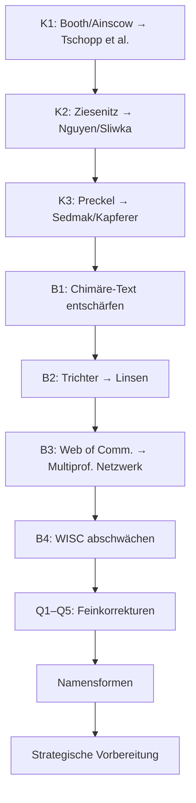

# Härtungsplan Visualisierung MPV – Konsolidierte Korrekturliste

> [!IMPORTANT]
> Massstab ist das offizielle Literaturverzeichnis im Abgabedokument (`mpv_abgabedokument.tex`). Was dort nicht steht, kann im Plakat nicht als Beleg fungieren.

---

## Priorität 1: Kritische Quellenkorrekturen (sofort)

### K1 · Frage 3: Booth/Ainscow ersetzen

**Problem:** Booth & Ainscow sind im Dossier-Literaturverzeichnis **nicht verzeichnet**. Sie erscheinen aber als Doppelportrait in der SVG (`Booth+Ainscow`) und werden in den Karten 3.2, 3.4, 3.5 mehrfach zitiert.

**Betroffene Dateien:**
| Datei | Zeilen/Stellen | Inhalt |
|---|---|---|
| [Frage3.md](file:///c:/Users/PascalSchmid/OneDrive%20-%20dxy/Kunden/fxyz/SHP/Masterarbeit%20Vertiefung%20OneDrive/MPV/26-MPV/Visualisierung/Frage3.md#L110-L114) | Z.110–114 | Portrait 4: Booth/Ainscow |
| [Frage3.md](file:///c:/Users/PascalSchmid/OneDrive%20-%20dxy/Kunden/fxyz/SHP/Masterarbeit%20Vertiefung%20OneDrive/MPV/26-MPV/Visualisierung/Frage3.md#L130) | Z.130 | Karte 3.2: `Booth/Ainscow 2019` |
| [Frage3.md](file:///c:/Users/PascalSchmid/OneDrive%20-%20dxy/Kunden/fxyz/SHP/Masterarbeit%20Vertiefung%20OneDrive/MPV/26-MPV/Visualisierung/Frage3.md#L138) | Z.138 | Karte 3.4: `Booth/Ainscow Dimension A und B` |
| [Frage3.md](file:///c:/Users/PascalSchmid/OneDrive%20-%20dxy/Kunden/fxyz/SHP/Masterarbeit%20Vertiefung%20OneDrive/MPV/26-MPV/Visualisierung/Frage3.md#L142) | Z.142 | Karte 3.5: `Booth/Ainscow` |
| [solux_frage3_layout.svg](file:///c:/Users/PascalSchmid/OneDrive%20-%20dxy/Kunden/fxyz/SHP/Masterarbeit%20Vertiefung%20OneDrive/MPV/26-MPV/Visualisierung/solux_frage3_layout.svg#L88) | Z.88 | Portrait-Label `Booth+Ainscow` |
| [Frage3.md](file:///c:/Users/PascalSchmid/OneDrive%20-%20dxy/Kunden/fxyz/SHP/Masterarbeit%20Vertiefung%20OneDrive/MPV/26-MPV/Visualisierung/Frage3.md#L73) | Z.73 | Filter 3: `Index für Inklusion` |
| [Frage1.md](file:///c:/Users/PascalSchmid/OneDrive%20-%20dxy/Kunden/fxyz/SHP/Masterarbeit%20Vertiefung%20OneDrive/MPV/26-MPV/Visualisierung/Frage1.md#L105) | Z.105 | Querverweis `analog zu Booth/Ainscow` |

**Korrektur:**
- Portrait 4 → **Tschopp, Buholzer & Grütter** · Stichwort: *Intergruppenkontakt, soziale Teilhabe*
- Filter 3: `Teilhabe / Index für Inklusion` → `Teilhabe / Intergruppenkontakt`
- Karte 3.2: `Booth/Ainscow 2019` → `Tschopp, Buholzer & Grütter 2022`
- Karte 3.4: `Inklusive Strukturen anregen (Booth/Ainscow Dimension A und B)` → `Soziale Teilhabe strukturieren (Tschopp, Buholzer & Grütter 2022)`
- Karte 3.5: `ob alle SuS als gleichwertige Mitglieder gelten (Booth/Ainscow)` → `ob strukturierte Intergruppenkontakte sozialer Teilhabe dienen (Tschopp et al. 2022)`
- SVG: `Booth+Ainscow` → `Tschopp+B.+G.`
- Frage1.md Z.105: Querverweis `analog zu Booth/Ainscow` → `als Doppelportrait`

---

### K2 · Frage 5: Ziesenitz ersetzen

**Problem:** Ziesenitz ist im Dossier-Literaturverzeichnis **nicht verzeichnet**. Erscheint als Portrait 5 und auf Karte 5.4.

**Betroffene Dateien:**
| Datei | Zeilen/Stellen | Inhalt |
|---|---|---|
| [Frage5.md](file:///c:/Users/PascalSchmid/OneDrive%20-%20dxy/Kunden/fxyz/SHP/Masterarbeit%20Vertiefung%20OneDrive/MPV/26-MPV/Visualisierung/Frage5.md#L132-L134) | Z.132–134 | Portrait 5: Ziesenitz |
| [Frage5.md](file:///c:/Users/PascalSchmid/OneDrive%20-%20dxy/Kunden/fxyz/SHP/Masterarbeit%20Vertiefung%20OneDrive/MPV/26-MPV/Visualisierung/Frage5.md#L103) | Z.103 | Element 4: `Routenplan nach Ziesenitz` |
| [Frage5.md](file:///c:/Users/PascalSchmid/OneDrive%20-%20dxy/Kunden/fxyz/SHP/Masterarbeit%20Vertiefung%20OneDrive/MPV/26-MPV/Visualisierung/Frage5.md#L154) | Z.154 | Karte 5.4: `Routenplan nach Ziesenitz` |
| [solux_frage5_layout.svg](file:///c:/Users/PascalSchmid/OneDrive%20-%20dxy/Kunden/fxyz/SHP/Masterarbeit%20Vertiefung%20OneDrive/MPV/26-MPV/Visualisierung/solux_frage5_layout.svg#L102) | Z.102 | Portrait-Label `Ziesenitz` |

**Korrektur:**
- Portrait 5 → **Nguyen & Sliwka** · Stichwort: *Lehrpersonenkompetenzen, Screening*
- `Routenplan nach Ziesenitz` → generische Vier-Schritt-Sequenz ohne Personenzuschreibung: `Beobachten → Dokumentieren → Diagnostik einbeziehen → Förderplan im Team`
- Karte 5.4: Personenzuschreibung entfernen
- SVG: `Ziesenitz` → `Nguyen/Sl.`

---

### K3 · Zentrum (Frage 4): Preckel ersetzen

**Problem:** `Preckel 2021` (Talent Development Framework, S. 274–289) existiert als separate Quelle **nicht** im Dossier. Nur `Preckel & Baudson 2013` (Frage 1, nicht Frage 4) ist verzeichnet.

**Betroffene Dateien:**
| Datei | Zeilen/Stellen | Inhalt |
|---|---|---|
| [Frage4.md](file:///c:/Users/PascalSchmid/OneDrive%20-%20dxy/Kunden/fxyz/SHP/Masterarbeit%20Vertiefung%20OneDrive/MPV/26-MPV/Visualisierung/Frage4.md#L87-L89) | Z.87–89 | Portrait 5: Preckel / TAD |
| [Frage4.md](file:///c:/Users/PascalSchmid/OneDrive%20-%20dxy/Kunden/fxyz/SHP/Masterarbeit%20Vertiefung%20OneDrive/MPV/26-MPV/Visualisierung/Frage4.md#L107) | Z.107 | Karte 4.2: `Preckel 2021, S. 274-289` |
| [solux_zentrum_layout.svg](file:///c:/Users/PascalSchmid/OneDrive%20-%20dxy/Kunden/fxyz/SHP/Masterarbeit%20Vertiefung%20OneDrive/MPV/26-MPV/Visualisierung/solux_zentrum_layout.svg#L41) | Z.41 | Portrait-Label `Preckel` |
| [solux_zentrum_layout.svg](file:///c:/Users/PascalSchmid/OneDrive%20-%20dxy/Kunden/fxyz/SHP/Masterarbeit%20Vertiefung%20OneDrive/MPV/26-MPV/Visualisierung/solux_zentrum_layout.svg#L46) | Z.46 | Stichwort `TAD` |

**Korrektur:**
- Portrait 5 → **Sedmak & Kapferer** · Stichwort: *Begabungsgerechtigkeit*
- Karte 4.2: `Talententwicklung in vier Stationen (Preckel 2021)` → `Begabtenförderung als Gerechtigkeitsfrage (Sedmak & Kapferer 2021)`
- SVG: `Preckel` → `Sedmak` und `TAD` → `Gerechtigk.`

---

## Priorität 2: Begriffskorrekturen (wichtig)

### B1 · Zentrum: „Chimäre im Fenster" entschärfen

**Problem:** Der sichtbare Text `Chimäre im Fenster` im SVG-Zentrum (Z.22–23) kann als mythologische Überformung oder Pathologisierung gelesen werden.

**Korrektur SVG:** `Chimäre` / `im Fenster` → `S. im` / `SOLUX-Fenster`

**Korrektur Frage4.md:** Ergänzung im Zentrum eines Fallankers:
> **Bei S. sichtbar:** Muster · Strategie · Ausdauer · Peer-Aufmerksamkeit

---

### B2 · Frage 3: „Anerkennungs-Trichter" umbenennen

**Problem:** „Trichter" suggeriert Verengung/Selektion – das Gegenteil der Intention.

**Betroffene Stellen:**
- [Frage3.md](file:///c:/Users/PascalSchmid/OneDrive%20-%20dxy/Kunden/fxyz/SHP/Masterarbeit%20Vertiefung%20OneDrive/MPV/26-MPV/Visualisierung/Frage3.md#L19) Z.19: Titel auf Deckel
- [Frage3.md](file:///c:/Users/PascalSchmid/OneDrive%20-%20dxy/Kunden/fxyz/SHP/Masterarbeit%20Vertiefung%20OneDrive/MPV/26-MPV/Visualisierung/Frage3.md#L45) Z.45: Überschrift Schicht C
- [Frage3.md](file:///c:/Users/PascalSchmid/OneDrive%20-%20dxy/Kunden/fxyz/SHP/Masterarbeit%20Vertiefung%20OneDrive/MPV/26-MPV/Visualisierung/Frage3.md#L156) Z.156: Schritt 3
- [Frage3.md](file:///c:/Users/PascalSchmid/OneDrive%20-%20dxy/Kunden/fxyz/SHP/Masterarbeit%20Vertiefung%20OneDrive/MPV/26-MPV/Visualisierung/Frage3.md#L204) Z.204: Karten-Lasche
- SVG-Titel und `<desc>`
- Couvert-Beschriftung `Q3 Trichter-Karten`

**Korrektur:** Alle Vorkommen von `Anerkennungs-Trichter` → **`Anerkennungs-Linsen`** und `Q3 Trichter-Karten` → `Q3 Linsen-Karten`

---

### B3 · Frage 5: „Web of Communication" umbenennen

**Problem:** Stammt aus Gubbins et al. 2020 – nicht im offiziellen Quellenkorpus.

**Betroffene Stellen:**
- [Frage5.md](file:///c:/Users/PascalSchmid/OneDrive%20-%20dxy/Kunden/fxyz/SHP/Masterarbeit%20Vertiefung%20OneDrive/MPV/26-MPV/Visualisierung/Frage5.md#L17) Z.17: Deckeltitel
- [Frage5.md](file:///c:/Users/PascalSchmid/OneDrive%20-%20dxy/Kunden/fxyz/SHP/Masterarbeit%20Vertiefung%20OneDrive/MPV/26-MPV/Visualisierung/Frage5.md#L47) Z.47: Hauptbild-Überschrift
- SVG-Titel und `<desc>`, Z.10, Z.2

**Korrektur:** `Web of Communication` → **`Multiprofessionelles Netzwerk`**

---

### B4 · Frage 1: WISC-Formulierung abschwächen

**Problem:** `WISC-V (deutschsprachig)` mit X wirkt wie pauschale Testablehnung.

**Betroffene Stellen:**
- [Frage1.md](file:///c:/Users/PascalSchmid/OneDrive%20-%20dxy/Kunden/fxyz/SHP/Masterarbeit%20Vertiefung%20OneDrive/MPV/26-MPV/Visualisierung/Frage1.md#L21) Z.21: Deckelbeschreibung
- SVG Z.12: `WISC-V (deutsch)` und Z.15: `Deutsch A1, unauswertbar`

**Korrektur:**
- `WISC-V (deutschsprachig)` → `Sprachgebundene Testung auf Deutsch`
- `unauswertbar` → `begrenzt aussagekräftig`
- Kreuz nur über Sprachzeile, nicht ganzes Testblatt

---

### B5 · Frage 5: SHP-Trias-Begriffe vollständig

**Problem:** SVG zeigt zu stark verkürzte Begriffe: `Lot Unabhängigkeit`, `Profile Partnerschaft`, `Auge Wachsamkeit`.

**Korrektur SVG:**
- `Lot` / `Unabhängigkeit` → `Senklot` / `Fachl. Unabhängigkeit`
- `Profile` / `Partnerschaft` → `Profile` / `Refl. Partnerschaftl.`
- `Auge` / `Wachsamkeit` → `Kompass` / `Instit. Wachsamkeit`

---

## Priorität 3: Feinabstimmung Quellengewichtung

### Q1 · Frage 1: MIRAGE entfernen

**Problem:** Stamm 2014/MIRAGE ist nicht als eigene Quelle im Dossier. Nur Stamm 2021 und Stamm 2025.

| Datei | Stelle | Korrektur |
|---|---|---|
| [Frage1.md](file:///c:/Users/PascalSchmid/OneDrive%20-%20dxy/Kunden/fxyz/SHP/Masterarbeit%20Vertiefung%20OneDrive/MPV/26-MPV/Visualisierung/Frage1.md#L90) Z.90 | Portrait: `MIRAGE, begabte Minoritäten` | → `begabte Minoritäten` |
| [Frage1.md](file:///c:/Users/PascalSchmid/OneDrive%20-%20dxy/Kunden/fxyz/SHP/Masterarbeit%20Vertiefung%20OneDrive/MPV/26-MPV/Visualisierung/Frage1.md#L91) Z.91 | Mündl. Anbindung: `MIRAGE-Studie` | → `Stamm 2021: begabte Minoritäten` |
| [Frage1.md](file:///c:/Users/PascalSchmid/OneDrive%20-%20dxy/Kunden/fxyz/SHP/Masterarbeit%20Vertiefung%20OneDrive/MPV/26-MPV/Visualisierung/Frage1.md#L121) Z.121 | Karte 1.2: `MIRAGE-Studie` | → `begabte Minoritäten (Stamm 2021)` |

---

### Q2 · Frage 1: Baudson-Jahreszahl korrigieren

**Problem:** Karte 1.2 nennt `Baudson 2025` – das ist aber Stützliteratur F1, nicht Kernliteratur. Baudson 2021 wäre korrekt für Lehrkrafturteil-Empirie.

| Datei | Stelle | Korrektur |
|---|---|---|
| [Frage1.md](file:///c:/Users/PascalSchmid/OneDrive%20-%20dxy/Kunden/fxyz/SHP/Masterarbeit%20Vertiefung%20OneDrive/MPV/26-MPV/Visualisierung/Frage1.md#L121) Z.121 | `Baudson 2025` | → `Baudson 2021` |
| [Frage1.md](file:///c:/Users/PascalSchmid/OneDrive%20-%20dxy/Kunden/fxyz/SHP/Masterarbeit%20Vertiefung%20OneDrive/MPV/26-MPV/Visualisierung/Frage1.md#L98) Z.98 | Stichwort `Fairness` | → `Lehrkrafturteil, implizite Theorien` |

---

### Q3 · Frage 2: GRAFOS auf GRAFINK reduzieren

**Problem:** GRAFOS (Sägesser/Eckhart 2016) ist im Dossier nicht separat verzeichnet.

| Datei | Stelle | Korrektur |
|---|---|---|
| [Frage2.md](file:///c:/Users/PascalSchmid/OneDrive%20-%20dxy/Kunden/fxyz/SHP/Masterarbeit%20Vertiefung%20OneDrive/MPV/26-MPV/Visualisierung/Frage2.md#L100) Z.100 | `GRAFINK, GRAFOS` | → `GRAFINK-Rahmenmodell` |
| SVG Z.89 | `GRAFINK` | ✅ korrekt, belassen |

---

### Q4 · Frage 2: Kausalitätssprache abschwächen

| Datei | Stelle | Ist | Soll |
|---|---|---|---|
| [Frage2.md](file:///c:/Users/PascalSchmid/OneDrive%20-%20dxy/Kunden/fxyz/SHP/Masterarbeit%20Vertiefung%20OneDrive/MPV/26-MPV/Visualisierung/Frage2.md#L127) Z.127 | Karte 2.1 | `durchbricht` | `reduziert … und macht bearbeitbar` |
| [Frage2.md](file:///c:/Users/PascalSchmid/OneDrive%20-%20dxy/Kunden/fxyz/SHP/Masterarbeit%20Vertiefung%20OneDrive/MPV/26-MPV/Visualisierung/Frage2.md#L143) Z.143 | Karte 2.5 | `entfallen zwei der drei Belastungen` | `werden … reduziert und kontrollierbarer` |

---

### Q5 · Frage 4: Drehtürmodell auf Karte abschwächen

| Datei | Stelle | Korrektur |
|---|---|---|
| [Frage4.md](file:///c:/Users/PascalSchmid/OneDrive%20-%20dxy/Kunden/fxyz/SHP/Masterarbeit%20Vertiefung%20OneDrive/MPV/26-MPV/Visualisierung/Frage4.md#L107) Z.107 | `Drei Enrichment-Typen, Drehtürmodell` | → `SEM, drei Enrichment-Typen. Förderung geht der Identifikation voraus.` |

---

## Priorität 4: Namensformen-Korrekturen

| Ist-Form | Soll-Form | Betroffene Dateien |
|---|---|---|
| `Hurschler` | **Hurschler Lichtsteiner** | Frage2.md Z.107–109, SVG F2 Z.86 |
| `Sägesser` / `Saegesser` | **Sägesser Wyss** | Frage2.md Z.99, SVG F2 Z.84 |
| `Marion Gauck und Carolin Reimann` | **Gauck, L. & Reimann, G.** (Vornamen aus Dossier) | Frage1.md Z.101 |
| `Haag` (allein) | **Haag et al.** | Frage1.md Z.107 |
| `Gräsel` (allein als Hauptname) | **Grosche et al.** oder Grosche/Fussangel/Gräsel | Frage5.md Z.118–120 |
| `M.-Oppl.` im Zentrum (ambig) | Stichwort präzisieren: V. Müller-Oppliger → *Plurale Gesellschaft, Lernarchitekturen* | Frage4.md Z.80, SVG Zentrum Z.44 |

---

## Priorität 5: Strategische Gewichtungsfragen (verteidigbar, aber vorbereiten)

### S1 · Frage 5: Kummer Wyss als Stützliteratur

Kummer Wyss 2017 ist **Stützliteratur** F5, nicht Kernliteratur. Als erstes Portrait in der SVG (Z.98: `K. Wyss`) ist das eine Übergewichtung. **Empfehlung:** Beibehalten, aber mündliche Verteidigung vorbereiten:
> *Kummer Wyss ist Herausgeberin des Sammelbands, in dem mehrere meiner Schweizer Kernreferenzen erschienen sind.*

### S2 · Frage 1: Karte 1.5 CFT/NNAT/TONI

Diese Testabkürzungen sind im Dossier nicht direkt verankert. **Empfehlung:** Auf `nonverbale Verfahren (vgl. Haag et al. 2018)` reduzieren.

### S3 · Zentrum: Weigand-Stichwort

SVG zeigt `Personenpr.` – gehört stärker zu F5. Für Zentrum (F4) besser: `inkl. Begabungsf.`

---

## Beibehalten (bestätigt)

- ✅ Frage 4 im Zentrum, vier Ringbereiche im Uhrzeigersinn
- ✅ Verbenlogik: Erkennen → Entlasten → Anerkennen → Sichtbar machen → Sichern
- ✅ Drei-Schicht-Architektur (Deckel, Innenseite, Hauptbild)
- ✅ Fünf-Karten-System pro Couvert
- ✅ Defizit-Deckel als Aufdeckungsdramaturgie
- ✅ Goldfunken nur dezent als Kohärenzmotiv
- ✅ Frage 2 (Schrift-Schach-Brücke) – wissenschaftlich am saubersten
- ✅ Chimäre als Bildmotiv im Zentrum (quellengestützt via Baum/Schader 2021)
- ✅ SHP-Trias als eigene Synthese (korrekt markiert)
- ✅ Kontrastfrage im F5-Dreieck

---

## Umsetzungsreihenfolge

> [!TIP]
> Die drei kritischen Korrekturen (K1–K3) betreffen jeweils **ein Portrait + eine bis drei Karten + eine SVG-Stelle**. Der Aufwand ist überschaubar, weil das offizielle Dossier intern konsistent ist und ausreichend Ersatzquellen bereithält.
