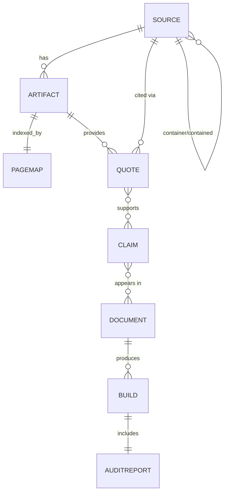

# Wissenschaftliches Schreibsystem (WSS)

**Architektur- und Umsetzungsplan**

| Feld | Wert |
|---|---|
| Dokument | `docs/WSS-Systemarchitektur.md` |
| Status | Entwurf v1.0 |
| Datum | 2026-05-15 |
| Autor | Architektur-Diskussion auf Basis des MPV-Repos |
| Ziel | Vollständige Spezifikation eines Systems, das wissenschaftliches Arbeiten von Quellenaufnahme bis Abgabe end-to-end unterstützt |
| Primärer Anwendungsfall | Masterarbeiten |
| Bevorzugte Sprache | Julia (mit dokumentierten Fallbacks) |
| Quellen der Erkenntnisse | MPV-Repo (siehe Abschnitt 2), eigene Skript-Erfahrungen |

---

## Inhaltsverzeichnis

1. [Executive Summary](#1-executive-summary)
2. [Lessons Learned aus dem MPV-Repo](#2-lessons-learned-aus-dem-mpv-repo)
3. [Vision und Anwendungsfälle](#3-vision-und-anwendungsfaelle)
4. [Glossar](#4-glossar)
5. [Domänenmodell](#5-domaenenmodell)
6. [Architekturüberblick](#6-architekturueberblick)
7. [Modulspezifikationen](#7-modulspezifikationen)
8. [Tech-Stack und Begründungen](#8-tech-stack-und-begruendungen)
9. [Datenmodell und Storage](#9-datenmodell-und-storage)
10. [Schnittstellen (CLI, Bibliothek, Web)](#10-schnittstellen)
11. [Roadmap und Meilensteine](#11-roadmap-und-meilensteine)
12. [Test- und Qualitätsstrategie](#12-test--und-qualitaetsstrategie)
13. [Betrieb, Build und CI/CD](#13-betrieb-build-und-cicd)
14. [Risiken und Mitigationen](#14-risiken-und-mitigationen)
15. [Migrationsplan: MPV-Repo → WSS](#15-migrationsplan-mpv-repo-wss)
16. [Anhang A: Beispiel-Workflows](#16-anhang-a-beispiel-workflows)
17. [Anhang B: Glossar Julia-Pakete](#17-anhang-b-glossar-julia-pakete)

---

## 1. Executive Summary

### 1.1 Problem

Wissenschaftliches Arbeiten – insbesondere das Verfassen von Masterarbeiten – ist heute ein **fragmentierter, fehleranfälliger und schlecht nachvollziehbarer Prozess**. Studierende und Forschende jonglieren mit:

- Literaturverwaltung (Zotero, Citavi, Mendeley)
- PDF-Annotation (Adobe, Preview, PDF Expert)
- Textverarbeitung (Word, LaTeX, Markdown)
- Notiznahme (OneNote, Obsidian, Notion)
- Cloud-Speicher (OneDrive, Dropbox)
- E-Mail- und Versionschaos

Diese Werkzeuge sind **datenisoliert**, **proprietär** und **bieten keinen Audit-Trail**. Es gibt keine Möglichkeit, am Ende einer Arbeit reproduzierbar zu zeigen, **welche Aussage auf welcher Originalseite welcher Quelle beruht** – obwohl genau das die Kernanforderung wissenschaftlichen Arbeitens ist.

### 1.2 Lösung

Das **Wissenschaftliche Schreibsystem (WSS)** ist ein integriertes, lokal lauffähiges System mit folgenden Eigenschaften:

- **Provenance-zentriert**: Jede Aussage in einer Abgabe ist auf eine konkrete Buchseite einer konkreten Quelle rückverfolgbar – automatisiert, nicht händisch.
- **Plain-Text-First**: Alle Daten (außer Binär-PDFs) liegen in offenen Formaten (BibTeX, Markdown, TOML, JSON) – Git-tauglich, diff-bar, langzeitstabil.
- **Audit-Driven**: Jeder Build erzeugt einen Coverage-Report. Lücken werden sichtbar.
- **Idempotent reproduzierbar**: Ein Klon des Projektrepos plus die Library erlaubt jede Abgabe identisch wiederherzustellen.
- **Single-Source-of-Truth**: BibTeX-Bibkeys sind die zentrale Identität jeder Quelle.
- **CLI-first, GUI-optional**: Alle Operationen über die Kommandozeile, optional Web-Frontend.

### 1.3 Zielgruppe

| Persona | Hauptbedürfnis |
|---|---|
| Masterstudierende | Ein Werkzeug, das hilft, eine umfangreiche Arbeit ohne Quellverlust zu schreiben |
| Promovierende | Mehrjährige Konsistenz, Reproduzierbarkeit, Wechsel zwischen Themen |
| Lehrende / Betreuer | Audit-Reports zum schnellen Prüfen der Quellenarbeit von Studierenden |
| Forschungsgruppen | Geteilte Bibliothek mit verteiltem Schreiben |

### 1.4 Nicht-Ziele

- Kein Ersatz für Volltextrecherche-Datenbanken (Google Scholar, PubMed, NASA ADS).
- Keine Online-Bibliotheks-Plattform (kein Sharing-Service, kein Cloud-Marktplatz).
- Keine KI-Schreibassistenz im Sinne von „Generiere mir einen Absatz" – WSS ist **provenance-tool**, keine Inhaltsgenerator.
- Kein Reference-Manager-Klon (Zotero/Citavi sind kompatible Datenquellen).

### 1.5 Erfolgskriterien

| Kriterium | Messung |
|---|---|
| Vollständige Rückverfolgbarkeit | 100 % aller Claims in einer Abgabe haben mind. eine verifizierte Quote |
| Reproduzierbarkeit | `wss build` aus geklontem Repo + Library erzeugt bitidentische PDFs |
| Performance | Re-Build einer 100-Seiten-Arbeit < 30 s |
| Onboarding | Ein neuer Nutzer ist in < 2 h produktiv |
| Datenportabilität | Export nach Word/LaTeX/Markdown/Zotero ohne Datenverlust |

---

## 2. Lessons Learned aus dem MPV-Repo

Das MPV-Repo ist **kein Theorieprojekt** – es enthält bereits funktionierende Lösungen für viele zentrale Probleme. Diese Sektion abstrahiert die wichtigsten Erkenntnisse.

### 2.1 Was funktioniert hat

#### 2.1.1 Bibkey als Primärschlüssel
Das gesamte Repo organisiert sich um BibTeX-Bibkeys: `stamm2025vonuntennachoben`, `baudson2021wasdenken`, `lehwald2017motivation`. Jeder Bibkey hat:

```
Literatur/<bibkey>/
├── source.pdf            (Hauptartefakt)
├── verified_quotes.md    (Manuell verifizierte Zitate)
├── excerpts/             (optionale Teilauszüge)
└── ggf. mehrere Foto-Scans mit Seitennummern im Dateinamen
```

**Lehre**: Konvention statt Konfiguration. Eindeutige Identität pro Werk = der zentrale Anker für alles andere.

#### 2.1.2 Trennung Inhalt / Form / Auslieferung
- **Inhalt**: `Visualisierung/Vortrag1.md` ... `Vortrag5.md` (Markdown mit BibTeX-Zitierungen)
- **Form**: `mpv_abgabedokument.tex` (LaTeX-Layout)
- **Auslieferung**: `Druckdokument_Kernliteratur_2026.pdf` (gebündelte Originalseiten)

**Lehre**: Drei Repräsentationen, die orthogonal evolvieren können. Markdown ist Autorenwerkzeug, LaTeX ist Setzerwerkzeug, PDF ist Empfängerwerkzeug.

#### 2.1.3 Audit-zentrierter Build
`Visualisierung/.cache/druck/build_druck_pdf.py` erzeugt nicht nur das Druckdokument, sondern auch ein **Audit-Markdown** mit allen Lücken:

```text
### N. `<bibkey>` (V<n> #<pos>) – TEILWEISE
- Pflichtseiten: S. 115-129 (15 S.)
- Im Druck-PDF: 14 Seiten extrahiert
- Lücke: 1 Seiten fehlen
- Auftrag: Fehlende Buchseiten fotografieren und nachreichen.
```

**Lehre**: Lücken sind erste Klasse-Ergebnisse. Was nicht im Audit steht, existiert nicht.

#### 2.1.4 Verifizierte Originalzitate
`verified_quotes.md` zwingt zur tatsächlichen Überprüfung am Original. Format konvergiert auf:

```markdown
- **Aussage**: "..."
  **Seite**: S. 72
  **Status**: verifiziert am Original (2026-04-12)
```

**Lehre**: Ein Zitat ohne explizite Seite und Verifikationsstatus ist wertlos.

#### 2.1.5 Reproduzierbare Komprimierungs-Pipeline
`archiv/compress_pdfs.py` reduzierte 741 MB → 87 MB mit dokumentierten Profilen:
- 1400 px / Q70 → Faktor 4.9
- 1000 px / Q60 → Faktor 8.5

**Lehre**: Komprimierung ist nicht Endgegner, sondern parametrisierte Pipeline mit Profilen.

### 2.2 Wo es schmerzhaft war

#### 2.2.1 Page-Offset-Hölle
Das schwerwiegendste strukturelle Problem. Im aktuellen `build_druck_pdf.py` MAP-Dictionary mussten wir **fünf unterschiedliche Mechanismen** unterstützen, um PDF-Index auf Buchseite abzubilden:

| Mechanismus | Verwendet wenn |
|---|---|
| `offset` | Lineares Mapping idx → page, einfacher Fall |
| `manual_map` | Bildscans, in denen das Mapping unregelmäßig ist |
| `multi_pdf_map` | Eine Quelle ist auf mehrere PDFs verteilt |
| `take_all` | PDF entspricht exakt dem gesuchten Kapitelumfang |
| `abs_pdf` + `take_all_abs` | PDF liegt absolut außerhalb des Bibkey-Ordners |

Diese fünf Varianten sind **alle Symptome eines fehlenden Datenmodells für PageIndex** (siehe Modul `PageIndexer` in Abschnitt 7).

**Lehre**: Die Frage „Welche PDF-Seite zeigt Buchseite N?" muss **datengetrieben statt code-getrieben** beantwortbar sein.

#### 2.2.2 Dateinamen lügen
Konkrete Fälle aus diesem Repo:
- `lehwald2017motivation S.70-72.pdf` enthielt faktisch **S. 69** (1 Foto, 1 Buchseite, falsche Beschriftung).
- `Baudson … s.115-132.pdf` hatte **14 PDF-Seiten = S. 115–128**, nicht 18 wie der Name suggeriert.
- `kuhlhofmann2019 S.35-59pdf.pdf` hatte zusätzlichen `pdf`-String im Namen (Tippfehler).

**Lehre**: Dateinamen sind **schwach typisierte Metadaten**. Das System muss aus dem PDF-Inhalt validieren, nicht aus dem Namen schließen.

#### 2.2.3 Verstreute Skripte ohne zentralen Einstiegspunkt
Im Laufe der MPV-Arbeit entstanden:
- `archiv/compress_pdfs.py`
- `Visualisierung/.cache/druck/build_druck_pdf.py`
- `Visualisierung/.cache/druck/parse_vortraege.py`
- `Visualisierung/.cache/druck/_compare_new_v4.py`
- Diverse `_*.py` und `_renders/` als Werkzeug-Tempdirs

Es gibt **keinen** einheitlichen Einstiegspunkt: kein `make`, kein `wss`, kein README mit Befehlsliste.

**Lehre**: Ein produktives System braucht ein einheitliches CLI mit verzeichneten Unterkommandos und stabilem API-Kontrakt.

#### 2.2.4 Specs vs. Realität
Beispiel: Vortrag 3 fordert `baudson2021wasdenken S. 115–129`. Das tatsächlich verfügbare PDF endet auf S. 128. Solche Diskrepanzen wurden manuell durch Rendering und Augensichtung entdeckt – Aufwand: 20 Minuten pro Fall.

**Lehre**: Discrepancy-Detection (Pflicht-Spec vs. Artefakt-Inhalt) muss automatisiert werden. OCR der Kopfzeilen ist hier der Schlüssel.

#### 2.2.5 Manuelle Verifikation als Bottleneck
Wir mussten Seiten als PNG rendern und visuell die Kopfzeile lesen, um die Pagination zu validieren (z. B. `lehwald_idx19.png` → "S. 71"). Dies ist offensichtlich automatisierbar.

**Lehre**: Tesseract über die obersten 10 % einer Seite + Regex-Match auf Zahlen → automatische PageMap-Generierung.

### 2.3 Strukturelle Erkenntnis

Wissenschaftliches Arbeiten ist **kein Textverarbeitungsproblem**, sondern ein **ETL-Pipeline-Problem mit Provenance-Anforderung**:

```
Rohdaten (PDFs, EPUBs)
     │
     ▼ Extract & Index
Library (versioniert, content-adressiert)
     │
     ▼ Annotate
Quotes (verifiziert gegen Original)
     │
     ▼ Compose
Claims (atomare Aussagen mit Quote-Backing)
     │
     ▼ Outline
Document (strukturierter Text mit Claim-Referenzen)
     │
     ▼ Render
Abgabe (PDF/Word/Druck) + Audit-Report
```

Jede Pfeilrichtung ist transformatorisch und reproduzierbar. Jeder Zustand ist persistierbar und versionierbar.

---

## 3. Vision und Anwendungsfälle

### 3.1 Vision Statement

> **WSS** ist die Werkbank für wissenschaftliches Schreiben: Sie verwaltet die Quellen, verifiziert die Aussagen, komponiert das Dokument und beweist am Ende lückenlos, woher jeder Satz stammt.

### 3.2 Hauptanwendungsfälle

#### UC-1: Quelle aufnehmen
**Akteur**: Studierende, beim Beschaffen eines neuen Buchs/Artikels.

**Ablauf**:
1. Nutzer hat ein PDF (`buch.pdf`) und einen DOI/ISBN oder BibTeX-Eintrag.
2. `wss source add buch.pdf --doi 10.1007/...` → System lädt Metadaten, generiert `bibkey`, ordnet ein.
3. System extrahiert Kopfzeilen, schlägt eine PageMap vor, vergleicht mit Dateinamen-Hinweisen.
4. System meldet Diskrepanzen (z. B. „Dateiname suggeriert S. 115–132, PDF enthält S. 115–128").
5. Nutzer bestätigt oder korrigiert PageMap.
6. Eintrag in `sources.bib`, Artifact in CAS gespeichert.

**Akzeptanz**: Eine Quelle, deren PDF im System ist, ist in < 60 s vollständig registriert.

#### UC-2: Zitat verifizieren
**Akteur**: Studierende, beim Lesen.

**Ablauf**:
1. Nutzer markiert Textstelle im PDF-Viewer (oder kopiert sie).
2. `wss quote add --source baudson2021wasdenken --page 117 "..."`
3. System validiert: liegt der Text wirklich auf S. 117 im PDF? Wenn ja → Quote als verifiziert. Wenn nein → Quote als „needs-review".
4. Quote wird in `quotes/baudson2021wasdenken.md` angehängt mit Zeitstempel und Bibkey-Verweis.

**Akzeptanz**: Eine verifizierte Quote enthält Bibkey + Buchseite + char-offset im PDF + Original-Hash.

#### UC-3: Aussage formulieren
**Akteur**: Studierende, beim Schreiben.

**Ablauf**:
1. Nutzer schreibt im Outline-Editor: „Hochbegabung ist ein heterogenes Konstrukt."
2. Nutzer fügt Claim hinzu mit Verweis auf eine oder mehrere Quotes.
3. System persistiert Claim als atomare Markdown-Datei in `claims/`.

**Akzeptanz**: Jeder Claim verweist auf mind. eine Quote. Ohne Quote ist es eine „unsupported claim" und wird markiert.

#### UC-4: Dokument zusammenbauen
**Akteur**: Studierende, vor Abgabe.

**Ablauf**:
1. `wss build masterarbeit --format pdf --audit`
2. System rendert Markdown-Outline → LaTeX → PDF.
3. System generiert Audit-Report: alle Claims, Quotes, Quellen, fehlende Verifikationen.
4. System baut zusätzlich `druckdokument.pdf` mit allen Originalseiten der referenzierten Quellen.

**Akzeptanz**: Build ist deterministisch (gleicher Input → gleicher Output, ggf. modulo Datum).

#### UC-5: Lücken-Audit
**Akteur**: Betreuer, beim Prüfen.

**Ablauf**:
1. `wss audit --html > audit.html`
2. Report zeigt: jede Quelle mit Verifikationsstand, jeder Claim mit Coverage, jeder Outline-Knoten mit Backing-Status.

**Akzeptanz**: Audit ist eine vollständige HTML-Datei, offline verteilbar.

#### UC-6: Library-Migration
**Akteur**: Studierende, mit bestehendem Zotero/Citavi-Archiv.

**Ablauf**:
1. `wss import zotero export.bib --pdfs ./PDFs`
2. System legt Bibkeys, Artefakte, PageMaps an.

**Akzeptanz**: Eine Zotero-Library mit 100 Einträgen migriert in < 10 min.

### 3.3 Nebenanwendungsfälle

- **UC-7 Mehrsprachige Quellen**: WSS muss DE/EN/FR-Quellen gleichberechtigt verwalten.
- **UC-8 Mehrere Editions**: dieselbe Quelle in zwei Auflagen → zwei Bibkeys, Cross-Reference erlaubt.
- **UC-9 Container-Beiträge**: Beitrag in Sammelband → eigener Bibkey mit `container`-Verweis.
- **UC-10 Druckdokument-Profile**: dasselbe Repo erzeugt PDFs in „Read"-, „Print"- und „Email"-Qualität.

---

## 4. Glossar

| Begriff | Definition |
|---|---|
| **Source** | Bibliographische Einheit (Werk). Eindeutig per Bibkey. |
| **Bibkey** | Eindeutiger String-Identifier einer Source, BibTeX-konform: `^[a-z][a-z0-9]+$`, kleinbuchstaben, ASCII. Konvention: `<Erstautor><Jahr><Stichwort>`. |
| **Artifact** | Konkrete Datei, die eine Source repräsentiert (PDF, EPUB, MP3-Hörbuch). Eine Source hat n Artifacts. |
| **CAS** | Content-Addressable Storage: Artifact wird unter `<sha256>.<ext>` abgelegt, niemals umbenannt. |
| **PageIndex** | Bijektive Abbildung `PDFPageIdx ↔ BookPageNumber` für ein Artifact. |
| **PageMap** | Konkrete persistierte PageIndex-Instanz (JSON/TOML). |
| **Quote** | Verifizierter Originaltext mit (Source, BookPage, Text, char-offset, verify-status, hash). |
| **Claim** | Atomare Aussage des Autors, gestützt durch ≥1 Quotes. |
| **Document** | Komposition aus Claims, strukturiert in Sections/Subsections. Hat ein Render-Target (PDF/Word/Web). |
| **Audit-Report** | Maschinen- und menschenlesbarer Bericht über Coverage, Verifikationsstand, Lücken. |
| **Druckdokument** | Spezielles Output-Artifact: Bündel aller Originalseiten, die in einem Document referenziert werden, plus Trennblätter. |
| **Provenance** | Vollständige Rückverfolgbarkeit jeder Aussage auf Originalquellen. |

---

## 5. Domänenmodell

### 5.1 Entitäten und Beziehungen



### 5.2 Entitätsdefinitionen

#### 5.2.1 Source

```julia
struct Source
    bibkey::String                      # Primärschlüssel, z. B. "baudson2021wasdenken"
    bibtex_type::Symbol                 # :article, :book, :incollection, …
    title::String
    authors::Vector{Author}
    year::Int
    container::Union{Nothing, String}   # bei :incollection: Bibkey des Sammelbands
    doi::Union{Nothing, String}
    isbn::Union{Nothing, String}
    publisher::Union{Nothing, String}
    edition::Union{Nothing, String}
    language::String                    # ISO 639-1, z. B. "de"
    tags::Vector{String}
    created_at::DateTime
    updated_at::DateTime
end
```

#### 5.2.2 Artifact

```julia
struct Artifact
    id::UUID                            # interne UUID
    source_bibkey::String               # Fremdschlüssel auf Source
    kind::Symbol                        # :pdf_publisher, :pdf_scan, :pdf_photo, :epub, :html, :audio
    sha256::String                      # Identität: Inhaltsadresse
    filename_hint::String               # ursprünglicher Dateiname, nur für Diagnose
    page_count::Int
    has_text_layer::Bool                # via Tesseract-Detection
    role::Symbol                        # :primary, :supplement, :photo_extract, :stuetzlit
    created_at::DateTime
end
```

#### 5.2.3 PageMap

```julia
struct PageMap
    artifact_id::UUID
    # Mappings: PDF-Index (0-basiert) → Buchseiten-Label
    # Buchseite kann auch String sein ("iii", "xii", "S.45a")
    pdf_to_book::OrderedDict{Int, String}
    # Inverses Mapping (denormalisiert für schnellen Lookup)
    book_to_pdf::OrderedDict{String, Vector{Int}}
    # Diskrepanzen, die das System gefunden, der Nutzer aber so will
    overrides::Vector{Override}
    # Wie wurde dieser PageMap erzeugt?
    method::Symbol                      # :ocr_header, :manual, :linear_offset, :imported
    confidence::Float64                 # 0.0–1.0
    validated_at::Union{Nothing, DateTime}
end
```

#### 5.2.4 Quote

```julia
struct Quote
    id::UUID
    source_bibkey::String
    artifact_id::UUID
    book_page::String                   # z. B. "117"
    pdf_page_idx::Int                   # 0-basiert, denormalisiert
    text::String                        # Wortlaut
    char_offset::Int                    # Position innerhalb der Seite
    context_before::String              # n Zeichen vor dem Zitat (für Disambiguierung)
    context_after::String
    verification_status::Symbol         # :verified, :needs_review, :failed
    verified_at::Union{Nothing, DateTime}
    verified_by::String                 # User-ID
    notes::String
    tags::Vector{String}
end
```

#### 5.2.5 Claim

```julia
struct Claim
    id::UUID                            # ULID, sortierbar
    short_id::String                    # human-readable, z. B. "20260514-1830-begabung-def"
    statement::String                   # die Aussage selbst
    supports::Vector{UUID}              # Quote-IDs, die diese Claim stützen
    contradicts::Vector{UUID}           # Quote-IDs, die widersprechen
    confidence::Symbol                  # :assertion, :hypothesis, :open_question
    tags::Vector{String}
    created_at::DateTime
    updated_at::DateTime
end
```

#### 5.2.6 Document

```julia
struct Document
    id::String                          # z. B. "masterarbeit"
    title::String
    outline::Vector{OutlineNode}
    target_format::Symbol               # :pdf, :docx, :html, :markdown
    style::String                       # z. B. "TUM-thesis", "APA7"
    metadata::Dict{Symbol, Any}         # Erscheinungsjahr, Betreuer, ...
end

struct OutlineNode
    level::Int                          # 1 = Section, 2 = Subsection, ...
    title::String
    body_md::String                     # Markdown mit eingebetteten Claim-Referenzen [[claim:short_id]]
    children::Vector{OutlineNode}
end
```

#### 5.2.7 Build & AuditReport

```julia
struct Build
    id::UUID
    document_id::String
    git_commit::String                  # Reproduzierbarkeit
    config_hash::String                 # Hash der wss.toml zum Build-Zeitpunkt
    started_at::DateTime
    finished_at::DateTime
    output_files::Vector{Path}
    audit::AuditReport
end

struct AuditReport
    total_claims::Int
    claims_with_quotes::Int
    claims_unsupported::Vector{UUID}
    total_quotes::Int
    quotes_verified::Int
    quotes_needs_review::Vector{UUID}
    sources_used::Set{String}
    sources_missing_artifacts::Vector{String}
    pagemap_discrepancies::Vector{Discrepancy}
end
```

### 5.3 Invarianten

Das System garantiert folgende Invarianten:

1. **Source-Eindeutigkeit**: kein Bibkey doppelt.
2. **Artifact-Inhaltsidentität**: SHA256-Kollision → ein Artifact (Dedup).
3. **PageMap-Vollständigkeit**: für jedes Artifact existiert eine PageMap (auch wenn nur identisch).
4. **Quote-Konsistenz**: zu jedem `Quote.artifact_id` existiert ein Artifact; `pdf_page_idx` liegt im Range; `book_page` entspricht der PageMap.
5. **Claim-Quote-Auflösung**: jede Quote-UUID in `Claim.supports` existiert.
6. **Build-Reproduzierbarkeit**: identische Inputs → identische Outputs (modulo Zeitstempel).

### 5.4 Lifecycle-Diagramme

#### 5.4.1 Source-Lifecycle

```
[NEW] --add metadata--> [REGISTERED] --add artifact--> [HAS_ARTIFACT]
   |                                                          |
   |                                                          v
   +--remove------------------------------ [DEPRECATED] <---index--+
```

#### 5.4.2 Quote-Lifecycle

```
[DRAFT] --auto-verify--> [VERIFIED]
   |          |
   |          +--mismatch--> [NEEDS_REVIEW] --manual confirm--> [VERIFIED]
   |                              |
   |                              +--reject--> [FAILED]
   |
   +--mark-deprecated--> [DEPRECATED]
```

#### 5.4.3 Build-Lifecycle

```
[QUEUED] --start--> [RUNNING] --success--> [PASSED] --published--> [RELEASED]
                       |
                       +--audit fail--> [FAILED] --fix & retry--> [QUEUED]
```

---

## 6. Architekturüberblick

### 6.1 Schichtenmodell

WSS gliedert sich in **fünf horizontale Schichten** und **drei orthogonale Querschnittsbelange**:

```
┌──────────────────────────────────────────────────────────────────────┐
│  L5  PRESENTATION   (CLI · TUI · Web/Pluto · API)                    │
├──────────────────────────────────────────────────────────────────────┤
│  L4  AUTHORING      (Outliner · AutoCite · LiveCheck · Renderers)    │
├──────────────────────────────────────────────────────────────────────┤
│  L3  KNOWLEDGE      (Quotes · Claims · Search · CitationGraph)       │
├──────────────────────────────────────────────────────────────────────┤
│  L2  LIBRARY        (Sources · Artifacts · PageIndexer · Importer)   │
├──────────────────────────────────────────────────────────────────────┤
│  L1  STORAGE        (CAS · SQLite · BibTeX-Files · Markdown-Files)   │
└──────────────────────────────────────────────────────────────────────┘
   Querschnitt:
   - Audit & Provenance  (überall integriert)
   - Configuration        (zentral, hierarchisch: System → Project → User)
   - Logging & Tracing    (strukturiert, JSON-Logs)
```

**Wichtige Eigenschaft**: jede Schicht ruft nur darunter liegende Schichten auf. L5 darf L1 nicht direkt ansprechen; das wäre ein Architekturverstoß.

### 6.2 Hauptmodule

| Modul | Schicht | Verantwortung |
|---|---|---|
| `WSS.Storage` | L1 | CAS, DB-Connection-Pool, Filesystem-Layout |
| `WSS.Library` | L2 | Sources, Artifacts, BibTeX-Sync |
| `WSS.PageIndexer` | L2 | OCR-basierte PageMap-Erzeugung & -Validierung |
| `WSS.Importer` | L2 | DOI/ISBN-Auflösung, Zotero-Migration, PDF-Inspect |
| `WSS.Quotes` | L3 | Quote-CRUD, Verifikation gegen Original |
| `WSS.Claims` | L3 | Claim-CRUD, Quote-Verknüpfung, Zettelkasten-Index |
| `WSS.Search` | L3 | Volltext (DuckDB FTS) + semantisch (Embeddings) |
| `WSS.Graph` | L3 | Citation- und Cross-Reference-Graph |
| `WSS.Documents` | L4 | Outline-Datenstruktur, Markdown-Parsing |
| `WSS.AutoCite` | L4 | Claim-Referenz-Auflösung → BibTeX-cite-Commands |
| `WSS.Render` | L4 | LaTeX/Tectonic, Pandoc-Bridge, Custom-PDF |
| `WSS.Druck` | L4 | Druckdokument-Builder (Adaption des aktuellen Skripts) |
| `WSS.Compress` | L4 | PDF-Komprimierungs-Pipeline mit Profilen |
| `WSS.Audit` | L4 | Coverage-Reports, Lücken-Detection, HTML-Dashboard |
| `WSS.CLI` | L5 | `wss`-Kommandozeile via Comonicon.jl |
| `WSS.Web` | L5 | Genie.jl/Stipple.jl Web-UI |
| `WSS.Notebook` | L5 | Pluto-basiertes Audit/Explorations-Dashboard |
| `WSS.Config` | quer | TOML-Konfiguration, Schema-Validierung |
| `WSS.Log` | quer | Strukturiertes Logging, JSON-Lines |

### 6.3 Datenflussdiagramme

#### 6.3.1 Quelle aufnehmen (UC-1)

```
   User:  wss source add buch.pdf --doi 10.1007/abc
                                │
                                ▼
              ┌─────────────────────────────────┐
              │ WSS.CLI.cmd_source_add          │
              └────────────────┬────────────────┘
                                │
        ┌───────────────────────┼─────────────────────────┐
        ▼                       ▼                         ▼
  WSS.Importer.fetch_doi   WSS.Storage.hash_file   WSS.PageIndexer.scan
        │                       │                         │
        ▼                       ▼                         ▼
  bibtex_entry             sha256 + CAS-write       PageMap-Vorschlag
        │                       │                         │
        └───────────────────────┴────────────┬────────────┘
                                              ▼
                          WSS.Library.register_source_and_artifact
                                              │
                                              ▼
                                sources.bib + library.db update
                                              │
                                              ▼
                            Diskrepanz-Meldung (PageMap vs Filename)
```

#### 6.3.2 Dokumentbau (UC-4)

```
       documents/masterarbeit.md (Outline mit [[claim:...]] und [[cite:...]])
                                │
                                ▼
                       WSS.Documents.parse
                                │
        ┌───────────────────────┼──────────────────────────┐
        ▼                       ▼                          ▼
  WSS.AutoCite.resolve   WSS.Claims.fetch           WSS.Quotes.fetch
        │                       │                          │
        ▼                       ▼                          ▼
   citecommands           claim_blocks               quote_inlines
        │                       │                          │
        └───────────────────────┴────────────┬─────────────┘
                                              ▼
                                  WSS.Render.to_latex
                                              │
                                              ▼
                              Tectonic_jll Build → PDF
                                              │
                                              ▼
                              WSS.Audit.compute_coverage
                                              │
                                              ▼
                              audit_report.html + .json
```

### 6.4 Konsistenz und Transaktionen

**Schreibende Operationen** werden in Transaktionen geklammert. Beispiel: Eine Source mit Artifact aufzunehmen, ist eine Transaktion über drei Stores:

1. `sources.bib` (Append).
2. `library.db` (Source-Row + Artifact-Row + PageMap-Row).
3. CAS (PDF in `artifacts/<sha256>.pdf`).

Bei Fehlschlag: alle Schritte werden zurückgerollt. Dafür hilft eine **Write-Ahead-Log-Datei** (`library.wal`), die jeden Schritt vor Commit dokumentiert.

### 6.5 Erweiterbarkeit

Drei Hauptpunkte für Plugins / Erweiterungen:

| Erweiterungspunkt | Mechanik |
|---|---|
| **Importer** | `AbstractImporter`-Interface; neue Subtypen für andere Quellen (z. B. ORCID, CrossRef, arXiv) |
| **Renderer** | `AbstractRenderer`-Interface; neue Targets (z. B. EPUB, PowerPoint via python-pptx) |
| **Storage-Backend** | `AbstractStorage`-Interface; künftig S3/Azure für Team-Setups |

Plugins werden als reguläre Julia-Pakete entwickelt und im `wss.toml` registriert:

```toml
[plugins]
importers = ["WSS.Plugin.ORCIDImporter", "WSS.Plugin.ArxivImporter"]
renderers = ["WSS.Plugin.EPUBRenderer"]
```

### 6.6 Sicherheits- und Datenschutz-Architektur

| Schutzziel | Maßnahme |
|---|---|
| Vertraulichkeit der Quellen | Keine Cloud-Upload-Default. CAS lokal. Embedding-Modelle lokal (Ollama). |
| Integrität der Artefakte | SHA256 auf jedem Artifact. Verifikation bei jedem Build. |
| Reproduzierbarkeit | Git-Repo + lokale Library hat alle Inputs. |
| Lizenzkonformität | `wss audit licenses` warnt vor Urheberrechtsproblemen beim Drucken großer Auszüge. |
| Backup | Plain-Text-Files Git-fähig. CAS spiegelbar via rsync/restic. |

---

## 7. Modulspezifikationen

Jedes Modul wird in einem einheitlichen Schema dokumentiert: Verantwortung, öffentliche API, Datenmodell-Anforderungen, Abhängigkeiten, Testing.

### 7.1 `WSS.Storage`

**Verantwortung**: Persistierung niedrigster Stufe. Verwaltet das Filesystem-Layout, die SQLite-Verbindung, das CAS. Stellt sicher, dass kein anderer Modul direkt mit Pfaden hantiert.

**Öffentliche API**:

```julia
module Storage

"Initialisiert ein neues WSS-Projekt im Verzeichnis `dir`."
function init_project(dir::AbstractString)::Project end

"Öffnet ein bestehendes WSS-Projekt."
function open_project(dir::AbstractString)::Project end

"Schreibt eine Datei ins CAS, retourniert SHA256."
function cas_put(p::Project, src::AbstractString; kind::Symbol)::String end

"Liefert den absoluten Pfad eines CAS-Eintrags."
function cas_path(p::Project, sha256::AbstractString)::String end

"Gibt eine SQLite-Connection (read-only) zurück."
function db_ro(p::Project)::SQLite.DB end

"Gibt eine SQLite-Connection (read-write, mit WAL) zurück."
function db_rw(p::Project)::SQLite.DB end

"Atomare Transaktion über mehrere Stores."
function transaction(f::Function, p::Project) end

end
```

**Datenmodell**: siehe Abschnitt 9.

**Abhängigkeiten**: `SQLite.jl`, `SHA` (stdlib), `Dates` (stdlib).

**Testing**: 
- Property-based Tests: Hash-Konsistenz (gleiche Datei → gleicher Hash).
- Concurrency-Tests: zwei gleichzeitige Transaktionen blockieren oder failen sauber.
- Crash-Tests: SIGKILL mitten in Transaktion → WAL-Rollback funktioniert.

### 7.2 `WSS.Library`

**Verantwortung**: Source- und Artifact-Verwaltung. Synchronisiert `sources.bib` mit der DB. Bietet CRUD-API für Sources und Artifacts.

**Öffentliche API**:

```julia
module Library

function add_source(p::Project, bibtex_entry::Dict)::Source end
function get_source(p::Project, bibkey::AbstractString)::Source end
function update_source(p::Project, bibkey::AbstractString, changes::Dict)::Source end
function deprecate_source(p::Project, bibkey::AbstractString)::Nothing end

function attach_artifact(p::Project, bibkey::AbstractString, file::AbstractString;
                          kind::Symbol = :pdf_publisher,
                          role::Symbol = :primary)::Artifact end
function list_artifacts(p::Project, bibkey::AbstractString)::Vector{Artifact} end
function primary_artifact(p::Project, bibkey::AbstractString)::Union{Nothing, Artifact} end

"Synchronisiert sources.bib aus der DB (idempotent)."
function sync_bibtex!(p::Project)::Nothing end

"Sucht Sources nach Titel/Autor/Jahr/Tags."
function search_sources(p::Project, q::AbstractString)::Vector{Source} end

end
```

**Schlüssel-Verhalten**:
- `add_source` mit existierendem Bibkey → Fehler `BibkeyExistsError`.
- `attach_artifact` mit existierendem Hash → kein neues Artifact, aber neue Source-Verknüpfung möglich (eine Datei kann zwei Sources zugeordnet sein, z. B. Sammelband und Beitrag).
- `sync_bibtex!` ist die Wahrheit-aus-DB-Funktion: ändert die `sources.bib`-Datei deterministisch.

**Abhängigkeiten**: `WSS.Storage`, `Bibliography.jl`, `BibInternal.jl`.

**Testing**:
- BibTeX-Roundtrip-Tests (Import → Export → Diff = leer).
- Sortier-Stabilität von `sync_bibtex!` (deterministisch).

### 7.3 `WSS.PageIndexer`

**Verantwortung**: Lösung des Page-Offset-Problems. Erzeugt `PageMap` automatisch via OCR, validiert sie und meldet Diskrepanzen.

**Öffentliche API**:

```julia
module PageIndexer

"Schlägt PageMap aus einem PDF vor."
function suggest_pagemap(artifact_path::AbstractString;
                          ocr_region::Symbol = :header,
                          min_confidence::Float64 = 0.7)::PageMap end

"Bestätigt und speichert eine PageMap zu einem Artifact."
function commit_pagemap!(p::Project, artifact_id::UUID, map::PageMap)::Nothing end

"Lädt die aktuelle PageMap eines Artifacts."
function get_pagemap(p::Project, artifact_id::UUID)::PageMap end

"Übersetzt PDF-Index ↔ Buchseite."
function pdf_to_book(map::PageMap, pdf_idx::Int)::String end
function book_to_pdf(map::PageMap, book_page::AbstractString)::Vector{Int} end

"Findet Diskrepanzen zwischen erwarteten und tatsächlichen Seiten."
function detect_discrepancies(map::PageMap, expected::PageSpec)::Vector{Discrepancy} end

end
```

**Algorithmus `suggest_pagemap`**:
1. Öffne PDF mit `Poppler_jll`.
2. Für jede Seite: rendere die obersten 12 % als Bitmap.
3. Tesseract-OCR auf diesem Streifen (schneller als ganze Seite).
4. Regex-Match auf Seitenzahlen: `\b(\d{1,4}|[ivxlcdm]+)\b` (arabisch + römisch).
5. Bei Mehrdeutigkeit (z. B. „Kapitel 3 ... Seite 47"): nimm rechtsbündigen Wert.
6. Konfidenz pro Seite: hängt von OCR-Score und Konsistenz mit Nachbarseiten ab.
7. Glätte Folge: wenn 9/10 Seiten linear, lückenhafte 10. annehmen.

**Output-Beispiel**:

```toml
# pagemap_<artifact_id>.toml
method = "ocr_header"
confidence = 0.94
generated_at = "2026-05-15T08:47:00Z"

[mappings]
0 = "115"
1 = "116"
2 = "117"
# ...
13 = "128"

[discrepancies]
# Dateiname suggerierte 115-132, OCR ergibt 115-128
filename_hint_range = "115-132"
actual_range = "115-128"
note = "S. 129–132 nicht im Artifact"
```

**Abhängigkeiten**: `Poppler_jll`, `Tesseract_jll`, `WSS.Storage`.

**Testing**:
- Gold-Set: 20 manuell verifizierte PageMaps aus echten Quellen (MPV-Repo).
- Akzeptanz: ≥ 95 % der Mappings korrekt bei Konfidenz ≥ 0.8.
- Regressionstests gegen unsere bekannten Trick-Fälle (lehwald, baudson, kuhl).

### 7.4 `WSS.Importer`

**Verantwortung**: Externe Metadaten beschaffen. Zotero-/Citavi-Migration.

**Öffentliche API**:

```julia
module Importer

abstract type AbstractImporter end

"Aufgelöst zu BibTeX-Eintrag und ggf. PDF-URL."
function fetch_metadata(::AbstractImporter, identifier::AbstractString)::ImportResult end

struct DOIImporter <: AbstractImporter end
struct ISBNImporter <: AbstractImporter end
struct ZoteroImporter <: AbstractImporter end
struct ManualImporter <: AbstractImporter end

"Importiert eine ganze Zotero-Library."
function import_zotero(p::Project, bib_file::AbstractString,
                        pdf_dir::AbstractString)::ImportSummary end

end
```

**Quellen für Metadaten**:
- DOI → CrossRef API (`https://api.crossref.org/works/<doi>`).
- ISBN → OpenLibrary API (`https://openlibrary.org/api/books`).
- arXiv → arXiv API.
- Manual → leeres Template mit Pflichtfeldern.

**Abhängigkeiten**: `HTTP.jl`, `JSON3.jl`, `WSS.Library`.

**Testing**:
- Mock-Server für Online-APIs (`Mocking.jl`).
- Offline-Modus: wenn keine Internet, fallback Manual mit klarer Meldung.

### 7.5 `WSS.Quotes`

**Verantwortung**: Quote-Lifecycle. **Automatische Verifikation** des Wortlauts gegen Original-PDF.

**Öffentliche API**:

```julia
module Quotes

function add_quote(p::Project;
                    source_bibkey::AbstractString,
                    book_page::AbstractString,
                    text::AbstractString,
                    artifact_id::Union{Nothing, UUID} = nothing)::Quote end

"Verifiziert eine Quote: existiert der Text auf dieser Seite?"
function verify_quote!(p::Project, quote::Quote)::Quote end

function list_quotes(p::Project, bibkey::AbstractString)::Vector{Quote} end
function search_quotes(p::Project, q::AbstractString)::Vector{Quote} end

"Re-verifiziert alle Quotes (z. B. nach Artifact-Update)."
function reverify_all!(p::Project; bibkey::Union{Nothing, AbstractString} = nothing) end

end
```

**Verifikations-Algorithmus**:
1. Lade Artifact und PageMap.
2. Extrahiere Text der angegebenen Buchseite (`Poppler.get_page_text(pdf, pdf_idx)`).
3. Normalisierung: Whitespaces zu einem Leerzeichen, Ligaturen auflösen, Umlaute beibehalten.
4. Fuzzy-Match (Damerau-Levenshtein, Schwelle 95 % Ähnlichkeit).
5. Bei Treffer: `verification_status = :verified`, `char_offset` setzen.
6. Bei kein Treffer: `:needs_review` mit Kandidaten-Liste (`top-3` ähnlichste Stellen im PDF).

**Quote-Persistenz**: Als Markdown-Datei pro Source:

```markdown
---
bibkey: baudson2021wasdenken
last_updated: 2026-05-15T08:47:00Z
---

## Quote q-01HXY7ZN
- **Buchseite**: 117
- **PDF-Index**: 2
- **Verifikation**: verified (2026-05-15, durch i)
- **Text**:
  > Die verschiedenen Grenzwertsetzungen für einen IQ, ab dem ein Mensch als
  > intellektuell hochbegabt gilt – oder auch als »besonders begabt«, was das
  > Problem jedoch nur verschiebt –, haben keine inhaltliche Grundlage.
- **Tags**: [iq-grenzwert, begabungsbegriff]
- **Notes**: Zentrale Stelle zur Kritik scharfer IQ-Schwellen.
```

**Abhängigkeiten**: `WSS.Library`, `WSS.PageIndexer`, `Poppler_jll`, `StringDistances.jl`.

**Testing**:
- Roundtrip: Quote schreiben → in PDF verifizieren → bestehen.
- False-positive: einen falschen Wortlaut auf S. 117 versuchen → `:needs_review`.

### 7.6 `WSS.Claims`

**Verantwortung**: Atomare Aussagen mit Quote-Backing. Implementiert Zettelkasten-Pattern.

**Öffentliche API**:

```julia
module Claims

function add_claim(p::Project;
                    statement::AbstractString,
                    supports::Vector{UUID} = UUID[],
                    confidence::Symbol = :assertion,
                    tags::Vector{<:AbstractString} = String[])::Claim end

function get_claim(p::Project, id_or_short::AbstractString)::Claim end
function link_quote!(p::Project, claim_id::UUID, quote_id::UUID;
                      relation::Symbol = :supports) end
function find_unsupported(p::Project)::Vector{Claim} end
function find_orphan_quotes(p::Project)::Vector{Quote} end

"Backlink-Liste: in welchen Documents wird diese Claim referenziert?"
function backlinks(p::Project, claim_id::UUID)::Vector{DocumentRef} end

end
```

**Claim-Persistenz**: Eine Markdown-Datei pro Claim, Zettelkasten-Stil:

```markdown
---
id: 01HXY7ZQABCDEF
short_id: 20260515-0847-iq-grenzwert
created_at: 2026-05-15T08:47:00Z
confidence: assertion
tags: [iq-grenzwert, begabungsbegriff]
supports: [q-01HXY7ZN, q-01HXY80A]
---

# IQ-Grenzwerte sind theoretisch nicht fundiert

Die Festlegung eines IQ-Schwellenwerts (z. B. 130) zur Definition von
Hochbegabung hat keine inhaltliche Grundlage. Begabungsunterschiede sind
graduell, nicht kategorial.

## Verwandte Claims
- [[claim:20260515-0855-begabung-graduell]]
- [[claim:20260516-1010-hochbegabten-stereotype]]
```

**Abhängigkeiten**: `WSS.Quotes`, `WSS.Storage`.

**Testing**:
- Claim ohne Quote-Backing → `find_unsupported` liefert ihn.
- Backlinks korrekt nach Dokument-Update.

### 7.7 `WSS.Search`

**Verantwortung**: Volltext- und semantische Suche.

**Öffentliche API**:

```julia
module Search

"Volltextindex aktualisieren (inkrementell)."
function reindex!(p::Project) end

"Volltext-Suche (BM25)."
function full_text(p::Project, q::AbstractString;
                    in::Vector{Symbol} = [:quotes, :claims, :sources],
                    limit::Int = 50)::Vector{SearchHit} end

"Semantische Suche via Embeddings."
function semantic(p::Project, q::AbstractString;
                   in::Vector{Symbol} = [:quotes, :claims],
                   limit::Int = 20)::Vector{SearchHit} end

end
```

**Implementierung**:
- Volltext: DuckDB FTS-Extension (`PRAGMA create_fts_index`).
- Semantisch: Embeddings via lokales Modell (Ollama mit `nomic-embed-text` oder `bge-m3`), gespeichert in DuckDB als Vektorspalten; Cosine-Similarity via SQL.

**Abhängigkeiten**: `DuckDB.jl`, `HTTP.jl` für Ollama.

**Testing**:
- BM25-Top-1-Treffer für bekannte Quote-Texte.
- Semantische Suche findet Synonyme (Test mit Wörterbüchern).

### 7.8 `WSS.Documents`

**Verantwortung**: Outline-Datenstruktur und Markdown-Parsing der Dokument-Vorlagen.

**Öffentliche API**:

```julia
module Documents

function load(p::Project, doc_id::AbstractString)::Document end
function save(p::Project, doc::Document) end

function parse_outline(md::AbstractString)::Vector{OutlineNode} end
function render_outline(nodes::Vector{OutlineNode})::String end

"Findet alle Claim-Referenzen in einem Document."
function claim_refs(doc::Document)::Vector{String} end
function cite_refs(doc::Document)::Vector{String} end

end
```

**Markdown-Syntax-Erweiterungen**:
- `[[claim:short_id]]` – inline-Claim-Einbettung.
- `[[cite:bibkey]]` oder `[[cite:bibkey, p. 117]]` – inline-Zitation.
- `:::section{name="..."}` Container für strukturierte Sections (Pandoc-kompatibel).

### 7.9 `WSS.AutoCite`

**Verantwortung**: Claim/Cite-Referenzen in einem Document zu konkreten Texten und BibTeX-Cite-Commands auflösen.

**Öffentliche API**:

```julia
module AutoCite

"Resolves all [[claim:...]] und [[cite:...]] zu echtem Text + Bib-Citations."
function resolve(p::Project, doc::Document)::ResolvedDocument end

"Welche Bibkeys werden benötigt für Bibliographie?"
function needed_bibkeys(doc::Document)::Set{String} end

end
```

### 7.10 `WSS.Render`

**Verantwortung**: ResolvedDocument → konkretes Output-Format.

**Öffentliche API**:

```julia
module Render

abstract type AbstractRenderer end

function render(::AbstractRenderer, doc::ResolvedDocument; out::AbstractString) end

struct LaTeXRenderer <: AbstractRenderer
    style::String                    # z. B. "TUM-thesis"
    engine::Symbol                   # :tectonic, :xelatex, :lualatex
end

struct PandocRenderer <: AbstractRenderer
    target::Symbol                   # :docx, :html, :epub
end

struct MarkdownRenderer <: AbstractRenderer end
```

**Implementierung LaTeXRenderer**:
- Generiert `.tex` mit Templates aus `templates/` Verzeichnis.
- Ruft `Tectonic_jll` für Build auf.
- Sammelt LaTeX-Fehler strukturiert.

### 7.11 `WSS.Druck`

**Verantwortung**: Druckdokument-Builder (direkter Nachfolger von `build_druck_pdf.py`).

**Öffentliche API**:

```julia
module Druck

"Sammelt Originalseiten aller in `doc` referenzierten Sources."
function build(p::Project, doc::Document;
                separators::Bool = true,
                profile::Symbol = :publisher_quality,
                audit::Bool = true)::DruckResult end

end
```

**Algorithmus**:
1. Sammle alle Bibkeys aus dem Document (über `WSS.Documents.cite_refs`).
2. Für jede Bibkey: lade Source + primäres Artifact + PageMap.
3. Bestimme PageSpec (aus Cite-Reference oder aus expliziter Anforderung im Document).
4. Extrahiere Seiten via PageIndexer.
5. Erzeuge Trennblatt mit Metadaten.
6. Konkateniere zu einem PDF.
7. Erzeuge Audit.

**Differenz zum aktuellen Skript**: Die MAP-Konfiguration entfällt komplett. Alles kommt aus der Library + PageMaps.

### 7.12 `WSS.Compress`

**Verantwortung**: PDF-Komprimierung mit benannten Profilen.

**Öffentliche API**:

```julia
module Compress

const PROFILES = Dict(
    :archive => (width = 2200, quality = 85),
    :publisher_quality => (width = 1800, quality = 80),
    :reading => (width = 1400, quality = 70),
    :mobile => (width = 1000, quality = 60),
    :tiny => (width = 800, quality = 55),
)

function compress(input::AbstractString, output::AbstractString;
                   profile::Symbol = :reading)::CompressResult end

end
```

**Implementierung**: Adaption des bestehenden `archiv/compress_pdfs.py` nach Julia mit `Poppler_jll` + `ImageMagick_jll`.

### 7.13 `WSS.Audit`

**Verantwortung**: Reports erzeugen.

**Öffentliche API**:

```julia
module Audit

function compute(p::Project, doc::Document)::AuditReport end

function to_html(report::AuditReport; out::AbstractString) end
function to_markdown(report::AuditReport; out::AbstractString) end
function to_json(report::AuditReport; out::AbstractString) end

"Kontinuierlicher Audit: detect-changes seit letztem Build."
function diff_report(prev::AuditReport, cur::AuditReport)::AuditDiff end

end
```

**Audit-Dimensionen**:
1. **Source-Coverage**: alle zitierten Sources haben Artifact?
2. **Quote-Verifikation**: alle Quotes verifiziert?
3. **Claim-Support**: alle Claims durch Quotes gestützt?
4. **PageMap-Konsistenz**: alle PageMaps konsistent mit Cite-Page-Specs?
5. **Document-Coverage**: alle Outline-Nodes haben Claims oder sind explizit als Übergangstext markiert?

### 7.14 `WSS.CLI`

**Verantwortung**: Einheitlicher Kommandozeilen-Einstiegspunkt.

**Hauptkommandos** (vollständige Liste in Abschnitt 10.1):

```
wss init <dir>                              # neues Projekt
wss source add <pdf> [--doi/--isbn/--bib]   # Quelle aufnehmen
wss source list [-q QUERY]
wss source show <bibkey>
wss artifact attach <bibkey> <pdf>
wss pagemap suggest <artifact-or-bibkey>
wss pagemap commit <artifact> <map.toml>
wss quote add --source ... --page ... <text>
wss quote verify [--all]
wss claim new --statement "..." --supports q-...,q-...
wss build <document> [--format pdf|docx|html] [--audit]
wss audit [--html|--md|--json]
wss druck build <document> [--profile reading]
wss compress <pdf> [--profile reading]
wss serve  # startet Web-UI
wss notebook  # startet Pluto-Dashboard
```

**Framework**: `Comonicon.jl` für deklarative Subcommand-Hierarchie und Autocompletion.

### 7.15 `WSS.Web` (optional)

**Verantwortung**: Web-basiertes Frontend für interaktive Bedienung.

**Stack**: `Genie.jl` als Server, `Stipple.jl` für reaktive UI, integrierter PDF.js-Viewer.

**Routen**:
- `/` – Dashboard.
- `/sources` – Source-Liste, Detailansicht.
- `/sources/:bibkey/read` – PDF-Viewer mit Annotation.
- `/claims` – Zettelkasten.
- `/documents/:id/edit` – Outline-Editor.
- `/build/:id` – Build-Status, Audit-Report.

### 7.16 `WSS.Notebook` (Pluto-Audit)

**Verantwortung**: Reaktives Audit-Dashboard.

**Inhalt** (Beispiel):
- Live-Anzeige des Coverage-Status.
- Drill-Down: Klick auf Lücke → springt zur Source.
- Vergleich zweier Builds (Diff-Report).
- Visualisierung des Citation-Graphen.

**Vorteil von Pluto**: Reaktiv. Sobald Library sich ändert, aktualisiert sich das Dashboard automatisch.

---

## 8. Tech-Stack und Begründungen

### 8.1 Grundsatzentscheidung Julia

Julia ist hier eine **bewusst ungewöhnliche, aber gut begründete Wahl**. Klassisch würden Python (Wissenschaft) oder TypeScript/Rust (Tooling) gewählt. Argumente für Julia:

| Argument | Begründung |
|---|---|
| Einheitliche Sprache | Backend, Skripte, Notebooks alles in Julia → keine FFI-Brüche |
| Performance | PDF-Verarbeitung, Embedding-Operationen JIT-kompiliert, ohne C-Glue |
| Wissenschaftliche Bibliotheken | `Statistics`, `Distributions`, `DataFrames`, `Plots` direkt verfügbar |
| Pluto.jl | Reaktive Notebooks ideal für Audit-Dashboards |
| Tectonic-Integration | LaTeX-Build self-contained via `Tectonic_jll` |
| Multiple Dispatch | Saubere Erweiterbarkeit (Plugins) ohne tiefe Vererbungshierarchien |
| User-Präferenz | Ausdrücklich gewünscht |

**Risiken** und Gegenmaßnahmen:

| Risiko | Maßnahme |
|---|---|
| Julia-Ökosystem für Web kleiner als JS/Python | Genie.jl ist reif genug für interne Tools; Pluto deckt Notebooks ab |
| Cold-start (TTFX) | `PackageCompiler.jl` für ausgelieferte CLI-Binaries |
| Tesseract/Poppler-Bindings weniger eingespielt | `_jll`-Pakete plus dünner Julia-Wrapper, Tests gegen Gold-Set |

### 8.2 Komplettübersicht der Abhängigkeiten

| Bereich | Paket | Zweck | Reife |
|---|---|---|---|
| Sprache | `julia >= 1.11` | Runtime | Stabil |
| CLI | `Comonicon.jl` | Subcommand-Framework | Reif |
| Config | `TOML` (stdlib), `Configurations.jl` | Strukturierte Config | Reif |
| Datenbank | `SQLite.jl`, `DuckDB.jl` | OLTP & OLAP | Reif |
| BibTeX | `BibInternal.jl`, `Bibliography.jl` | Parsing & Schreiben | Mittel |
| PDF | `Poppler_jll`, `MuPDF_jll` | Text/Rendering | Stabil (JLL) |
| OCR | `Tesseract_jll` | Layered OCR | Stabil (JLL) |
| Bildverarbeitung | `Images.jl`, `ImageMagick_jll` | Resize/Encode | Reif |
| Hashing | `SHA` (stdlib) | SHA-256 | Reif |
| HTTP | `HTTP.jl` | API-Calls | Reif |
| JSON | `JSON3.jl` | Schnelles JSON | Reif |
| String-Distanz | `StringDistances.jl` | Damerau-Levenshtein | Reif |
| LaTeX | `Tectonic_jll` | Self-contained TeX | Reif |
| Pandoc | externes Binary (via Shell) | DOCX/HTML/EPUB-Export | n/a |
| Embeddings | Ollama via `HTTP.jl` (oder `Transformers.jl`) | Lokales Modell | Mittel |
| Web | `Genie.jl`, `Stipple.jl` | UI | Reif |
| Notebook | `Pluto.jl` | Reaktive Notebooks | Exzellent |
| Testing | `Test` (stdlib), `Mocking.jl`, `JET.jl` | Tests | Reif |
| Logging | `Logging` (stdlib) + JSON-Backend | Strukturiert | Mittel |
| Docs | `Documenter.jl` | API-Docs | Reif |
| CI | GitHub Actions + `julia-actions/setup-julia` | Build/Test | Reif |
| Packaging | `PackageCompiler.jl` | Standalone-Binaries | Reif |

### 8.3 Externe Werkzeuge (außerhalb Julia)

| Tool | Zweck | Pflicht/Optional |
|---|---|---|
| Tesseract OCR | Über `Tesseract_jll`, kein System-Install nötig | Pflicht (Pflicht via JLL) |
| Ollama | Lokale Embedding-/LLM-Modelle | Optional (für semantische Suche) |
| Pandoc | DOCX/EPUB/HTML-Export | Optional (für nicht-LaTeX-Targets) |
| Git | Versionierung der Projekt-Daten | Empfohlen |
| rclone / restic | Backup der Library | Optional |

### 8.4 Hardware-Empfehlung

| Komponente | Minimum | Empfohlen |
|---|---|---|
| CPU | 4 Kerne | 8 Kerne |
| RAM | 8 GB | 16 GB (besonders bei Embeddings) |
| SSD | 100 GB frei | 500 GB SSD |
| GPU | nicht erforderlich | optional für lokale LLM-Modelle |

---

## 9. Datenmodell und Storage

### 9.1 Projekt-Layout (Filesystem)

```
mein-projekt/                          # WSS-Projekt-Root
├── wss.toml                           # Projektkonfiguration
├── sources.bib                        # BibTeX (Single Source of Truth)
├── library.db                         # SQLite: Sources/Artifacts/PageMaps/Indizes
├── library.db-wal                     # SQLite WAL (transient)
├── artifacts/                         # Content-addressable PDF-Storage
│   ├── ab/cd/abcd1234...ef.pdf        # SHA256-erste-4-zeichen-Hierarchie
│   ├── ab/cd/abcd1234...ef.meta.json  # Artifact-Metadaten
│   ├── ab/cd/abcd1234...ef.pagemap.toml
│   └── ...
├── quotes/
│   ├── baudson2021wasdenken.md        # Eine Datei pro Bibkey
│   ├── lehwald2017motivation.md
│   └── _index.json                    # Schneller Lookup
├── claims/
│   ├── 20260515-0847-iq-grenzwert.md
│   ├── 20260515-0855-begabung-graduell.md
│   └── _index.json
├── documents/
│   ├── masterarbeit/
│   │   ├── outline.md                 # Hauptdokument
│   │   ├── 01-einleitung.md           # optionale Sub-Dateien
│   │   ├── 02-grundlagen.md
│   │   └── meta.toml                  # Titel, Style, Sprache
│   └── vortrag2.md
├── templates/                         # LaTeX/Pandoc-Templates
│   ├── thesis.tex.tmpl
│   └── beamer.tex.tmpl
├── build/                             # Reproduzierbare Outputs (gitignore)
│   ├── masterarbeit.pdf
│   ├── masterarbeit.audit.html
│   └── druckdokument.pdf
├── .wss/                              # interne State, gitignore
│   ├── cache/                         # rendered thumbnails, fts cache
│   ├── logs/                          # JSON-Log-Lines
│   └── locks/                         # File locks für parallele Sessions
└── .gitignore
```

### 9.2 `wss.toml` Konfiguration

```toml
[project]
name = "Masterarbeit Hochbegabung"
author = "Anna Beispiel"
language = "de"
created_at = "2026-04-01T10:00:00Z"

[paths]
# Default-Werte; bei Bedarf überschreibbar
artifacts = "artifacts"
quotes = "quotes"
claims = "claims"
documents = "documents"
build = "build"

[bibtex]
# Sortierreihenfolge in der ausgegebenen sources.bib
sort_by = ["author", "year"]
fields_order = ["author", "title", "year", "journal", "publisher", "doi"]
trailing_comma = true

[pagemap]
ocr_engine = "tesseract"
ocr_language = "deu+eng"
header_region = 0.12               # obere 12 % der Seite scannen
min_confidence = 0.7
auto_smooth = true

[embeddings]
provider = "ollama"
model = "bge-m3"
ollama_url = "http://localhost:11434"
dimensions = 1024

[search]
fts_engine = "duckdb"
default_limit = 50

[render.latex]
engine = "tectonic"
style = "thesis-tum"

[render.docx]
template = "templates/reference.docx"

[druck]
default_profile = "publisher_quality"
include_separators = true
separator_template = "templates/separator.tex"

[compress]
default_profile = "reading"

[plugins]
importers = []
renderers = []
```

### 9.3 SQLite-Schema (DDL)

```sql
-- sources: bibliographische Eckdaten (denormalisiert aus BibTeX für schnellen Lookup)
CREATE TABLE sources (
    bibkey         TEXT PRIMARY KEY,
    bibtex_type    TEXT NOT NULL,
    title          TEXT NOT NULL,
    year           INTEGER NOT NULL,
    container      TEXT REFERENCES sources(bibkey),
    doi            TEXT,
    isbn           TEXT,
    language       TEXT NOT NULL DEFAULT 'de',
    raw_bibtex     TEXT NOT NULL,         -- exakter Originaleintrag
    deprecated     INTEGER NOT NULL DEFAULT 0,
    created_at     TEXT NOT NULL,
    updated_at     TEXT NOT NULL
);

CREATE INDEX idx_sources_year ON sources(year);
CREATE INDEX idx_sources_title ON sources(title);

CREATE TABLE authors (
    source_bibkey  TEXT NOT NULL REFERENCES sources(bibkey),
    position       INTEGER NOT NULL,
    family         TEXT NOT NULL,
    given          TEXT NOT NULL,
    PRIMARY KEY (source_bibkey, position)
);

CREATE TABLE tags (
    source_bibkey  TEXT NOT NULL REFERENCES sources(bibkey),
    tag            TEXT NOT NULL,
    PRIMARY KEY (source_bibkey, tag)
);

CREATE INDEX idx_tags_tag ON tags(tag);

-- artifacts: konkrete Dateien
CREATE TABLE artifacts (
    id             TEXT PRIMARY KEY,     -- UUID v7
    source_bibkey  TEXT NOT NULL REFERENCES sources(bibkey),
    kind           TEXT NOT NULL,        -- pdf_publisher, pdf_scan, ...
    sha256         TEXT NOT NULL,
    filename_hint  TEXT,
    page_count     INTEGER NOT NULL,
    has_text_layer INTEGER NOT NULL,
    role           TEXT NOT NULL DEFAULT 'primary',
    created_at     TEXT NOT NULL
);

CREATE INDEX idx_artifacts_source ON artifacts(source_bibkey);
CREATE INDEX idx_artifacts_sha256 ON artifacts(sha256);

-- pagemaps: jede Seite eines Artifacts → Buchseiten-Label
CREATE TABLE pagemaps (
    artifact_id    TEXT NOT NULL REFERENCES artifacts(id),
    pdf_idx        INTEGER NOT NULL,
    book_page      TEXT NOT NULL,
    confidence     REAL NOT NULL,
    method         TEXT NOT NULL,        -- ocr_header, manual, linear_offset
    PRIMARY KEY (artifact_id, pdf_idx)
);

CREATE INDEX idx_pagemaps_book ON pagemaps(artifact_id, book_page);

-- quotes: Aussagen mit Verifikationsstand
CREATE TABLE quotes (
    id                  TEXT PRIMARY KEY,  -- UUID v7
    source_bibkey       TEXT NOT NULL REFERENCES sources(bibkey),
    artifact_id         TEXT NOT NULL REFERENCES artifacts(id),
    book_page           TEXT NOT NULL,
    pdf_page_idx        INTEGER NOT NULL,
    text                TEXT NOT NULL,
    char_offset         INTEGER,
    context_before      TEXT,
    context_after       TEXT,
    verification_status TEXT NOT NULL,    -- verified, needs_review, failed
    verified_at         TEXT,
    verified_by         TEXT,
    notes               TEXT,
    created_at          TEXT NOT NULL,
    updated_at          TEXT NOT NULL
);

CREATE INDEX idx_quotes_source ON quotes(source_bibkey);
CREATE INDEX idx_quotes_status ON quotes(verification_status);

CREATE TABLE quote_tags (
    quote_id TEXT NOT NULL REFERENCES quotes(id),
    tag      TEXT NOT NULL,
    PRIMARY KEY (quote_id, tag)
);

-- claims: atomare Aussagen
CREATE TABLE claims (
    id             TEXT PRIMARY KEY,     -- UUID v7
    short_id       TEXT NOT NULL UNIQUE, -- z. B. 20260515-0847-iq-grenzwert
    statement      TEXT NOT NULL,
    body_md        TEXT NOT NULL,
    confidence     TEXT NOT NULL,        -- assertion, hypothesis, open_question
    created_at     TEXT NOT NULL,
    updated_at     TEXT NOT NULL
);

CREATE TABLE claim_supports (
    claim_id  TEXT NOT NULL REFERENCES claims(id),
    quote_id  TEXT NOT NULL REFERENCES quotes(id),
    relation  TEXT NOT NULL DEFAULT 'supports',  -- supports, contradicts
    PRIMARY KEY (claim_id, quote_id, relation)
);

CREATE TABLE claim_tags (
    claim_id  TEXT NOT NULL REFERENCES claims(id),
    tag       TEXT NOT NULL,
    PRIMARY KEY (claim_id, tag)
);

-- documents: Outline-Metadaten (Outline-Body bleibt in Markdown-Dateien)
CREATE TABLE documents (
    id            TEXT PRIMARY KEY,
    title         TEXT NOT NULL,
    target_format TEXT NOT NULL,
    style         TEXT,
    metadata_json TEXT NOT NULL DEFAULT '{}',
    created_at    TEXT NOT NULL,
    updated_at    TEXT NOT NULL
);

CREATE TABLE document_refs (
    document_id   TEXT NOT NULL REFERENCES documents(id),
    ref_kind      TEXT NOT NULL,        -- claim, cite
    ref_id        TEXT NOT NULL,        -- claim short_id oder bibkey
    line_number   INTEGER,
    PRIMARY KEY (document_id, ref_kind, ref_id, line_number)
);

-- builds: jeder Build-Lauf
CREATE TABLE builds (
    id            TEXT PRIMARY KEY,
    document_id   TEXT NOT NULL REFERENCES documents(id),
    git_commit    TEXT,
    config_hash   TEXT NOT NULL,
    started_at    TEXT NOT NULL,
    finished_at   TEXT,
    status        TEXT NOT NULL,        -- running, passed, failed
    audit_json    TEXT
);

-- FTS5 Volltextindex
CREATE VIRTUAL TABLE fts_quotes USING fts5(
    quote_id UNINDEXED, text, source_bibkey UNINDEXED
);

CREATE VIRTUAL TABLE fts_claims USING fts5(
    claim_id UNINDEXED, statement, body_md
);
```

### 9.4 Migration und Schema-Versionierung

Die DB enthält eine Tabelle `_schema_version` mit numerischem Versionsstand. Schema-Migrationen liegen als SQL-Dateien in `migrations/v0001_initial.sql`, `v0002_add_tags.sql` etc. und werden beim Öffnen idempotent angewendet.

### 9.5 Datei-Backups und Reproduzierbarkeit

| Asset | Backup-Strategie | Versionierung |
|---|---|---|
| `sources.bib`, `wss.toml` | Git | Git |
| `quotes/`, `claims/`, `documents/`, `templates/` | Git | Git |
| `library.db` | derivat, neu erzeugbar aus Plain-Text-Daten | nicht in Git |
| `artifacts/` | rclone / restic / externe Platte | nicht in Git (LFS optional) |
| `build/` | gitignore | n/a |

**Goldene Regel**: `git pull` + `wss reindex` + lokales `artifacts/` reicht für vollständigen State.

---

## 10. Schnittstellen

### 10.1 CLI-Vollreferenz (`wss`)

```
wss <subcommand> <args> [flags]

PROJECT
  wss init <dir>                                 Neues Projekt anlegen
  wss status                                     Übersicht
  wss reindex                                    Indizes neu aufbauen aus Plain-Text
  wss doctor                                     Diagnose: korrupte DB? fehlende Artefakte?

SOURCE
  wss source add <pdf> [--doi/--isbn/--bib] [--bibkey ...]
  wss source list [-q QUERY] [--tag TAG]
  wss source show <bibkey>
  wss source edit <bibkey>
  wss source remove <bibkey>                     Markiert deprecated; löscht nicht physisch
  wss source tag add <bibkey> <tag>
  wss source tag rm  <bibkey> <tag>

ARTIFACT
  wss artifact attach <bibkey> <pdf> [--role primary|supplement] [--kind ...]
  wss artifact list [-b bibkey]
  wss artifact verify [-b bibkey]                Re-Hash und Vergleich gegen DB

PAGEMAP
  wss pagemap suggest <artifact|bibkey>          Erzeugt Vorschlag, schreibt nichts
  wss pagemap show    <artifact|bibkey>
  wss pagemap commit  <artifact|bibkey> [--from <toml>]
  wss pagemap diff    <artifact|bibkey>          Vergleich aktuelle PageMap vs. neuer OCR
  wss pagemap validate <artifact|bibkey>         Vollvalidierung gegen Erwartungen

QUOTE
  wss quote add --source <bibkey> --page <p> "<text>"
  wss quote add --interactive
  wss quote verify [--all] [--bibkey ...]
  wss quote list [-b bibkey] [--status verified|needs_review|failed]
  wss quote show <id>
  wss quote edit <id>

CLAIM
  wss claim new --statement "..." [--supports q-...] [--tag ...]
  wss claim show <id|short_id>
  wss claim edit <id|short_id>
  wss claim link <claim> <quote> [--relation supports|contradicts]
  wss claim unsupported
  wss claim orphans

DOCUMENT
  wss doc new <id> [--title ...]
  wss doc edit <id>                              Öffnet $EDITOR auf outline.md
  wss doc refs <id>                              Zeigt alle Cite/Claim-Refs
  wss doc validate <id>                          Findet kaputte Refs

BUILD
  wss build <document> [--format pdf|docx|html|md] [--out <dir>] [--audit]
  wss build --watch <document>                   Re-baut bei Änderung
  wss build list                                 letzte Builds
  wss build show <build-id>

DRUCK
  wss druck build <document> [--profile reading|publisher_quality|...]
  wss druck audit <document>

AUDIT
  wss audit [--document ...] [--html|--md|--json] [--out FILE]
  wss audit diff <build-a> <build-b>

SEARCH
  wss search "<query>" [--in quotes,claims,sources] [--semantic]

IMPORT
  wss import zotero <export.bib> --pdfs <dir>
  wss import bibtex <file.bib>
  wss import doi    <doi>

COMPRESS
  wss compress <input.pdf> [--profile reading|...] [--out FILE]

SERVE
  wss serve [--port 8080] [--host 0.0.0.0]
  wss notebook [--port 1234]
```

**Globale Flags**: `--project <dir>`, `--config <file>`, `--verbose`, `--json` (strukturierter Output für Skripting).

### 10.2 Julia-API (Beispielnutzung als Library)

```julia
using WSS

# Projekt öffnen
proj = WSS.open_project(".")

# Quelle hinzufügen
src = WSS.Library.add_source(proj, Dict(
    :bibkey => "baudson2021wasdenken",
    :bibtex_type => :incollection,
    :title => "Was Menschen über (Hoch-)Begabung und (Hoch-)Begabte denken",
    :year => 2021,
    :container => "muelleroppliger2021handbuch",
))

# PDF attachen + PageMap automatisch
art = WSS.Library.attach_artifact(proj, "baudson2021wasdenken",
                                   "baudson_kapitel.pdf"; kind = :pdf_publisher)
map = WSS.PageIndexer.suggest_pagemap(WSS.Storage.cas_path(proj, art.sha256))
WSS.PageIndexer.commit_pagemap!(proj, art.id, map)

# Quote mit automatischer Verifikation
q = WSS.Quotes.add_quote(proj;
    source_bibkey = "baudson2021wasdenken",
    book_page = "117",
    text = "Die verschiedenen Grenzwertsetzungen für einen IQ ...")
@assert q.verification_status == :verified

# Claim
c = WSS.Claims.add_claim(proj;
    statement = "IQ-Grenzwerte sind nicht theoretisch fundiert",
    supports = [q.id],
    tags = ["iq-grenzwert"])

# Build
doc = WSS.Documents.load(proj, "masterarbeit")
build = WSS.Render.render(WSS.LaTeXRenderer("thesis-tum", :tectonic),
                          WSS.AutoCite.resolve(proj, doc); out = "build/")
report = WSS.Audit.compute(proj, doc)
WSS.Audit.to_html(report; out = "build/audit.html")
```

### 10.3 Web-API (optional, REST)

```
GET    /api/sources                       Liste
POST   /api/sources                       Neu
GET    /api/sources/:bibkey
PUT    /api/sources/:bibkey
DELETE /api/sources/:bibkey

GET    /api/sources/:bibkey/artifacts
POST   /api/sources/:bibkey/artifacts     multipart-Upload

GET    /api/artifacts/:id/pdf             stream PDF
GET    /api/artifacts/:id/pages/:idx      thumbnail PNG
GET    /api/artifacts/:id/pagemap
PUT    /api/artifacts/:id/pagemap

GET    /api/quotes
POST   /api/quotes
PUT    /api/quotes/:id

GET    /api/claims
POST   /api/claims

GET    /api/documents/:id
PUT    /api/documents/:id
POST   /api/documents/:id/build

GET    /api/audit/:document_id
```

Authentifizierung: standardmäßig localhost-only, kein Auth. Bei `--remote` Modus: Bearer-Token via `wss.toml`.

### 10.4 File-Watcher und Hot Reload

`WSS.Watch` läuft als Hintergrundprozess in Genie/Pluto und beobachtet:
- `quotes/*.md` → Änderung → DB-Sync.
- `claims/*.md` → dito.
- `documents/**/*.md` → Live-Preview im Web-UI.
- `sources.bib` → Library-Diff anzeigen.

---

## 11. Roadmap und Meilensteine

Die Roadmap ist in **fünf Phasen** organisiert. Jede Phase liefert nutzbares Inkrement; Iteration zwischen Phasen ist möglich.

### 11.1 Übersicht

| Phase | Dauer (kalkuliert) | Hauptergebnis | Wertversprechen |
|---|---|---|---|
| **Ph 0 — Spike & Setup** | 1 Woche | Repo, CI, leeres Paket-Skelett | Tech-Stack validiert |
| **Ph 1 — Library** | 4–6 Wochen | Sources, Artifacts, **PageIndexer** | Quellen-Verwaltung mit automatischer Pagination |
| **Ph 2 — Quotes & Claims** | 3–4 Wochen | Quote-Verifikation, Claim-Zettelkasten | Echte wissenschaftliche Arbeit damit möglich |
| **Ph 3 — Authoring & Render** | 3–4 Wochen | Outline-Editor, LaTeX-Render, AutoCite | End-to-end-Build PDF |
| **Ph 4 — Druck & Audit** | 2–3 Wochen | Druckdokument, HTML-Audit-Dashboard | Open-Book-Prüfung möglich |
| **Ph 5 — Semantic & Web** | 4–6 Wochen | Embeddings-Suche, Web-UI | Komfort, Skalierung |

**Gesamt**: ca. 17–24 Wochen für vollständiges System, ca. 8–10 Wochen für nutzbaren Kern (Ph 1–3).

### 11.2 Phase 0 — Spike & Setup (1 Woche)

**Ziel**: Tech-Stack-Validierung mit minimalem aber lauffähigem Skelett.

**Tasks**:
- T0.1 Julia-Paket `WSS.jl` mit `Project.toml`/`Manifest.toml` anlegen.
- T0.2 GitHub-Repo + GitHub-Actions-CI (Test, Lint, Build).
- T0.3 Subpakete (`WSS.Storage`, `WSS.Library`, ...) als Submodule der `WSS`-Hauptmodul.
- T0.4 Test-Setup mit `Test`-Stdlib, Coverage via `Coverage.jl`.
- T0.5 Documenter.jl-Stub für API-Doku.
- T0.6 Smoke-Test: `wss --version` läuft via `Comonicon.jl`.
- T0.7 `Tectonic_jll`, `Poppler_jll`, `Tesseract_jll` minimal eingebunden und Smoke-getestet.

**Definition of Done**:
- CI grün.
- `wss` Binary baubar via `julia --project -e 'using WSS; WSS.CLI.main()'`.
- README mit Quickstart.

### 11.3 Phase 1 — Library (4–6 Wochen)

**Ziel**: Quellen und Artefakte verwalten; **das Page-Offset-Problem ein für alle Mal lösen**.

#### Sprint 1.1 — Storage & Sources (1 Woche)
- T1.1.1 `WSS.Storage` mit CAS, SQLite-Init, Migrations-Framework.
- T1.1.2 `Source`-Struktur und CRUD.
- T1.1.3 BibTeX-Import (eines Eintrags).
- T1.1.4 BibTeX-Export (`sync_bibtex!`).

#### Sprint 1.2 — Artifacts (1 Woche)
- T1.2.1 `Artifact`-Struktur, Hash-basierte Aufnahme.
- T1.2.2 `attach_artifact` mit Dedup.
- T1.2.3 Text-Layer-Detection.

#### Sprint 1.3 — PageIndexer Phase A: OCR-Engine (1–2 Wochen)
- T1.3.1 `Tesseract_jll`-Wrapper für Streifen-OCR.
- T1.3.2 Regex-basierte Seitenzahl-Erkennung (arabisch + römisch).
- T1.3.3 Glättungs-Algorithmus.
- T1.3.4 Konfidenz-Bewertung.

#### Sprint 1.4 — PageIndexer Phase B: Validierung & Persistenz (1 Woche)
- T1.4.1 PageMap-TOML-Format.
- T1.4.2 Diskrepanz-Detection (Filename vs OCR).
- T1.4.3 `pagemap commit / show / diff` CLI.

#### Sprint 1.5 — Importer (1 Woche)
- T1.5.1 DOI-Importer (CrossRef).
- T1.5.2 Zotero-Importer (BibTeX-Datei + Anlagen).
- T1.5.3 ISBN-Importer (OpenLibrary).

**Definition of Done für Phase 1**:
- 20 Quellen aus dem MPV-Repo lassen sich importieren und mit PageMaps versehen.
- PageMap-Erkennung ≥ 95 % korrekt im Gold-Set.
- BibTeX-Roundtrip ist verlustfrei.
- Audit `wss artifact verify` läuft ohne Fehler.

### 11.4 Phase 2 — Quotes & Claims (3–4 Wochen)

**Ziel**: Aussagen verifiziert mit Quellen verbinden.

#### Sprint 2.1 — Quote-Engine (1 Woche)
- T2.1.1 Quote-Datenmodell und CLI.
- T2.1.2 Verifikations-Algorithmus (Fuzzy-Match).
- T2.1.3 Quote-Markdown-Format mit YAML-Frontmatter.

#### Sprint 2.2 — Quote-Persistenz und Suche (1 Woche)
- T2.2.1 `quotes/<bibkey>.md` Markdown-Sync ↔ DB.
- T2.2.2 FTS5-Volltextindex auf Quotes.
- T2.2.3 `wss quote search`.

#### Sprint 2.3 — Claims (1 Woche)
- T2.3.1 Claim-Datenmodell, Markdown-Persistenz.
- T2.3.2 `wss claim link`, `unsupported`, `orphans`.
- T2.3.3 Backlink-Resolver.

#### Sprint 2.4 — Migrations-Hilfen (optional, 1 Woche)
- T2.4.1 Import von `verified_quotes.md` aus dem MPV-Repo.
- T2.4.2 CLI-Wizard für manuelle Bulk-Quote-Aufnahme.

**Definition of Done für Phase 2**:
- 50 Quotes aus MPV-Repo migriert, alle verifiziert (oder als needs_review markiert).
- 10 Claims angelegt, mit Backlinks zu Quotes.
- `wss claim unsupported` liefert die korrekte Liste.

### 11.5 Phase 3 — Authoring & Render (3–4 Wochen)

**Ziel**: Aus Markdown-Outline ein vollständiges PDF/Word erzeugen.

#### Sprint 3.1 — Document-Parser (1 Woche)
- T3.1.1 Markdown mit `[[claim:...]]` und `[[cite:...]]` parsen.
- T3.1.2 Outline-Knoten-Hierarchie aus H1/H2/H3.
- T3.1.3 Multi-Datei-Outlines (Includes).

#### Sprint 3.2 — AutoCite & Resolver (1 Woche)
- T3.2.1 Cite-Reference-Auflösung zu LaTeX-Cite-Commands.
- T3.2.2 Claim-Einbettung mit konfigurierbaren Modi (inline-Quote vs. Paraphrase).
- T3.2.3 Bibliografie-Generierung.

#### Sprint 3.3 — LaTeX-Render (1 Woche)
- T3.3.1 LaTeX-Template-System.
- T3.3.2 Tectonic-Build mit strukturierter Fehlerausgabe.
- T3.3.3 Style-Auswahl (thesis-tum, apa7, ...).

#### Sprint 3.4 — Pandoc-Bridge (1 Woche)
- T3.4.1 Pandoc-Wrapper für DOCX/HTML/EPUB.
- T3.4.2 Konsistente Citation-Behandlung über Formate.

**Definition of Done für Phase 3**:
- Beispiel-Masterarbeit (50 S.) baut als PDF und DOCX.
- Bibliografie ist korrekt sortiert, vollständig.
- `wss build --watch` aktualisiert PDF bei jeder Markdown-Änderung.

### 11.6 Phase 4 — Druck & Audit (2–3 Wochen)

**Ziel**: Open-Book-Prüfung möglich + Audit-Dashboard.

#### Sprint 4.1 — Druckdokument-Builder (1 Woche)
- T4.1.1 Adaption von `build_druck_pdf.py` nach Julia.
- T4.1.2 Trennblatt-Template.
- T4.1.3 Profile-Integration mit `WSS.Compress`.

#### Sprint 4.2 — Audit-HTML (1 Woche)
- T4.2.1 Audit-Datenmodell vollständig.
- T4.2.2 HTML-Template mit Drill-Down und Charts.
- T4.2.3 `audit diff` zwischen Builds.

#### Sprint 4.3 — Pluto-Dashboard (1 Woche)
- T4.3.1 Pluto-Notebook mit reaktivem Audit-View.
- T4.3.2 Citation-Graph-Visualisierung (`Graphs.jl` + Plot).

**Definition of Done für Phase 4**:
- Druckdokument für Beispielmasterarbeit baubar in < 60 s.
- HTML-Audit zeigt Coverage, Lücken, Mismatches mit Klick-Drill-Down.
- Pluto-Dashboard live aktualisierbar.

### 11.7 Phase 5 — Semantic & Web (4–6 Wochen, optional)

**Ziel**: Komfort und Skalierung für anspruchsvolle Nutzer.

- T5.1 Embeddings-Pipeline mit Ollama-Anbindung.
- T5.2 Semantische Quote-Suche.
- T5.3 Genie.jl-Web-UI mit PDF.js-Viewer.
- T5.4 Multi-User-Auth (Bearer-Token).
- T5.5 Citation-Graph als interaktive Visualisierung.
- T5.6 `PackageCompiler.jl` Binary-Build für `wss` (Cold-Start < 1 s).

### 11.8 Meilenstein-Übersicht

```
Woche 1     Spike-Repo, CI, Skelett, Subpakete
Woche 5     Library mit Sources, BibTeX, Artifacts
Woche 7     PageIndexer alpha mit MPV-Gold-Set
Woche 9     Quote-Verifikation läuft
Woche 11    Claims + Markdown-Persistenz
Woche 14    Erstes vollständiges PDF aus Outline
Woche 16    Audit-HTML + Druckdokument
Woche 20    Semantische Suche
Woche 24    Web-UI + Standalone-Binary
```

---

## 12. Test- und Qualitätsstrategie

### 12.1 Testpyramide

```
                    ┌───────────────────┐
                    │  E2E Tests        │  ~10 Stück
                    │  (echte PDFs,     │
                    │   ganze Pipeline) │
                    └───────────────────┘
                ┌───────────────────────────┐
                │  Integration Tests        │  ~50 Stück
                │  (mehrere Module zusammen)│
                └───────────────────────────┘
        ┌───────────────────────────────────────────┐
        │  Unit Tests                               │  ~300+ Stück
        │  (eine Funktion, eine Datei, schnell)     │
        └───────────────────────────────────────────┘
```

### 12.2 Unit-Tests

- Jede öffentliche Funktion hat ≥ 1 Test.
- Property-based Tests für Hashing, BibTeX-Sortierung, PageMap-Operationen.
- Schnell: gesamte Unit-Suite < 30 s.

### 12.3 Integration-Tests

- Storage + Library: Source anlegen, Artifact, PageMap, Roundtrip.
- Library + PageIndexer: PDF aufnehmen → OCR-PageMap → Verifikation.
- Quote + PageIndexer + Quotes-Verify: full chain.

### 12.4 E2E-Tests

Beispiel-Szenario:

```julia
@testset "MPV-Replay" begin
    # Replay des realen MPV-Workflows als Smoketest
    tmpdir = mktempdir()
    proj = WSS.init_project(tmpdir)
    WSS.import_bibtex(proj, "$ASSETS/Quellen.bib")
    WSS.import_pdfs(proj, "$ASSETS/Literatur/")

    doc = WSS.Documents.load(proj, "vortrag2")
    build = WSS.build(proj, doc; format = :pdf, audit = true)

    @test build.status == :passed
    @test build.audit.claims_unsupported |> isempty
    @test isfile(joinpath(tmpdir, "build/vortrag2.pdf"))
end
```

### 12.5 Gold-Set für PageIndexer

20 reale PDFs aus dem MPV-Repo, manuell verifizierte PageMaps. CI führt PageIndexer gegen Gold-Set aus; Regression bricht den Build.

| Bibkey | Schwierigkeit | Bemerkung |
|---|---|---|
| `baudson2021wasdenken` | leicht | sauberer Publisher-PDF, linear |
| `lehwald2017motivation` (S.47-75) | mittel | 1 Bildtafel-Sprung |
| `kappus2010migration` | schwer | Bildscan ohne Header |
| `kuhl2019diversitaet` | mittel | mehrsprachig (de+fr) |
| `nottbusch2017graphomotorik` | mittel | unklare Kapitelseiten |
| … | | (15 weitere) |

### 12.6 Performance-Tests

| Operation | Erwartung |
|---|---|
| `wss source add buch.pdf` | < 10 s inkl. PageMap |
| Quote-Verify (1000 Quotes) | < 60 s |
| Build (100-Seiten-Thesis) | < 30 s |
| Druckbau (50 Quellen, 600 S.) | < 60 s |
| FTS-Suche | < 200 ms |
| Semantic Search | < 2 s |

Benchmarks im CI mit `BenchmarkTools.jl`. Regression > 20 % bricht den Build.

### 12.7 Statische Analyse

- `JET.jl` für Type-Inference und Dead-Code-Detection.
- `Aqua.jl` für Paket-Hygiene (keine Ambiguities, keine ungebrauchten Deps).
- `JuliaFormatter.jl` als Pre-commit-Hook.

### 12.8 Mutation-Testing (optional)

`Mutate.jl` für kritische Module (PageIndexer, Quote-Verify).

### 12.9 Manuelle Akzeptanztests

Pro Major-Release: eine real existierende Masterarbeit aus dem MPV-Repo wird durch das System rekonstruiert. Output muss inhaltlich äquivalent sein.

---

## 13. Betrieb, Build und CI/CD

### 13.1 Build-System

Standard-Julia-Toolchain:

```bash
julia --project -e 'using Pkg; Pkg.instantiate(); Pkg.test()'
julia --project -e 'using WSS; WSS.build_cli()'
```

### 13.2 Standalone-Binary

Mit `PackageCompiler.jl`:

```julia
using PackageCompiler
create_app(".", "build/wss-app";
           executables = ["wss" => "WSS.CLI.main"],
           include_lazy_artifacts = true,
           force = true)
```

Resultiert in einem ca. 200–400 MB großen Binary mit Cold-Start < 1 s.

### 13.3 GitHub Actions Pipeline

```yaml
# .github/workflows/ci.yml
name: CI

on: [push, pull_request]

jobs:
  test:
    runs-on: ${{ matrix.os }}
    strategy:
      matrix:
        os: [ubuntu-latest, macos-latest, windows-latest]
        julia-version: ['1.11', 'nightly']
    steps:
      - uses: actions/checkout@v4
      - uses: julia-actions/setup-julia@v2
        with:
          version: ${{ matrix.julia-version }}
      - uses: julia-actions/cache@v2
      - uses: julia-actions/julia-buildpkg@v1
      - uses: julia-actions/julia-runtest@v1
      - uses: julia-actions/julia-processcoverage@v1
      - uses: codecov/codecov-action@v4

  lint:
    runs-on: ubuntu-latest
    steps:
      - uses: actions/checkout@v4
      - uses: julia-actions/setup-julia@v2
      - run: julia --project -e 'using JuliaFormatter; format(".") || exit(1)'

  docs:
    runs-on: ubuntu-latest
    if: github.ref == 'refs/heads/main'
    steps:
      - uses: actions/checkout@v4
      - uses: julia-actions/setup-julia@v2
      - run: julia --project=docs docs/make.jl

  release:
    needs: [test, lint]
    if: startsWith(github.ref, 'refs/tags/')
    runs-on: ubuntu-latest
    steps:
      - uses: actions/checkout@v4
      - uses: julia-actions/setup-julia@v2
      - run: julia --project -e 'using Pkg; Pkg.add("PackageCompiler"); using PackageCompiler; create_app(".", "build/wss-app")'
      - uses: softprops/action-gh-release@v2
        with:
          files: build/wss-app.tar.gz
```

### 13.4 Release-Strategie

- **SemVer**: Major.Minor.Patch.
- **0.x bis MVP** (Phase 4 abgeschlossen).
- Release-Notes auto-generiert aus Conventional-Commits.
- Tags lösen Binary-Build aus.

### 13.5 Logging und Observability

- Strukturiertes JSON-Logging (`Logging`-Stdlib + JSON-Formatter).
- Logs in `.wss/logs/wss-YYYY-MM-DD.log`.
- Optionale OpenTelemetry-Anbindung in Phase 5.

### 13.6 Wartung

- Schema-Migrationen idempotent.
- DB-Backups als Plain-Text-Daten (immer reproduzierbar).
- `wss doctor` als Diagnose-Tool: zeigt inkonsistente Zustände, schlägt Fixes vor.

### 13.7 Distribution

- **Julia-Paket**: über General-Registry (sobald Public).
- **Standalone-Binary**: GitHub-Releases.
- **Docker-Image**: für Power-User mit Embeddings-Stack (Ollama + WSS).
- **macOS-Installer**: optional via `pkgbuild` (Phase 5+).

---

## 14. Risiken und Mitigationen

### 14.1 Technische Risiken

| Risiko | Wahrsch. | Impact | Mitigation |
|---|---|---|---|
| OCR-Genauigkeit unter 90 % bei schlechten Scans | mittel | hoch | Gold-Set, Tuning der OCR-Region, Manual-Override-CLI |
| Cold-Start von Julia > 5 s schreckt CLI-Nutzer ab | hoch | mittel | `PackageCompiler.jl` Binary, Server-Mode für interaktive Sessions |
| LaTeX-Engine-Fehler durch Tectonic-Versionsdrift | niedrig | mittel | Tectonic-Version in `wss.toml` pinned |
| Konflikte zwischen Plain-Text-Files und DB-State | mittel | hoch | `wss doctor`, idempotenter `reindex`, Lock-Files |
| Embeddings-Modell wechselt → Vektoren inkompatibel | mittel | mittel | Modell-Name als Index-Schlüssel, automatische Re-Embedding bei Wechsel |
| Bibliography.jl Bugs bei Sonderzeichen in BibTeX | mittel | niedrig | Fallback auf eigene Roundtrip-Tests, ggf. eigener Parser |
| File-System mit Sonderzeichen (Umlaute) auf Windows | hoch | mittel | Normalisierung, NFC/NFD-Tests im CI |

### 14.2 Projekt- und Prozessrisiken

| Risiko | Wahrsch. | Impact | Mitigation |
|---|---|---|---|
| Scope Creep (z. B. „auch Notenverwaltung") | hoch | mittel | strikte Roadmap; non-goals explizit dokumentiert (Abschnitt 1.4) |
| Zu wenige reale Test-User → blind spots | mittel | hoch | Beta-Phase nach Phase 3 mit 3–5 Studierenden |
| Wartung nach Master-Abschluss | hoch | niedrig | gut dokumentierter Code, automatisierte Tests, kleine Module |
| Lizenzkonflikte mit Verlagstexten | niedrig | hoch | Nur Originalseiten extrahieren, keine Volltextexporte; Lizenz-Audit-Modul |
| Akademische Akzeptanz | mittel | mittel | Whitepaper, Konferenzbeitrag (z. B. ICAIL, JCDL) |

### 14.3 Datenrisiken

| Risiko | Wahrsch. | Impact | Mitigation |
|---|---|---|---|
| Verlust der lokalen Library | mittel | sehr hoch | restic/rclone-Integration, dokumentierte Backup-Strategie |
| Korruption der `library.db` | niedrig | mittel | DB ist derivativ — Wiederaufbau aus Plain-Text immer möglich |
| Versehentliches `git push` von Artefakten | mittel | mittel | `artifacts/` standardmäßig in `.gitignore` |
| Citation-Drift (Source ändert sich extern) | niedrig | mittel | SHA256-Verifikation bei Build, Warnung |

### 14.4 Sicherheitsrisiken

| Risiko | Wahrsch. | Impact | Mitigation |
|---|---|---|---|
| Web-UI exponiert sensible Quellen ins Netz | mittel | hoch | Default localhost-only; Multi-User explizit opt-in |
| Embedding-API leakt Quelltext an externen Provider | mittel | hoch | Default lokal (Ollama); Cloud-Embedding nur opt-in mit Warnung |
| Malicious PDF crasht Poppler | niedrig | niedrig | Sandboxing möglich via `_jll`; CVE-Tracking |

---

## 15. Migrationsplan: MPV-Repo → WSS

### 15.1 Ist-Stand

Das aktuelle MPV-Repo enthält:

| Asset | Anzahl | Format | Migrations-Aufwand |
|---|---|---|---|
| BibTeX-Einträge in `Quellen.bib` | ~60 | BibTeX | trivial (Import) |
| PDF-Artefakte in `Literatur/<bibkey>/` | ~50 | PDF (mix) | mittel (PageMaps neu erstellen) |
| `verified_quotes.md` Dateien | ~25 | Markdown | mittel (Format-Konversion) |
| Markdown-Vorträge `Vortrag*.md` | 5 | Markdown | mittel (zu `documents/`) |
| LaTeX-Dokument `mpv_abgabedokument.tex` | 1 | LaTeX | hoch (Outline rekonstruieren) |
| Python-Skripte | ~5 | Python | hoch (Julia-Reimplementation) |

### 15.2 Migrationsschritte

#### Schritt 1: Vorbereitung (1 Tag)
- WSS in Phase 1 lauffähig.
- Leeres WSS-Projekt anlegen: `wss init mpv-migrated`.

#### Schritt 2: Sources importieren (0,5 Tag)
```bash
wss import bibtex /path/to/Quellen.bib
```
Erwartet: ~60 Sources angelegt, BibTeX-Roundtrip identisch.

#### Schritt 3: Artefakte attachen (1–2 Tage)
Automatisiertes Script iteriert über `Literatur/<bibkey>/source.pdf`:

```bash
for d in Literatur/*/; do
  bk=$(basename "$d")
  pdf="$d/source.pdf"
  [ -f "$pdf" ] && wss artifact attach "$bk" "$pdf" --kind pdf_publisher
done
```

#### Schritt 4: PageMaps erzeugen (1 Tag, automatisch)
```bash
wss pagemap suggest --all --auto-commit-if-confidence 0.9
```

Erwartete Akzeptanzrate: ≥ 90 %; restliche manuell überprüfen.

#### Schritt 5: Quotes migrieren (2–3 Tage, semi-automatisch)
Adapter-Skript liest `verified_quotes.md` Dateien und ruft `wss quote add` mit den Daten auf. Verifikation läuft automatisch; nicht-verifizierte Quotes werden zur Review markiert.

#### Schritt 6: Documents-Outlines erstellen (2–3 Tage, manuell)
Pro Vortrag eine `documents/vortragN/outline.md` erstellen. Inhalt aus `Vortrag*.md` übernehmen, Cite-Refs migrieren.

#### Schritt 7: Druckdokument testen (0,5 Tag)
```bash
wss druck build vortrag2
```
Vergleich mit aktuellem `Druckdokument_Kernliteratur_2026.pdf`.

#### Schritt 8: Audit ausführen (0,5 Tag)
```bash
wss audit --html --out build/audit.html
```
Erwartung: gleiche oder bessere Coverage als aktuelles Audit.

**Gesamtaufwand**: ca. 9–13 Tage für vollständige Migration nach Phase 4.

### 15.3 Was bleibt im alten Repo?

- `mpv_abgabedokument.tex` als historisches Dokument.
- Alle Python-Skripte für historische Reproduzierbarkeit.
- Der aktuelle Druck-PDF.

Das aktuelle Repo wird **archiviert** (read-only), das WSS-Projekt arbeitet auf einer Kopie der Library.

### 15.4 Parallel-Betrieb in der Übergangsphase

Während Phase 1–3 läuft das alte Repo weiter (für aktuelle MPV-Abgabe). Sobald WSS Phase 4 erreicht, schaltet die nächste Masterarbeit komplett auf WSS um.

---

## 16. Anhang A: Beispiel-Workflows

### 16.1 Eine Masterarbeit von null beginnen

```bash
# 1. Projekt anlegen
wss init meine-masterarbeit
cd meine-masterarbeit
$EDITOR wss.toml   # Titel, Autor, Sprache

# 2. Erste Quellen aufnehmen
wss source add ~/Downloads/baudson2021.pdf --doi 10.1234/abc
wss source add ~/Downloads/lehwald2017.pdf --isbn 9783407258612

# 3. PageMaps prüfen
wss pagemap show baudson2021wasdenken
wss pagemap diff baudson2021wasdenken   # Diskrepanzen?

# 4. Erste Quotes
wss quote add --source baudson2021wasdenken --page 117 \
    "Die verschiedenen Grenzwertsetzungen für einen IQ ..."

# 5. Erste Claim
wss claim new --statement "IQ-Grenzwerte sind nicht theoretisch fundiert" \
    --supports q-01HXY7ZN --tag iq-grenzwert

# 6. Dokument starten
wss doc new masterarbeit --title "Hochbegabung im inklusiven Unterricht"
wss doc edit masterarbeit

# 7. Iterativ schreiben, Quotes und Claims hinzufügen
wss build masterarbeit --watch &

# 8. Vor Abgabe: alles prüfen
wss audit --html --out build/audit.html
wss druck build masterarbeit --profile publisher_quality
```

### 16.2 Eine Quelle korrekt aufnehmen (Detail)

```bash
# Fall A: Open-Access-Paper mit DOI
wss source add paper.pdf --doi 10.1007/978-3-658-12345-6_4

# Fall B: Buch ohne DOI, mit ISBN
wss source add buch.pdf --isbn 9783407258612

# Fall C: Sammelbandbeitrag → erst Container, dann Beitrag
wss source add handbuch.pdf --isbn 9783658263420   # Container
wss source add baudson.pdf --bibkey baudson2021wasdenken \
    --container muelleroppliger2021handbuch \
    --pages 115-128

# Fall D: Bibtex manuell
wss source add buch.pdf --bib "@book{eigenkey, title={...}, ...}"
```

### 16.3 Eine Quote verifizieren

```bash
# Quick-Mode
wss quote add --source baudson2021wasdenken --page 117 \
    "Die verschiedenen Grenzwertsetzungen für einen IQ ..."
# → Output: q-01HXY7ZN [VERIFIED]

# Interactive-Mode (öffnet $EDITOR mit Template)
wss quote add --interactive

# Bei Mismatch zeigt das System Kandidaten:
# > Text nicht exakt gefunden auf S. 117.
# > Kandidaten (Ähnlichkeit):
# >   [1] 94%: "...Grenzwertsetzungen für einen IQ ..."  (S. 117, char 1240)
# >   [2] 31%: "...ähnliche Stelle..."
# > Wähle [1-3] oder [s]kip oder [m]anual confirm:
```

### 16.4 Druckdokument für Open-Book-Prüfung

```bash
wss druck build vortrag2 --profile publisher_quality

# Output:
# - build/vortrag2-druck.pdf    (200 MB, Verlagsqualität)
# - build/vortrag2-druck.audit.md
# - build/vortrag2-druck.audit.html
#
# Alternative Profile:
wss druck build vortrag2 --profile reading    # ~50 MB
wss druck build vortrag2 --profile mobile     # ~25 MB
```

---

## 17. Anhang B: Glossar Julia-Pakete

Kurzbeschreibung der wichtigsten Pakete für schnelle Orientierung:

| Paket | Zweck im WSS |
|---|---|
| `Comonicon.jl` | CLI-Framework. Definiert Subkommandos als Funktionen mit Docstrings, generiert Help und Autocompletion. |
| `Bibliography.jl` | BibTeX-Parser und -Schreiber. Reife Lösung, aber gelegentliche Quirks bei Sonderzeichen → Roundtrip-Tests im CI. |
| `BibInternal.jl` | Internes Datenmodell, das `Bibliography.jl` nutzt. Direktzugriff für eigene Transformations. |
| `SQLite.jl` | OLTP-Store. Ausgereift, schnell. |
| `DuckDB.jl` | OLAP-Store mit FTS und Vector-Support. Ergänzt SQLite für Analytics. |
| `Poppler_jll` | PDF-Renderer und Text-Extraktor. Stabil, gut dokumentiert. |
| `MuPDF_jll` | Alternative zu Poppler, oft schneller bei Rendering. |
| `Tesseract_jll` | OCR-Engine. Mehrsprachenpacks via `Tesseract_jll.tessdata_*`. |
| `Images.jl` | Universalwerkzeug für Bilder. Resize, Color-Conversion, Filter. |
| `ImageMagick_jll` | Backend für viele Bildoperationen. |
| `StringDistances.jl` | Damerau-Levenshtein, Jaro-Winkler etc. für Fuzzy-Matching. |
| `HTTP.jl` | HTTP-Client und -Server. Stabil. |
| `JSON3.jl` | Schneller JSON-Parser. |
| `Configurations.jl` | Schema-basierte TOML-Konfiguration mit Validierung. |
| `Tectonic_jll` | Self-contained TeX-Engine. Kein systemweites TeX-Live nötig. |
| `Genie.jl` | Web-Framework. Wie Rails/Phoenix, aber in Julia. |
| `Stipple.jl` | Reaktive UI-Bibliothek auf Vue.js-Basis. |
| `Pluto.jl` | Reaktive Notebooks. Ideal für Audit-Dashboards. |
| `Graphs.jl` | Citation- und Reference-Graph. |
| `PackageCompiler.jl` | Standalone-Binary-Build. |
| `JET.jl` | Statische Analyse für Type-Inference. |
| `Aqua.jl` | Hygiene-Checks für Pakete. |
| `JuliaFormatter.jl` | Code-Style-Auto-Format. |
| `Documenter.jl` | API-Dokumentations-Generator. |
| `BenchmarkTools.jl` | Performance-Tests. |
| `Mocking.jl` | API-Mocks für Tests. |

---

## 18. Schluss

WSS ist **kein** Projekt zum Aufschieben in eine ferne Zukunft. Die meisten Bausteine existieren bereits als ausgereifte Julia-Pakete. Das MPV-Repo hat die fachlichen Anforderungen am echten Anwendungsfall validiert: jedes Modul in der vorgeschlagenen Architektur löst ein konkretes Problem, das im MPV-Repo manuell gelöst wurde.

Der vorgeschlagene Weg in fünf Phasen liefert nach **8–10 Wochen** einen produktiv einsetzbaren Kern (Library + Quotes + Claims + Render) und nach **17–24 Wochen** das vollständige System.

Empfehlung für den nächsten konkreten Schritt: **Phase 0** (Spike & Setup, 1 Woche). Damit ist das Tech-Stack-Risiko vollständig bewertet, bevor in echte Implementationsarbeit investiert wird. Konkret:

1. Repo `WSS.jl` anlegen.
2. `Comonicon.jl` Skelett mit `wss --version`.
3. Smoke-Test mit `Tectonic_jll`, `Poppler_jll`, `Tesseract_jll` auf einer realen MPV-Quelle.
4. CI grün.

Danach kann Phase 1 starten – die echte Arbeit am **PageIndexer**, dem zentralen Schmerzpunkt aus dem MPV-Repo.

---

**Ende des Dokuments.**


